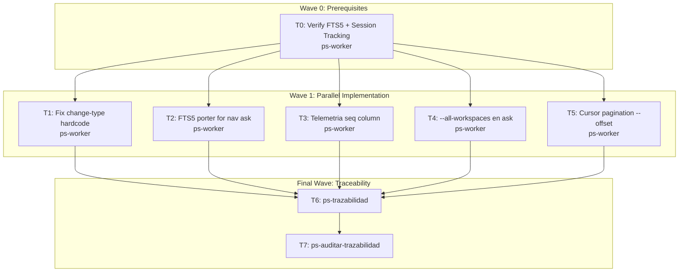

# Wave 1: Quick Wins + Foundation Telemetrica

**Goal:** Entregar 3 mejoras inmediatas al ahorro de tokens (FTS5 en ask, pagination, change-type fix) y preparar la foundation telemetrica para context-pack adaptativo en Wave 2+.

**Architecture:** mi-lsp es un CLI Go con SQLite repo-local (`index.db`), daemon global con SQLite (`daemon.db`), y patron catalog-first/daemon-optional. Wave 1 no altera la arquitectura -- agrega FTS5 virtual table, OFFSET a queries existentes, flags a comandos existentes, y enriquece telemetria existente.

**Tech Stack:** Go 1.22+, SQLite (WAL mode), Cobra CLI, fsnotify daemon

**Context Source:** Brainstorming 2026-04-07. Plan aprobado en `/home/fgpaz/.claude/plans/mellow-finding-reef.md`. Archivos verificados con line numbers exactos.

**Runtime:** CC

**Available Agents:**
- `ps-worker` -- general-purpose file/git/config/docs (Go code changes)
- `ps-explorer` -- read-only code exploration
- `ps-docs` -- documentation specialist
- `ps-code-reviewer` -- code review post-implementation
- `ps-sdd-sync-gen` -- SDD sync between code and wiki

**Initial Assumptions:**
- SQLite FTS5 extension esta disponible en el build de Go SQLite usado por mi-lsp (mattn/go-sqlite3 con FTS5 enabled)
- `client_name` y `session_id` en access_events ya se populan parcialmente desde el CLI (a verificar)
- Los cambios en schema.go son backward-compatible via ALTER TABLE / CREATE IF NOT EXISTS

---

## Risks & Assumptions

**Assumptions needing validation:**
- FTS5 disponible en mattn/go-sqlite3: verificar con `PRAGMA compile_options` que incluya `ENABLE_FTS5`
- `session_id` ya llega al daemon: verificar en `internal/cli/root.go` si el CLI genera y envia session_id

**Known risks:**
- FTS5 virtual table agrega tamanho a index.db: mitigado por ser solo doc_records (decenas, no miles)
- OFFSET en SQLite es O(N) para offsets grandes: aceptable porque max_items es 50 por default

**Unknowns:**
- Performance de FTS5 porter stemmer con contenido mixto ingles/espanol: probar con docs existentes

---

## Wave Dispatch Map

| Task | Wave | Agent | Subdoc | Done When |
|------|------|-------|--------|-----------|
| T0 | 0 | ps-worker | `./wave-1/T0-verify-prerequisites.md` | FTS5 confirmed available, session_id flow traced |
| T1 | 1 | ps-worker | `./wave-1/T1-fix-change-type.md` | `go build ./...` exits 0, git diff status codes parsed |
| T2 | 1 | ps-worker | `./wave-1/T2-fts5-porter-ask.md` | `go test ./internal/service/ -run TestAsk` passes, FTS5 queries work |
| T3 | 1 | ps-worker | `./wave-1/T3-telemetria-seq.md` | `seq` column exists in access_events, increments per session |
| T4 | 1 | ps-worker | `./wave-1/T4-ask-all-workspaces.md` | `mi-lsp nav ask "question" --all-workspaces` returns results from multiple workspaces |
| T5 | 1 | ps-worker | `./wave-1/T5-cursor-pagination.md` | `mi-lsp nav find "X" --offset 10` skips first 10 results |
| T6 | F | -- | inline | ps-trazabilidad complete |
| T7 | F | -- | inline | ps-auditar-trazabilidad clean |

---

## Final Wave: Traceability

### Task T6: Run ps-trazabilidad
- Classify change type: infrastructure + feature (schema, CLI, service, daemon)
- Verify sync: `07_baseline_tecnica.md` (telemetria changes), `09_contratos_tecnicos.md` (new flags)
- Verify RF impact: `RF-QRY-001` (ask), `RF-DAE-002` (telemetria)
- Output closure summary

### Task T7: Run ps-auditar-trazabilidad
- Read-only cross-document consistency audit
- Check RF-FL-data-test alignment for modified commands
- Flag contradictions or gaps
- If gaps found: return to implementation or update wiki

---

## Documentation Sync Triggers (post-implementation)

Per CLAUDE.md policy:
- Commands/flags changes -> sync `09_contratos_tecnicos.md` + affected `CT-*.md`
- Schema changes -> sync `08_modelo_fisico_datos.md` + affected `DB-*.md`
- Daemon/telemetria changes -> sync `07_baseline_tecnica.md` + affected `TECH-*.md`
