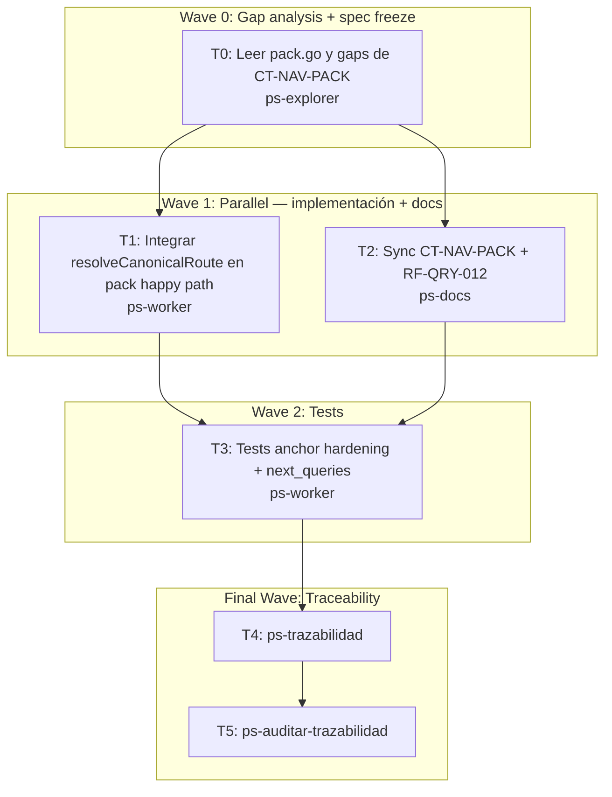

# Wave 3a: nav pack hardening Implementation Plan

**Goal:** Integrar `resolveCanonicalRoute` como backbone de routing del happy path de `nav pack`, poblar `next_queries`, y alinear `CT-NAV-PACK` con la implementación real.

**Architecture:** `pack.go` actualmente usa `resolvePackAnchor` + `selectPackPrimary` en el happy path (Tier 2 directo sin pasar por el route core compartido). La mejora consiste en redirigir el happy path a través de `resolveCanonicalRoute` para que pack y route compartan el mismo ranking Tier 2, y luego pack construya el reading pack completo desde ese anchor. Los flags `--rf/--fl/--doc` ya están cableados en `resolvePackAnchor`; se preservan y se pasan como payload al route core.

**Tech Stack:** Go 1.22+, Cobra CLI, SQLite FTS5, `internal/service/pack.go`, `internal/service/route.go`, `internal/model/types.go`, `internal/cli/nav.go`.

**Context Source:** Wave 2 completada: `resolveCanonicalRoute` existe en `internal/service/route.go`. `pack.go` usa Tier 1 solo como fallback de índice vacío. `CT-NAV-PACK` define el contrato pero `next_queries` no está poblado. `RF-QRY-012` spec cubre flags de hardening y ladder canónica. `go test ./internal/...` pasa al 100%.

**Runtime:** CC

**Available Agents:**
- `ps-worker` — ejecución general: código, git, config, docs
- `ps-docs` — especialista wiki y documentación
- `ps-explorer` — exploración read-only de código

**Initial Assumptions:**
- `resolveCanonicalRoute` puede invocarse desde `pack.go` sin introducir ciclos de importación (mismo package `service`). ✓
- El anchor resultante del route core es compatible con el `packAnchor` usado en `selectPackPrimary` — ambos se resuelven por `DocRecord.Path` o `DocRecord.DocID`.
- `next_queries` puede generarse desde `PackResult.Why` y la familia detectada sin requerir un nuevo campo en el modelo.

---

## Risks & Assumptions

**Assumptions needing validation:**
- `resolveCanonicalRoute` ya usa `rankDocs` internamente — verificar que el resultado de `Canonical.AnchorDoc` es equivalente a `selectPackPrimary` para el mismo task. Si divergen, pack necesita su propio ranking.
- `PackResult.NextQueries` no existe en el modelo — validar si se agrega al struct o se mapea a un campo existente.

**Known risks:**
- Cambiar el happy path de pack puede afectar los tests existentes `TestNavPackBuildsFunctionalReadingPackInCanonicalOrder`. Leer los tests antes de cambiar.
- Si `resolveCanonicalRoute` es más lento que `selectPackPrimary` (abre SQLite dos veces), puede haber regresión de performance. Mitigación: reutilizar el `db` ya abierto.

**Unknowns:**
- Si `PackResult` necesita el campo `NextQueries []string` — buscar si ya existe o si hay un campo equivalente.

---

## Wave Dispatch Map

| Task | Wave | Agent | Subdoc | Done When |
|------|------|-------|--------|-----------|
| T0 | 0 | ps-explorer | `./2026-04-13-wave-3a-nav-pack-hardening/T0-gap-analysis.md` | Gaps documentados y validados |
| T1 | 1 | ps-worker | `./2026-04-13-wave-3a-nav-pack-hardening/T1-pack-route-integration.md` | `go build ./...` EXIT:0, `go test ./internal/service` EXIT:0 |
| T2 | 1 | ps-docs | `./2026-04-13-wave-3a-nav-pack-hardening/T2-docs-sync.md` | CT-NAV-PACK y RF-QRY-012 actualizados |
| T3 | 2 | ps-worker | `./2026-04-13-wave-3a-nav-pack-hardening/T3-tests.md` | `go test ./internal/service -run Pack` EXIT:0 |
| T4 | F | — | inline | ps-trazabilidad complete |
| T5 | F | — | inline | ps-auditar-trazabilidad clean |

---

## Final Wave: Traceability Closure

**T4: Run /ps-trazabilidad**
- Verificar cadena `FL-QRY-01 → RF-QRY-012 → CT-NAV-PACK → TP-QRY`
- Confirmar `pack.go` usa `resolveCanonicalRoute` en happy path
- Confirmar `CT-NAV-PACK` refleja `next_queries` y Tier 2 routing
- Confirmar `go test ./internal/...` pasa

**T5: Run /ps-auditar-trazabilidad**
- Audit read-only: RF-QRY-012 → TP-QRY test coverage
- Verify no regresión en tests de Wave 2 (RouteResult, ask, pack stale)
- Veredicto: `Approved` o `Blocked`
