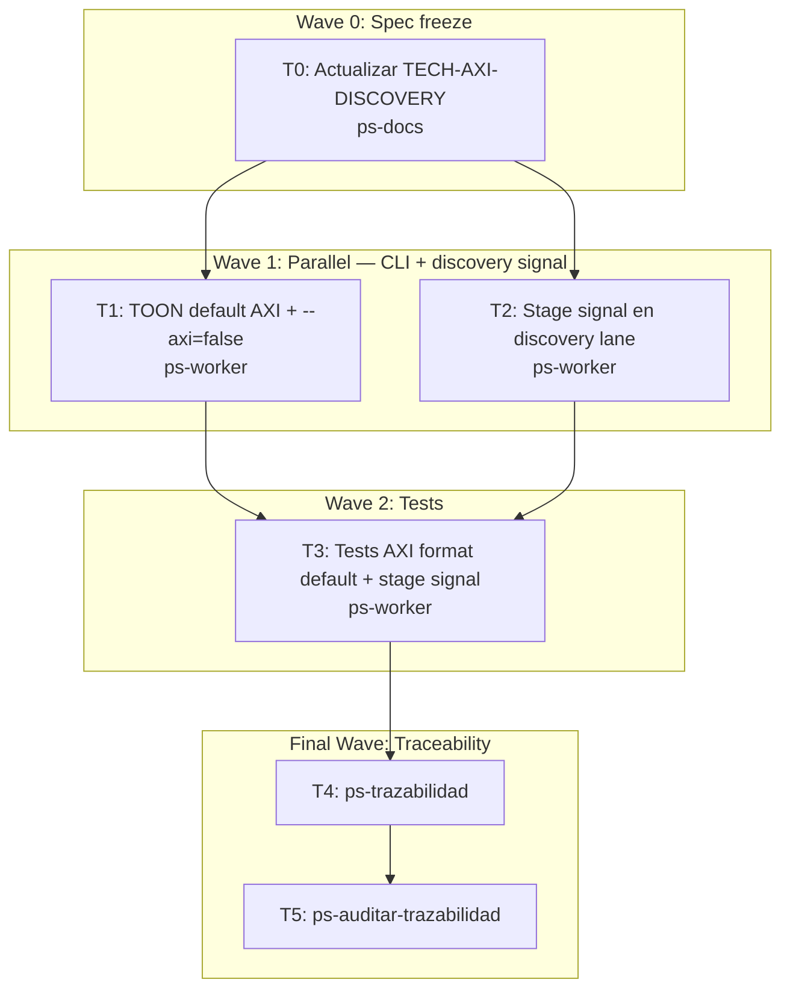

# Wave 3b: AXI discovery hardening Implementation Plan

**Goal:** Implementar TOON-default cuando AXI está activo sin `--format` explícito; agregar soporte `--axi=false`; agregar señal `stage` en discovery lane para distinguir `anchor|preview|discovery`.

**Architecture:** El CLI en `root.go` fija `format="compact"` como default global. La regla de TOON-default en AXI efectivo vive en `PersistentPreRunE` o en `effectiveFormat()` — si el modo efectivo es AXI y no hubo `--format` explícito, el format sube a "toon". El campo `stage` en `RouteDoc` ya existe en el modelo; hay que asegurarse de que `buildDiscoveryAdvisory` lo puebla con `anchor|preview|discovery`.

**Tech Stack:** Go, `internal/cli/root.go`, `internal/cli/axi_mode.go`, `internal/service/route.go`, `internal/model/types.go`.

**Context Source:** `MI_LSP_AXI=1` ya está implementado (`root.go:52`). `--axi/--classic` mutual exclusion ya está en `root.go:101`. `RouteDoc.Stage` existe en el modelo. `buildDiscoveryAdvisory` en `route.go` no puebla `Stage`. Format default es "compact" sin lógica de override por AXI.

**Runtime:** CC

**Available Agents:**
- `ps-worker` — código, config, git
- `ps-docs` — wiki y documentación
- `ps-explorer` — exploración read-only

**Initial Assumptions:**
- `flagChanged(cmd, "format")` es suficiente para detectar si `--format` fue explícito.
- `RouteDoc.Stage` ya existe en `model.types.go` — solo hay que poblarlo en `buildDiscoveryAdvisory`.
- El cambio de format default no afecta tests que no pasen `--format` explícito (los tests usan `env.Items` directamente, no el formato de salida).

---

## Risks & Assumptions

**Assumptions needing validation:**
- Cambiar format a "toon" en AXI mode no rompe tests de output existentes en `internal/cli`. Validar antes de commitear.
- `--axi=false` necesita que cobra procese el flag booleano negativo — verificar que `--axi` sea `BoolVar` (no `BoolP`) ya que cobra soporta `--axi=false` nativamente con `BoolVar`.

**Known risks:**
- Tests de `internal/cli` que lean el output en formato compact pueden fallar si el default cambia. Mitigación: asegurarse de que esos tests pasen `--format compact` explícitamente o mockeen la salida.

**Unknowns:**
- Si hay tests de output en `internal/cli` que dependan del format default. Verificar con `grep -r "format" internal/cli/*_test.go`.

---

## Wave Dispatch Map

| Task | Wave | Agent | Subdoc | Done When |
|------|------|-------|--------|-----------|
| T0 | 0 | ps-docs | `./2026-04-13-wave-3b-axi-discovery/T0-spec-freeze.md` | TECH-AXI-DISCOVERY refleja TOON default y stage signal |
| T1 | 1 | ps-worker | `./2026-04-13-wave-3b-axi-discovery/T1-toon-default-axi-false.md` | `go build ./...` EXIT:0 |
| T2 | 1 | ps-worker | `./2026-04-13-wave-3b-axi-discovery/T2-discovery-stage-signal.md` | `go build ./...` EXIT:0 |
| T3 | 2 | ps-worker | `./2026-04-13-wave-3b-axi-discovery/T3-tests.md` | `go test ./internal/...` EXIT:0 |
| T4 | F | — | inline | ps-trazabilidad complete |
| T5 | F | — | inline | ps-auditar-trazabilidad clean |

---

## Final Wave: Traceability Closure

**T4: Run /ps-trazabilidad**
- Verificar RF-WKS-004 → CT-CLI-AXI-MODE → TECH-AXI-DISCOVERY
- Confirmar TOON default activo en AXI mode sin `--format` explícito
- Confirmar `RouteDoc.Stage` se puebla en discovery lane
- `go test ./internal/...` pasa

**T5: Run /ps-auditar-trazabilidad**
- Audit cross-doc: CT-CLI-AXI-MODE, TECH-AXI-DISCOVERY, RF-WKS-004
- Verificar no regresión en tests de Wave 2
- Veredicto: `Approved` o `Blocked`
