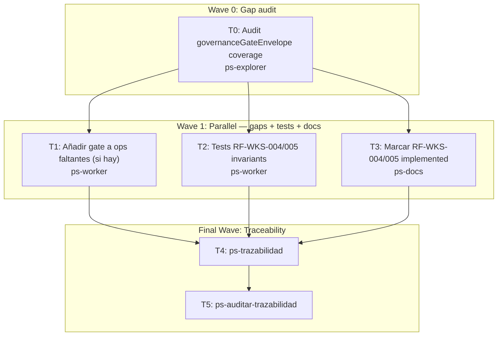

# Wave 3c: RF-WKS-004/005 hardening Implementation Plan

**Goal:** Completar formalmente RF-WKS-004 (AXI selectivo por superficie) y RF-WKS-005 (governance gate) con cobertura de tests y marcarlos como `implemented`.

**Architecture:** RF-WKS-004 está parcialmente implementado en `axi_mode.go`. RF-WKS-005 está implementado en `governance.go` con `governanceGateEnvelope`. El gap es: (1) no hay tests que cubran el governance gate blocking en todas las superficies, (2) RF-WKS-004 tiene invariantes sin tests (`--axi + --classic` = error, `MI_LSP_AXI=1` activa AXI, `--classic` prevalece sobre todo), (3) los RFs no están marcados como `implemented` en los docs.

**Tech Stack:** Go, `internal/service/governance.go`, `internal/cli/axi_mode.go`, `internal/cli/root.go`, test files.

**Context Source:** `governanceGateEnvelope` implementado en `service/governance.go`. `axi_mode.go` implementa `supportsAXISurface + defaultAXIForOperation + isClassicRequested`. `root.go:101` ya valida `--axi + --classic`. Governance tests existen en `governance_test.go` pero pueden no cubrir el gate blocking en operations `nav.pack`, `nav.route`, etc. `RF-WKS-004` y `RF-WKS-005` están en `.docs/wiki/04_RF/` como untracked (ya commiteados en Wave 2).

**Runtime:** CC

**Available Agents:**
- `ps-worker` — código, git, config
- `ps-docs` — wiki y documentación
- `ps-explorer` — exploración read-only

**Initial Assumptions:**
- `governanceGateEnvelope` ya se llama en `nav.pack`, `nav.route`, `nav.ask`, y `nav.governance`. Verificar si falta alguna operación.
- Los tests de `governance_test.go` ya cubren el blocking state básico. Los nuevos tests son para la propagación del gate a nav.pack y nav.route.
- RF-WKS-004 y RF-WKS-005 pueden marcarse como `implemented` al final de este wave.

---

## Risks & Assumptions

**Assumptions needing validation:**
- Verificar con `grep governanceGateEnvelope internal/service/*.go` que todas las operaciones nav lo usan.
- Verificar si `RF-WKS-004.md` y `RF-WKS-005.md` están correctamente referenciados en `04_RF.md` y `FL-BOOT-01.md`.

**Known risks:**
- Agregar governance gate a una operación que no lo tiene puede romper tests que no configuran governance. Mitigación: usar el mismo patrón de fixture que los tests existentes.

**Unknowns:**
- Si hay operaciones (workspace.list, workspace.remove) que deliberadamente no tienen governance gate y eso es correcto por diseño.

---

## Wave Dispatch Map

| Task | Wave | Agent | Subdoc | Done When |
|------|------|-------|--------|-----------|
| T0 | 0 | ps-explorer | `./2026-04-13-wave-3c-wks-governance-axi/T0-gate-audit.md` | Lista de ops sin gate documentada |
| T1 | 1 | ps-worker | `./2026-04-13-wave-3c-wks-governance-axi/T1-gate-coverage.md` | `go build ./...` EXIT:0 |
| T2 | 1 | ps-worker | `./2026-04-13-wave-3c-wks-governance-axi/T2-tests.md` | `go test ./internal/service -run Governance` EXIT:0 |
| T3 | 1 | ps-docs | `./2026-04-13-wave-3c-wks-governance-axi/T3-docs-mark-implemented.md` | RF-WKS-004/005 estado=implemented |
| T4 | F | — | inline | ps-trazabilidad complete |
| T5 | F | — | inline | ps-auditar-trazabilidad clean |

---

## Final Wave: Traceability Closure

**T4: Run /ps-trazabilidad**
- Verificar cadena `FL-BOOT-01 → RF-WKS-004 → CT-CLI-AXI-MODE` y `FL-BOOT-01 → RF-WKS-005`
- Confirmar que `governanceGateEnvelope` cubre todas las nav operations
- `go test ./internal/...` pasa

**T5: Run /ps-auditar-trazabilidad**
- Audit: RF-WKS-004/005 marcados `implemented`, test coverage en 06_matriz
- Veredicto: `Approved` o `Blocked`
