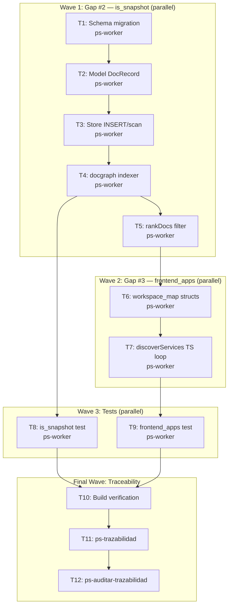

# Wave 4a — Doc Snapshot Penalty + TS Split en workspace-map

**Goal:** Implementar Gap #2 (`is_snapshot` flag en `doc_records` con penalizacion en `rankDocs`) y Gap #3 (seccion `frontend_apps` en `nav workspace-map` para repos TypeScript/Next.js).

**Architecture:** Gap #2 agrega un campo `is_snapshot INTEGER NOT NULL DEFAULT 0` a `doc_records`, poblado automaticamente durante indexacion por path pattern (`/old/`, `/archive/`, `/deprecated/`, `/historico/`, `/legacy/`, case-insensitive), y filtrado en `rankDocs` con `continue` antes del scoring. Gap #3 agrega una seccion `frontend_apps[]` en el output de `nav workspace-map` para repos con `"typescript"` en `Languages` que no tienen entrypoints `.csproj`.

**Tech Stack:** Go (mi-lsp), SQLite schema migrations via `ensureColumn`, docgraph indexing pipeline, ranking pipeline, workspace-map service.

**Context Source:** DocRecords DDL en `internal/store/schema.go:62-74` no tiene `is_snapshot`. `rankDocs` en `internal/service/ask.go:~132` scoring in-memory sin filtro snapshot. `discoverServices` en `internal/service/workspace_map.go:~155` itera solo `project.Entrypoints` (`.sln`/`.csproj`). `WorkspaceRepo.Languages` en `internal/workspace/topology.go:~370` ya detecta `"typescript"` via `tsconfig.json`, `next.config.*`. `ensureColumn` pattern existe en `internal/store/schema.go:145-152`. No hay `ensureColumn` para `doc_records` aun.

**Runtime:** Codex

**Available Agents:**
- `ps-worker` — codigo, git, config, tests
- `ps-docs` — wiki y documentacion
- `ps-explorer` — exploracion read-only

**Initial Assumptions:**
- La deteccion de snapshot es puramente por path segment, no por contenido ni metadata de usuario.
- Los segmentos a detectar son exactamente: `/old/`, `/archive/`, `/deprecated/`, `/historico/`, `/legacy/` (case-insensitive via `strings.ToLower`).
- La exclusion en `rankDocs` es un `continue` total, no una reduccion de score.
- La seccion `frontend_apps` es independiente de `services[]` (no se mezcla).
- Los repos TS se detectan por `WorkspaceRepo.Languages` ya existente en `project.Repos[i].Languages`.

---

## Risks & Assumptions

**Assumptions needing validation:**
- `ensureColumn(db, "doc_records", "is_snapshot", "INTEGER NOT NULL DEFAULT 0")` es idempotente y no rompe el schema existente.
- `isSnapshotPath` con `strings.ToLower` es suficiente para covers `/old/`, `/Archive/`, `/DEPRECATED/`, etc.

**Known risks:**
- Agregar columna `is_snapshot` al DDL de `doc_records` (linea ~73 en schema.go) requiere verificar que no haya otro DDL conflicting o un ALTER TABLE manual en otra parte.
- El campo nuevo en `DocRecord` struct puede romper tests que hacen `model.DocRecord{}` literal sin el campo. Mitigacion: actualizar los tests, no revertir.
- Los FTS triggers de `doc_records` no exponen `is_snapshot` (solo indexan `title, doc_id, search_text`), por lo que no necesitan cambio.

**Unknowns:**
- Si existe algun test que haga mock de `DocRecord` con el struct viejo y falle — se validara cuando se corra `go test ./internal/...` al final.

---

## Wave Dispatch Map



**Task Index Table:**

| Task | Wave | Agent | Subdoc | Done When |
|------|------|-------|--------|-----------|
| T1 | 1 | ps-worker | `./2026-04-13-wave-4a-doc-snapshot-penalty-ts-split/T1-schema-migration.md` | `go build ./...` EXIT:0 |
| T2 | 1 | ps-worker | `./2026-04-13-wave-4a-doc-snapshot-penalty-ts-split/T2-model-docrecord.md` | `go build ./...` EXIT:0 |
| T3 | 1 | ps-worker | `./2026-04-13-wave-4a-doc-snapshot-penalty-ts-split/T3-store-insert-scan.md` | `go build ./...` EXIT:0 |
| T4 | 1 | ps-worker | `./2026-04-13-wave-4a-doc-snapshot-penalty-ts-split/T4-docgraph-indexer.md` | `go build ./...` EXIT:0 |
| T5 | 1 | ps-worker | `./2026-04-13-wave-4a-doc-snapshot-penalty-ts-split/T5-rankdocs-filter.md` | `go build ./...` EXIT:0 |
| T6 | 2 | ps-worker | `./2026-04-13-wave-4a-doc-snapshot-penalty-ts-split/T6-workspace-map-structs.md` | `go build ./...` EXIT:0 |
| T7 | 2 | ps-worker | `./2026-04-13-wave-4a-doc-snapshot-penalty-ts-split/T7-discover-services-ts.md` | `go build ./...` EXIT:0 |
| T8 | 3 | ps-worker | `./2026-04-13-wave-4a-doc-snapshot-penalty-ts-split/T8-is-snapshot-test.md` | `go test ./internal/docgraph/... -run IsSnapshot` EXIT:0 |
| T9 | 3 | ps-worker | `./2026-04-13-wave-4a-doc-snapshot-penalty-ts-split/T9-frontend-apps-test.md` | `go test ./internal/service/... -run FrontendApps` EXIT:0 |
| T10 | F | ps-worker | inline | `go test ./internal/... -count=1` EXIT:0 |
| T11 | F | — | inline | `/ps-trazabilidad` complete |
| T12 | F | — | inline | `/ps-auditar-trazabilidad` clean |

---

## Final Wave: Traceability Closure

**T10: Build + full test suite**
```bash
go build ./... && go test ./internal/... -count=1
```
- Todos los tests pasan, ninguna regresion.

**T11: Run `/ps-trazabilidad`**
- Clasificar cambio tipo: schema + model + indexer + ranker + workspace-map
- Verificar RF/FL/data model/architecture/tests/technical layer sync
- Output: closure summary

**T12: Run `/ps-auditar-trazabilidad`**
- Read-only cross-document consistency audit
- Verificar: RF-QRY-001 a RF-QRY-013 coverage, docs `07_baseline_tecnica.md` y `08_modelo_fisico_datos.md` sincronizados si corresponde
- Veredicto: `Approved` o `Blocked`

---

## Doc Sync Decision

| Cambio | ¿Observable externamente? | Actualizar docs? |
|--------|--------------------------|-----------------|
| `is_snapshot` en schema | No — es internal pipeline detail, no hay CLI flag ni output JSON que lo exponga | No (`07`/`08` no necesarios) |
| `frontend_apps` en workspace-map | Si — nuevo campo JSON en output de `nav workspace-map` | Si — actualizar `07_baseline_tecnica.md` con la nueva seccion si hay cambio de comportamiento |
