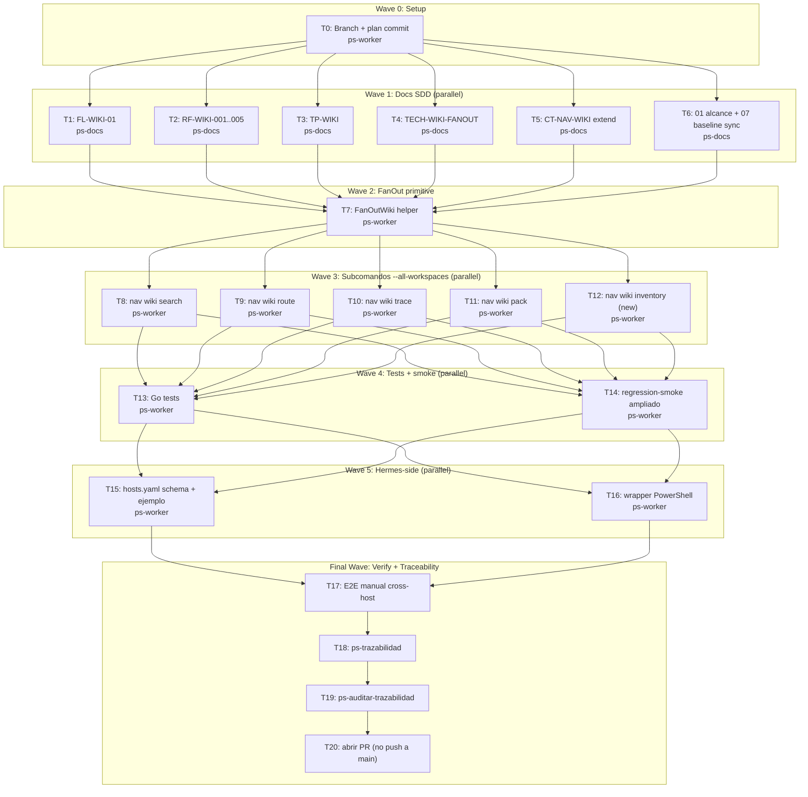

# Hermes Wiki Global Navigation — Wave 1 Implementation Plan

**Goal:** Hermes (agente del usuario en teslita + tesla-desktop) navega wikis de los proyectos registrados en `~/.mi-lsp/registry.toml` con un solo comando global por máquina, y une resultados cross-máquina vía SSH/Tailscale sin que `mi-lsp` aprenda transporte de red.

**Architecture:** Extender los cinco subcomandos `nav wiki *` (`search`, `route`, `trace`, `pack` existentes; `inventory` nuevo) con el flag `--all-workspaces`, replicando el patrón `AllWorkspaces` con `semaphore=4` que ya vive en `internal/service/ask.go`. El envelope TOON gana un campo `workspace:<alias>` por item y un `host:""` opcional que Hermes setea al mergear cross-máquina. mi-lsp permanece CLI puro: no aprende SSH, no aprende hosts, no expone MCP/HTTP.

**Tech Stack:** Go (`internal/cli/nav.go`, `internal/nav/`, `internal/service/`), Markdown SDD (`.docs/wiki/`), PowerShell (`scripts/release/`, wrapper Hermes-side).

**Context Source:** mi-lsp profile = `ordered_wiki + spec_backend` (no hay capa `02_resultados/RS-*`). Wikis canónicas en 50+ workspaces (`workspace list`). `nav find/search/ask` ya implementan `--all-workspaces` con semaphore=4 y devuelven items con `workspace:<alias>`. `nav wiki search/route/trace/pack` existen pero **no** soportan `--all-workspaces`. `nav wiki inventory` no existe. `CT-NAV-WIKI.md` ya documenta los wiki subcomandos sin el flag. Decisiones de marco lockeadas en `C:\Users\fgpaz\.claude\plans\pensemos-una-idea-para-synthetic-boot.md` (sesión de brainstorming aprobada por el usuario).

**Runtime:** CC

**Available Agents:**
- `ps-docs` — documentation specialist; wiki docs, specs, READMEs, changelogs (usado para Wave 1 docs SDD)
- `ps-worker` — general execution; file/git/config/docs/shell (usado para Go, PowerShell, integraciones)
- `ps-explorer` — read-only code/docs exploration (referencia, no muta)
- `ps-code-reviewer` — performance > diseño > seguridad (review opcional post-Wave 3)
- `ps-sdd-sync-gen` — auto-gen specs SDD desde código (referencia opcional)
- `general-purpose` — fallback amplio si ps-worker no alcanza

**Initial Assumptions:**
- El patrón `AllWorkspaces` con semaphore=4 en `internal/service/ask.go` es reusable como helper sin refactor mayor.
- `nav wiki search` actual usa el doc-index repo-local (`.mi-lsp/index.db` con tablas `doc_records/doc_edges/doc_mentions`) y puede federarse simplemente iterando la registry.
- El consumidor Hermes parsea TOON; no requiere JSON.

---

## Goal Index

```yaml
goals:
  - goal_id: G0
    title: "Branch dedicada para Wave 1"
    source_refs:
      rs: []
      fl: []
      rf: []
      ct: []
    github_issues: []
    expected_outcome: "Branch local feature/hermes-wiki-global-nav existe y está checked out; .docs/raw/plans/ contiene el plan committeado."
    done_when:
      - "git branch --show-current -> feature/hermes-wiki-global-nav"
      - "git log -1 --pretty=%s sobre el plan -> contiene 'docs(plan): add hermes-wiki-global-nav'"
    evidence_expected:
      - "git status + git log -1 capturados en T0 report"
    stop_if:
      - "Branch feature/hermes-wiki-global-nav ya existe con commits divergentes"

  - goal_id: G1
    title: "Hermes navega wikis globalmente vía mi-lsp CLI sin MCP, intra-máquina y cross-máquina"
    source_refs:
      rs: []  # mi-lsp profile no tiene capa RS
      fl: ["FL-WIKI-01"]
      rf: ["RF-WIKI-001", "RF-WIKI-002", "RF-WIKI-003", "RF-WIKI-004", "RF-WIKI-005"]
      ct: ["CT-NAV-WIKI"]
    github_issues: []
    expected_outcome: "Los cinco subcomandos nav wiki * aceptan --all-workspaces y devuelven envelopes merge-friendly con workspace por item, host opcional, y stats de workspaces_queried/failed; Hermes corre la misma invocación local y vía Tailscale SSH y mergea resultados."
    done_when:
      - "go build ./... -> exit 0"
      - "go test ./internal/cli/... ./internal/service/... ./internal/nav/... -> PASS"
      - "mi-lsp nav wiki inventory --all-workspaces --format toon -> ok=true; items[N>0]"
      - "mi-lsp nav wiki search 'governance' --all-workspaces --format toon -> ok=true; items con workspace<>'' por entrada"
      - "scripts/release/regression-smoke.ps1 -> exit 0"
      - "~/.hermes/hosts.yaml.example existe y wrapper PowerShell corre local+remoto contra dos máquinas vía Tailscale"
    evidence_expected:
      - "Output TOON de las cinco invocaciones --all-workspaces (search, route, trace, pack, inventory)"
      - "go test report"
      - "regression-smoke.ps1 output"
      - "Captura E2E manual (Wave 5) ejecutada desde teslita contra tesla-desktop"
    stop_if:
      - "El helper AllWorkspaces se ha movido o cambiado de signatura desde el último audit"
      - "Más del 20% de workspaces tienen governance_blocked=true (sample contaminado)"
```

---

## Risks & Assumptions

**Assumptions needing validation:**
- `internal/service/ask.go` exporta o expone el patrón `AllWorkspaces` reusable. T7 confirma esto leyendo el archivo antes de extraer la primitiva. Si no es exportado pero sí encapsulable, T7 lo factoriza en `internal/nav/fanout.go`.
- Hermes consume TOON (no JSON). Si Hermes solo entiende JSON, el wrapper PowerShell de T16 puede invocar `--format json` (también soportado por mi-lsp) sin cambiar nada del lado servidor.

**Known risks:**
- **R1**: Un workspace con índice doc corrupto rompe el fan-out. *Mitigación*: timeout por workspace (30s, default heredado de `nav ask`); workspace fallido entra a `workspaces_failed[]` y no bloquea el resultado global.
- **R2**: El envelope cambia y rompe consumidores existentes de `--workspace` sin `--all-workspaces`. *Mitigación*: el nuevo campo `host:""` y `stats.workspaces_queried` son aditivos; el shape single-workspace permanece idéntico. T13 incluye assertion explícito sobre back-compat.
- **R3**: El comando nuevo `inventory` colisiona en su naming con futuro `mi-lsp inventory` global. *Mitigación*: vive estrictamente bajo `nav wiki inventory`, no a nivel root; CT-NAV-WIKI documenta el namespace.
- **R4**: `pack --all-workspaces` produce N mini-packs, no un super-pack mergeado — semánticamente raro. *Mitigación*: CT-NAV-WIKI documenta explícitamente que pack federated devuelve un envelope con `items[]` donde cada item es un pack-por-workspace, y Hermes decide si los une.

**Unknowns:**
- ¿`pack` tiene flags que rompen al federar (`--rf`, `--fl`, `--doc`)? T11 valida con `pack --workspace <alias> --rf <id>` antes de implementar el flag federado para entender comportamiento actual.

---

## Wave Dispatch Map



---

## Task Index Table

| Task | Goal | Wave | Agent | Subdoc | Done When |
|------|------|------|-------|--------|-----------|
| T0 | G0 | 0 | ps-worker | `./2026-05-11-hermes-wiki-global-nav/T0-branch-setup.md` | git branch -> feature/hermes-wiki-global-nav |
| T1 | G1 | 1 | ps-docs | `./2026-05-11-hermes-wiki-global-nav/T1-fl-wiki-01.md` | FL-WIKI-01.md + 03_FL.md actualizados |
| T2 | G1 | 1 | ps-docs | `./2026-05-11-hermes-wiki-global-nav/T2-rf-wiki.md` | RF-WIKI-001..005.md + 04_RF.md actualizados |
| T3 | G1 | 1 | ps-docs | `./2026-05-11-hermes-wiki-global-nav/T3-tp-wiki.md` | TP-WIKI.md + 06_matriz_pruebas_RF.md actualizados |
| T4 | G1 | 1 | ps-docs | `./2026-05-11-hermes-wiki-global-nav/T4-tech-wiki-fanout.md` | TECH-WIKI-FANOUT.md + 07_baseline_tecnica.md actualizados |
| T5 | G1 | 1 | ps-docs | `./2026-05-11-hermes-wiki-global-nav/T5-ct-nav-wiki.md` | CT-NAV-WIKI.md + 09_contratos_tecnicos.md actualizados |
| T6 | G1 | 1 | ps-docs | `./2026-05-11-hermes-wiki-global-nav/T6-alcance-sync.md` | 01_alcance_funcional.md + 02_arquitectura.md actualizados |
| T7 | G1 | 2 | ps-worker | `./2026-05-11-hermes-wiki-global-nav/T7-fanout-primitive.md` | FanOutWiki helper en internal/nav/fanout_wiki.go; go build PASS |
| T8 | G1 | 3 | ps-worker | `./2026-05-11-hermes-wiki-global-nav/T8-nav-wiki-search.md` | nav wiki search --all-workspaces -> envelope merge-friendly |
| T9 | G1 | 3 | ps-worker | `./2026-05-11-hermes-wiki-global-nav/T9-nav-wiki-route.md` | nav wiki route --all-workspaces -> envelope merge-friendly |
| T10 | G1 | 3 | ps-worker | `./2026-05-11-hermes-wiki-global-nav/T10-nav-wiki-trace.md` | nav wiki trace --all-workspaces -> envelope merge-friendly |
| T11 | G1 | 3 | ps-worker | `./2026-05-11-hermes-wiki-global-nav/T11-nav-wiki-pack.md` | nav wiki pack --all-workspaces -> N mini-packs por workspace |
| T12 | G1 | 3 | ps-worker | `./2026-05-11-hermes-wiki-global-nav/T12-nav-wiki-inventory.md` | nav wiki inventory --all-workspaces (nuevo) + --with-layer-counts |
| T13 | G1 | 4 | ps-worker | `./2026-05-11-hermes-wiki-global-nav/T13-tests-go.md` | go test ./... PASS para los seis archivos modificados |
| T14 | G1 | 4 | ps-worker | `./2026-05-11-hermes-wiki-global-nav/T14-regression-smoke.md` | regression-smoke.ps1 cubre los cinco --all-workspaces |
| T15 | G1 | 5 | ps-worker | `./2026-05-11-hermes-wiki-global-nav/T15-hermes-hosts.md` | hosts.yaml.example en companion folder |
| T16 | G1 | 5 | ps-worker | `./2026-05-11-hermes-wiki-global-nav/T16-hermes-wrapper.md` | wrapper PowerShell que ejecuta los cinco subcomandos local+ssh |
| T17 | G1 | F | — | inline (abajo) | E2E manual passes; evidencia capturada |
| T18 | G1 | F | — | inline | ps-trazabilidad ok |
| T19 | G1 | F | — | inline | ps-auditar-trazabilidad ok |
| T20 | G1 | F | — | inline | PR abierto contra main, no merge |

---

## Final Wave (inline)

### T17 — E2E manual cross-host

**Owner:** humano operador (Gabriel) con guía paso-a-paso.

**Procedure:**

```powershell
# Desde teslita (la máquina actual):
mi-lsp workspace status mi-lsp --format toon
mi-lsp nav governance --workspace mi-lsp --format toon

# (a) Inventario local con --all-workspaces (Wave 3 entregada)
mi-lsp nav wiki inventory --all-workspaces --format toon | Set-Content evidence-wave5/inventory-local.toon

# (b) Search local con --all-workspaces
mi-lsp nav wiki search "governance" --all-workspaces --format toon | Set-Content evidence-wave5/search-local.toon

# (c) Cross-host via Tailscale SSH (tesla-desktop debe estar encendida)
tailscale ssh tesla-desktop -- mi-lsp nav wiki inventory --all-workspaces --format toon | Set-Content evidence-wave5/inventory-remote.toon

# (d) Wrapper Hermes-side (T16) corre local + ssh y mergea
pwsh ~/.hermes/global-search.ps1 "governance" | Set-Content evidence-wave5/hermes-merged.toon

# Apagar tesla-desktop y repetir (d) para confirmar fallo no-fatal
# El envelope debe incluir hosts_failed[] con tesla-desktop y reason: timeout
```

**Done when:** los cuatro archivos de evidencia existen; en `hermes-merged.toon` los items tienen `host` distinto (local + tesla-desktop) cuando ambas máquinas están encendidas; con tesla-desktop apagada, el wrapper devuelve resultados locales más `hosts_failed[]`.

**Stop if:** Tailscale SSH no conecta (problema fuera del scope del plan; documentar y diferir).

### T18 — ps-trazabilidad

Invocar `/ps-trazabilidad` con scope = "Wave 1 Hermes wiki global navigation". Debe cerrar sin gaps en: FL-WIKI-01, RF-WIKI-001..005, TP-WIKI, TECH-WIKI-FANOUT, CT-NAV-WIKI, 01_alcance, 07_baseline.

**Done when:** la skill reporta `harness_verdict: approved` y `wiki_source_verdict: approved`, o lista los gaps que requieren corrección antes de la auditoría.

**Stop if:** la skill detecta wiki_source_protocol blockers (tablas normativas, doc_id/block_id ausentes, fenced toon faltante) — volver a Wave 1 tasks afectadas.

### T19 — ps-auditar-trazabilidad

Invocar `/ps-auditar-trazabilidad` cross-document. Debe validar consistencia FL ↔ RF ↔ TP ↔ TECH ↔ CT y que cada nuevo RF tiene su entrada en 04_RF.md, su TP en TP-WIKI.md, y que CT-NAV-WIKI cita el flag `--all-workspaces` para cada subcomando.

**Done when:** auditoría retorna verdict aprobado sin gaps cross-layer.

**Stop if:** se detecta drift entre código (Wave 2/3) y docs (Wave 1) — abrir tarea correctiva antes del PR.

### T20 — Abrir PR contra main

```powershell
git push -u origin feature/hermes-wiki-global-nav
gh pr create --title "feat(wiki): global cross-workspace navigation for Hermes" --body "$(cat <<'EOF'
## Summary
- Wave 1 entregada: cinco subcomandos `nav wiki *` ganan `--all-workspaces` (search/route/trace/pack existentes + nuevo inventory)
- Envelope TOON uniforme con `workspace` por item, `host` opcional, `workspaces_queried/failed` en stats
- Patrón AllWorkspaces (semaphore=4) reusado desde `internal/service/ask.go`
- Hermes-side: `~/.hermes/hosts.yaml` + wrapper PowerShell de orquestación cross-host vía Tailscale SSH
- Cero MCP/HTTP; mi-lsp permanece CLI puro

## Test plan
- [ ] go build ./... exit 0
- [ ] go test ./internal/cli/... ./internal/service/... ./internal/nav/... PASS
- [ ] scripts/release/regression-smoke.ps1 PASS
- [ ] E2E manual desde teslita: inventory local + cross-host vía Tailscale (evidencia en `.docs/raw/plans/2026-05-11-hermes-wiki-global-nav/evidence-wave5/`)
- [ ] ps-trazabilidad y ps-auditar-trazabilidad sin gaps

Anchors: FL-WIKI-01, RF-WIKI-001..005, TP-WIKI, TECH-WIKI-FANOUT, CT-NAV-WIKI
EOF
)"
```

**Done when:** PR existe contra `main`, status checks corren. **Nunca merge directo.**

**Stop if:** no hay credenciales `gh` configuradas — reportar y dejar el push manual al humano.

---

## Plan-to-Card Traceability

No hay tracker Linear/GitHub Issues configurado en este repo (CLAUDE.md no lo menciona). Las referencias `linear_parent/child` y `github_issues` quedan como `not_applicable` / `[]`. Si en el futuro se adopta tracker, este plan puede ser re-asociado vía el campo `anchors`.

---

## Notes

- **No tests-first** salvo Wave 4 explícita (el usuario pidió tests Go en el brainstorming).
- **mi-lsp obligatorio** para navegar código fuente: las subdocs de Wave 2/3 imponen usar `mi-lsp nav search/find/refs/context` antes que ripgrep.
- **Frequent commits**: cada subdoc termina con un commit semantic. T0 commitea el plan inicial.
- **Branch protection**: no push directo a main (regla del repo CLAUDE.md + petición explícita del usuario).
