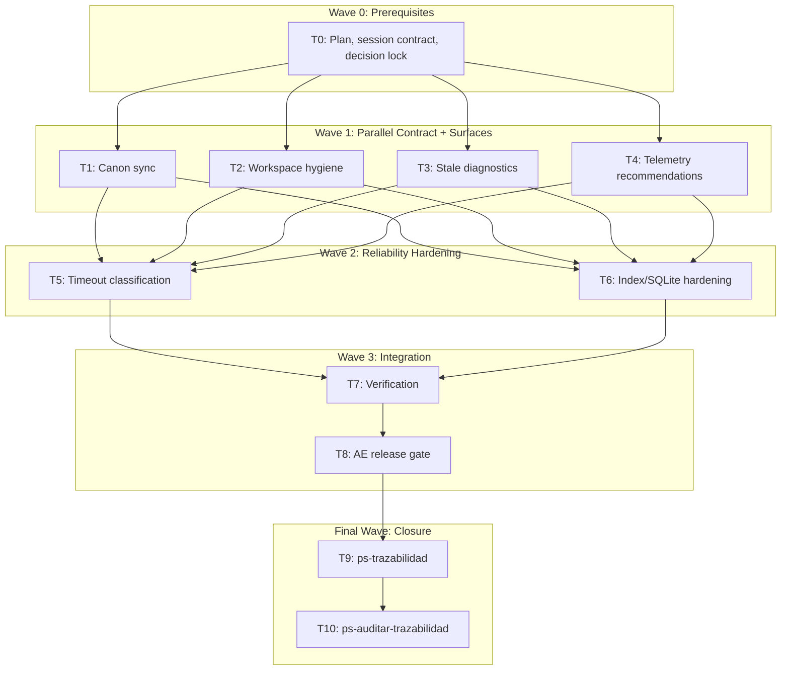

# mi-lsp Agent-First Hygiene & Reliability Implementation Plan

**Goal:** Build an agent-first hygiene and reliability layer that reduces stale workspace/worktree friction, improves diagnostics, and hardens recurring timeout/index/storage failure modes.

**Architecture:** Add a `workspace hygiene` CLI/service surface that composes existing registry doctor and prune primitives instead of duplicating mutation logic. Then improve diagnostics and telemetry recommendations around governance/index stale state, workspace resolution, search timeouts, missing indexed files, and SQLite locks.

**Tech Stack:** Go CLI using Cobra, repo-local SQLite index, global daemon telemetry SQLite, markdown/wiki canon, AE release scripts.

**Context Source:** `ps-contexto`/`mi-lsp` confirmed governance valid, profile `spec_backend`, index current, and AE layer present. Telemetry showed recurring `text_generic/context deadline exceeded`, stale workspace aliases, workspace resolution failures, missing indexed paths, SQLite locked doc queries, and one Roslyn duplicate project-name failure.

**Runtime:** Codex

**Available Agents:**
- `codex` - primary local coding agent for Go, docs, tests, and AE closure.

**Initial Assumptions:**
- No GitHub or Linear card exists for this work; task metadata uses `github_issues: []`.
- `workspace hygiene --apply-safe` may mutate only `~/.mi-lsp/registry.toml` through existing prune logic.
- Binary behavior changes require AE release-distribution dry gate evidence or an explicit waiver.

## Goal Index

```yaml
goals:
  - goal_id: G1
    title: "Agent-first workspace hygiene"
    source_refs:
      rs: []
      fl: ["FL-BOOT-01"]
      rf: ["RF-WKS-004", "RF-WKS-005"]
      ct: ["CT-CLI-DAEMON-ADMIN"]
    github_issues: []
    expected_outcome: "Agents and users can run one safe hygiene command to diagnose stale aliases, duplicate roots, worktree families, and apply only safe registry cleanup."
    done_when:
      - "mi-lsp workspace hygiene --format toon returns backend=registry-hygiene"
      - "mi-lsp workspace hygiene --apply-safe never deletes files or worktrees"
    evidence_expected:
      - ".docs/auditoria/2026-05-26-mi-lsp-agent-first-hygiene/traceability-closure.yaml"
    stop_if:
      - "hygiene implementation bypasses existing registry prune safety"
  - goal_id: G2
    title: "Actionable diagnostics"
    source_refs:
      rs: []
      fl: ["FL-QRY-01", "FL-IDX-01"]
      rf: ["RF-WKS-005", "RF-QRY-002", "RF-IDX-003"]
      ct: ["CT-NAV-GOVERNANCE", "CT-NAV-WIKI"]
    github_issues: []
    expected_outcome: "Stale index, workspace resolution, invalid repo selector, timeout, and missing indexed path failures return typed, actionable guidance."
    done_when:
      - "workspace status and nav governance expose stale index timestamps when stale"
      - "admin export summary recommends workspace hygiene when stale registry or resolution failures appear"
    evidence_expected:
      - "go test output for workspace/service/daemon/docgraph/store packages"
    stop_if:
      - "diagnostics persist raw query text or payload content in telemetry decision_json"
  - goal_id: G3
    title: "AE-compliant release closure"
    source_refs:
      rs: []
      fl: ["FL-DAE-01"]
      rf: ["RF-DAE-002"]
      ct: ["CT-CLI-DAEMON-ADMIN"]
    github_issues: []
    expected_outcome: "The branch closes with traceability, audit, and AE release-distribution evidence or waiver."
    done_when:
      - "ps-trazabilidad and ps-auditar-trazabilidad are run after implementation verification"
      - "AE release dry gate output or waiver is recorded"
    evidence_expected:
      - ".docs/auditoria/2026-05-26-mi-lsp-agent-first-hygiene/"
    stop_if:
      - "release gate is skipped without waiver"
```

## Risks & Assumptions

**Assumptions needing validation:**
- Existing `PruneStaleWorkspaces` is the only mutation path needed for `--apply-safe`.
- Stale index timestamps can be exposed without making `--no-auto-sync` write files.
- SQLite lock handling can improve without changing the persistence schema.

**Known risks:**
- CLI public surface changes require docs, tests, and release evidence.
- Telemetry recommendations must stay sanitized and avoid raw payload/query leakage.
- Broad reliability work can sprawl; stop at typed diagnostics and targeted hardening.

**Unknowns:**
- Whether doc query locking is caused by open mode, concurrent index writes, or long read transactions; T6 must identify and patch the minimal owned cause.

## Wave Dispatch Map



## Task Index

| Task | Goal | Wave | Agent | Subdoc | Issue/Card | Done When |
|------|------|------|-------|--------|------------|-----------|
| T0 | G3 | 0 | codex | `2026-05-26-mi-lsp-agent-first-hygiene-reliability/T0-plan-contract-decision-lock.md` | not_applicable | Plan and session contract exist |
| T1 | G1 | 1 | codex | `2026-05-26-mi-lsp-agent-first-hygiene-reliability/T1-canon-sync.md` | not_applicable | RF/TP/CT/TECH docs mention hygiene |
| T2 | G1 | 1 | codex | `2026-05-26-mi-lsp-agent-first-hygiene-reliability/T2-workspace-hygiene.md` | not_applicable | `workspace hygiene` returns `registry-hygiene` |
| T3 | G2 | 1 | codex | `2026-05-26-mi-lsp-agent-first-hygiene-reliability/T3-status-governance-diagnostics.md` | not_applicable | Stale details include compared paths/timestamps |
| T4 | G2 | 1 | codex | `2026-05-26-mi-lsp-agent-first-hygiene-reliability/T4-telemetry-recommendations.md` | not_applicable | Summary recommends hygiene for stale registry signals |
| T5 | G2 | 2 | codex | `2026-05-26-mi-lsp-agent-first-hygiene-reliability/T5-timeout-classification.md` | not_applicable | Search timeout partials remain non-error |
| T6 | G2 | 2 | codex | `2026-05-26-mi-lsp-agent-first-hygiene-reliability/T6-index-sqlite-hardening.md` | not_applicable | Missing indexed files produce stale-index diagnostics |
| T7 | all | 3 | codex | `2026-05-26-mi-lsp-agent-first-hygiene-reliability/T7-integration-verification.md` | not_applicable | Focused Go tests pass |
| T8 | G3 | 3 | codex | `2026-05-26-mi-lsp-agent-first-hygiene-reliability/T8-ae-release-distribution.md` | not_applicable | AE release dry gate or waiver recorded |
| T9 | all | F | codex | inline | not_applicable | ps-trazabilidad complete |
| T10 | all | F | codex | inline | not_applicable | ps-auditar-trazabilidad complete |

## Final Wave

T9 must run `ps-trazabilidad`, create/update `.docs/auditoria/2026-05-26-mi-lsp-agent-first-hygiene/traceability-closure.yaml`, and confirm changed paths match this plan.

T10 must run `ps-auditar-trazabilidad` read-only. If audit finds drift, return to the failing task and rerun T9/T10.
