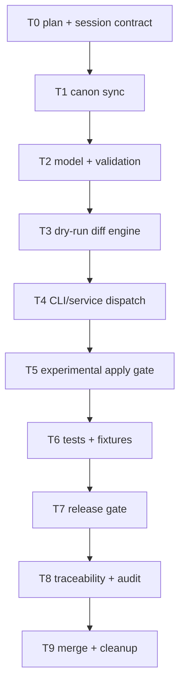

# mi-lsp nav edit-plan Implementation Plan

**Goal:** Add `mi-lsp nav edit-plan` so agents can submit structured patch packets, get deterministic diffs/evidence by default, and optionally apply changes only through an explicit experimental gate.

**Architecture:** The service parses an `edit-plan-v1` packet, validates targets and operations against the resolved workspace, applies changes in memory, emits a unified diff and guardrail evidence, and writes files only when both `--apply` and `--experimental-apply` are present. The CLI is a thin stdin/packet-file frontend over `nav.edit-plan`; the operation remains direct and does not depend on daemon health.

**Tech Stack:** Go CLI/service, Cobra, repo-local file IO, git status checks, existing `model.Envelope`, docs-first governance.

**Context Source:** `ps-contexto` equivalent loaded via `mi-lsp workspace status` and `nav governance`; governance is unblocked and index is current. Current code has CLI nav dispatch in `internal/cli/nav.go`, service dispatch in `internal/service/app.go`, stdin patterns in `nav.batch`/`nav.multi-read`, and direct query routing in `internal/cli/root.go`.

**Runtime:** Codex

**Available Agents:**
- `mi-lsp` - project-specific CLI/navigation guidance.
- `ps-contexto` - context and governance gate.
- `ps-trazabilidad` - traceability closure.
- `ps-auditar-trazabilidad` - read-only closure audit.
- `ae-orquestador` - AE mode and closure policy.
- `writing-plans` - wave-dispatchable implementation plans.
- `pipeline-validator` - validation of execution pipelines.

**Initial Assumptions:** No external Linear/GitHub issue is linked. `nav edit-plan` is a new public CLI surface and therefore requires docs, tests, release gate, local binary refresh, and full integration cleanup. AST edits are explicitly out of scope.

## Goal Index

```yaml
goals:
  - goal_id: G1
    title: "Structured edit plan proposal and experimental apply"
    source_refs:
      rs: []
      fl: [FL-QRY-01]
      rf: [RF-QRY-001, RF-QRY-002, RF-QRY-017, RF-QRY-018]
      ct: [CT-NAV-EDIT-PLAN]
    github_issues: []
    expected_outcome: "Agents can submit a safe patch packet and receive a deterministic diff/evidence, with optional experimental apply only under explicit guardrails."
    done_when:
      - "`mi-lsp nav edit-plan --stdin` returns dry-run diff without writing files."
      - "`--apply` without `--experimental-apply` is rejected."
      - "`--apply --experimental-apply` writes only validated text files in a clean git tree."
      - "Docs, tests, release evidence, traceability and audit are closed."
    evidence_expected:
      - ".docs/auditoria/2026-05-26-mi-lsp-nav-edit-plan/traceability-closure.yaml"
      - ".docs/auditoria/2026-05-26-mi-lsp-nav-edit-plan/traceability-audit.yaml"
      - ".docs/auditoria/2026-05-26-mi-lsp-nav-edit-plan/ae-release-evidence.md"
    stop_if:
      - "governance_blocked=true"
      - "any implementation requires editing .docs/wiki/_mi-lsp/read-model.toml"
      - "apply cannot be made rollback-safe for touched files"
```

## Risks & Assumptions

- Risk: edit tooling can create false confidence. Mitigation: dry-run default, explicit guardrails, hashes, fail-closed validation.
- Risk: apply can diverge from preview. Mitigation: compute diff and revalidate hashes in the same execution before writing.
- Risk: regex replacement can overmatch. Mitigation: `replace_regex_limited` requires `max_replacements` and rejects multiline regex.

## Wave Dispatch Map



## Task Index

- `T0-plan-contract-decision-lock.md`
- `T1-canon-sync.md`
- `T2-model-validation.md`
- `T3-dry-run-diff-engine.md`
- `T4-cli-service-dispatch.md`
- `T5-experimental-apply.md`
- `T6-tests-dogfood.md`
- `T7-ae-release-distribution.md`
- `T8-ps-trazabilidad-audit.md`
- `T9-integrate-main-cleanup.md`
