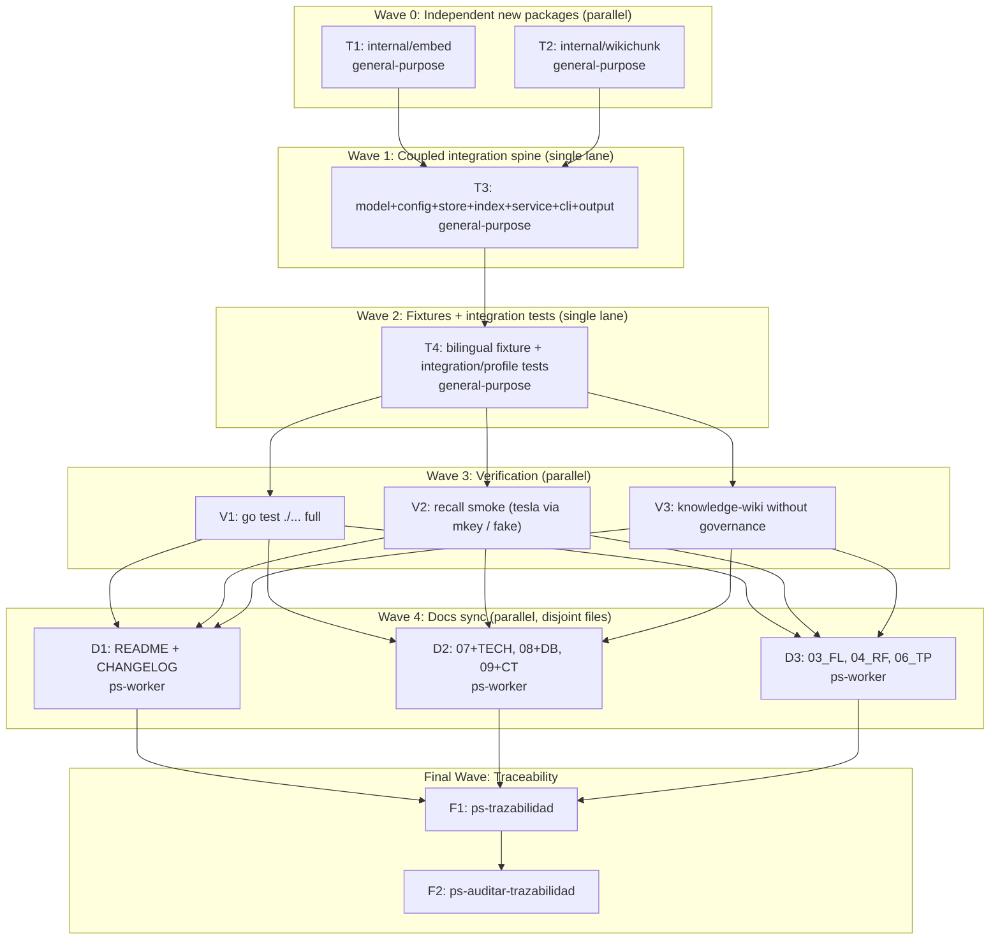

<!--
linear_parent: not_applicable
linear_child: not_applicable
anchors: [".docs/raw/prompts/2026-05-30-semantic-wiki-navigation.md", ".docs/raw/plans/2026-05-30-semantic-wiki-nav-design.md", "RF-QRY-001", "FL-QRY-01"]
allowed_paths: ["cmd/**","internal/**","docs/**","README.md","CHANGELOG.md","testdata/**",".docs/wiki/07_baseline_tecnica.md",".docs/wiki/07_tech/**",".docs/wiki/08_modelo_fisico_datos.md",".docs/wiki/08_db/**",".docs/wiki/09_contratos_tecnicos.md",".docs/wiki/09_contratos/**",".docs/wiki/03_FL.md",".docs/wiki/04_RF.md",".docs/wiki/06_matriz_pruebas_RF.md",".docs/raw/plans/**",".docs/auditoria/2026-05-30-semantic-wiki-nav/**","go.mod","go.sum"]
forbidden_paths: [".git/**",".mi-lsp/**",".docs/wiki/_mi-lsp/read-model.toml",".docs/wiki/00_gobierno_documental.md",".env",".env.*","**/*.pem","**/*.key","**/*.pfx","dist/**","worker-dotnet/**"]
verify: ["go build ./...","go test ./...","mi-lsp nav governance --workspace mi-lsp --format toon"]
stop_if: ["existing go test ./... not green at baseline","forbidden_path_touched","compile coupling forces editing a code LSP backend"]
secret_scan: "none — api_key only referenced by env-var NAME (MI_LSP_EMBEDDINGS_API_KEY); no real secret in repo"
-->

# Semantic Knowledge-Wiki Navigation — Implementation Plan

**Goal:** Add a pluggable OpenAI-compatible embeddings backend + a `nav recall` semantic-search command over markdown knowledge wikis, with a `knowledge-wiki` profile that bypasses the spec-driven governance gate; generalize the Source Map navigability pattern. Additive, non-breaking.

**Architecture:** New pure-Go packages `internal/embed` (OpenAI-compatible HTTP client + cosine + BLOB codec) and `internal/wikichunk` (heading chunker). A `wiki_chunk_embeddings` BLOB table in `.mi-lsp/index.db`. Indexing computes/persists chunk vectors incrementally; `nav recall` embeds the query, ranks by cosine, returns `archivo § heading + score + snippet`. Endpoint offline ⇒ lexical fallback. No CGO, no heavy deps.

**Tech Stack:** Go 1.24, `modernc.org/sqlite` (pure-Go), `spf13/cobra`, stdlib `net/http`/`encoding/json`/`encoding/binary`.

**Context Source:** ps-contexto + governance gate (governance_blocked=false, in_sync). Exploration workflow (5 Explore agents) mapped exact hook points — see `.docs/auditoria/2026-05-30-semantic-wiki-nav/exploration/exploration-findings.md`. Baseline `go test ./...` green (EXIT=0). Full design: `.docs/raw/plans/2026-05-30-semantic-wiki-nav-design.md`.

**Runtime:** CC

**Available Agents:**
- `ps-worker` — general-purpose file/git/config/docs/shell execution
- `ps-explorer` — read-only code + docs exploration
- `general-purpose` — multi-step research and code tasks
- `Explore` — read-only fan-out search
- (Go implementation routed to `general-purpose`/`ps-worker`; no Go-specialist agent exists, so the most capable general agent is used with zero-inference subdocs.)

**Initial Assumptions:**
- `modernc.org/sqlite` pure-Go (verified go.mod:13) ⇒ vector store is BLOB + Go cosine; sqlite-vec/CGO rejected.
- Existing tests must stay green; the semantic path is additive and degradable.
- tesla endpoint is reachable from the dev host's tailnet for the optional real smoke; otherwise a fake httptest server provides deterministic vectors.

## Goal Index

```yaml
goals:
  - goal_id: G1
    title: "Pluggable embeddings backend + semantic index"
    source_refs: {rs: [], fl: ["FL-IDX-01"], rf: ["RF-IDX-001"], ct: []}
    github_issues: []
    expected_outcome: "mi-lsp index embeds markdown wiki chunks via an OpenAI-compatible endpoint and persists vectors incrementally in .mi-lsp/index.db."
    done_when: ["go build ./... exits 0","wiki_chunk_embeddings table created and populated by a fixture index run"]
    evidence_expected: ["go-test-final.txt","integration test output"]
    stop_if: ["a CGO dependency would be required","an existing code LSP backend must be rewritten"]
  - goal_id: G2
    title: "nav recall semantic command (ungated) + knowledge-wiki profile"
    source_refs: {rs: [], fl: ["FL-QRY-01"], rf: ["RF-QRY-001"], ct: []}
    github_issues: []
    expected_outcome: "mi-lsp nav recall <query> returns archivo § heading + score + snippet; works on a knowledge-wiki WITHOUT 00_gobierno_documental.md; ES query retrieves an EN note by meaning."
    done_when: ["nav recall returns ranked sections for a query","knowledge-wiki fixture (no governance) is not blocked","bilingual ES->EN recall test passes"]
    evidence_expected: ["recall-smoke.txt","knowledge-wiki-no-governance.txt"]
    stop_if: ["recall would require the governance gate to pass"]
  - goal_id: G3
    title: "Docs sync + Source Map generalization + closure"
    source_refs: {rs: [], fl: [], rf: [], ct: []}
    github_issues: []
    expected_outcome: "README/CHANGELOG/07-08-09 + TECH/DB/CT + FL/RF/TP synced; nav recall documented as the generalized Source Map navigator; traceability closed."
    done_when: ["docs reference nav recall + [embeddings] + knowledge-wiki profile","ps-trazabilidad + ps-auditar-trazabilidad pass"]
    evidence_expected: ["traceability-closure.yaml","audit output"]
    stop_if: ["cross-layer drift cannot be resolved"]
```

## Risks & Assumptions

**Assumptions needing validation:**
- tesla reachable for real smoke — validate with a single curl/embed probe; if unreachable, the fake-server integration test still proves multilingual recall.
- Heading chunker must not split inside fenced code blocks — covered by unit tests.

**Known risks:**
- Coupled Go compile unit (model↔store↔service↔cli). Mitigation: the spine is ONE sequential lane (T3) that ends on `go build ./...` green; new packages (T1/T2) are isolated.
- Parallel agents writing the same file / racing git. Mitigation: waves are partitioned so no two concurrent lanes touch the same file; agents do NOT run git — the orchestrator commits per wave.

**Unknowns:**
- Exact line numbers may have drifted — every task instructs the agent to READ the hook file before editing (line numbers are hints, not literals).

---

## Wave Dispatch Map

A wave groups tasks with no unresolved cross-dependencies. Waves run in sequence; tasks within a wave run in parallel (Workflow tool). The orchestrator commits after each wave (agents never run git → no race). Concurrent lanes are always file-disjoint.



## Task Index

| Task | Goal | Wave | Agent | Subdoc | Done When |
|------|------|------|-------|--------|-----------|
| T1 | G1 | 0 | general-purpose | `./2026-05-30-semantic-wiki-nav/T1-embed.md` | `go test ./internal/embed/...` green |
| T2 | G1 | 0 | general-purpose | `./2026-05-30-semantic-wiki-nav/T2-wikichunk.md` | `go test ./internal/wikichunk/...` green |
| T3 | G1,G2 | 1 | general-purpose | `./2026-05-30-semantic-wiki-nav/T3-integration-spine.md` | `go build ./...` exits 0 |
| T4 | G2 | 2 | general-purpose | `./2026-05-30-semantic-wiki-nav/T4-fixtures-tests.md` | targeted `go test` green incl. ES→EN + no-gov |
| V1 | G1,G2 | 3 | ps-worker | inline (T5 verify) | `go test ./...` exits 0 |
| V2 | G2 | 3 | ps-worker | inline (T5 verify) | recall returns ranked items (real or fake) |
| V3 | G2 | 3 | ps-worker | inline (T5 verify) | knowledge-wiki indexes+recalls without 00_gobierno |
| D1 | G3 | 4 | ps-worker | `./2026-05-30-semantic-wiki-nav/D1-readme-changelog.md` | README+CHANGELOG mention recall |
| D2 | G3 | 4 | ps-worker | `./2026-05-30-semantic-wiki-nav/D2-tech-canon.md` | 07/08/09 + TECH/DB/CT synced |
| D3 | G3 | 4 | ps-worker | `./2026-05-30-semantic-wiki-nav/D3-fl-rf-tp.md` | FL/RF/TP entries added |
| F1 | all | F | — | inline | ps-trazabilidad closure produced |
| F2 | all | F | — | inline | ps-auditar-trazabilidad clean |

## Final Wave (inline)

**F1 — ps-trazabilidad:** classify change (additive command + config + schema + docs), verify FL/RF/data-model/test/technical-layer sync, produce `.docs/auditoria/2026-05-30-semantic-wiki-nav/traceability-closure.yaml`.

**F2 — ps-auditar-trazabilidad:** read-only cross-document audit; verify every goal's `expected_outcome`/`done_when`/`evidence_expected`/`stop_if` checked; flag any drift; then `scripts/ae/pre-push-guard.ps1` before PR.

**Binary-affecting note:** This change rebuilds the `mi-lsp` binary. Per session contract, AE-RELEASE-DISTRIBUTION publish is WAIVED this cycle (merge via PR; no GitHub release requested). Record the waiver in closure.
