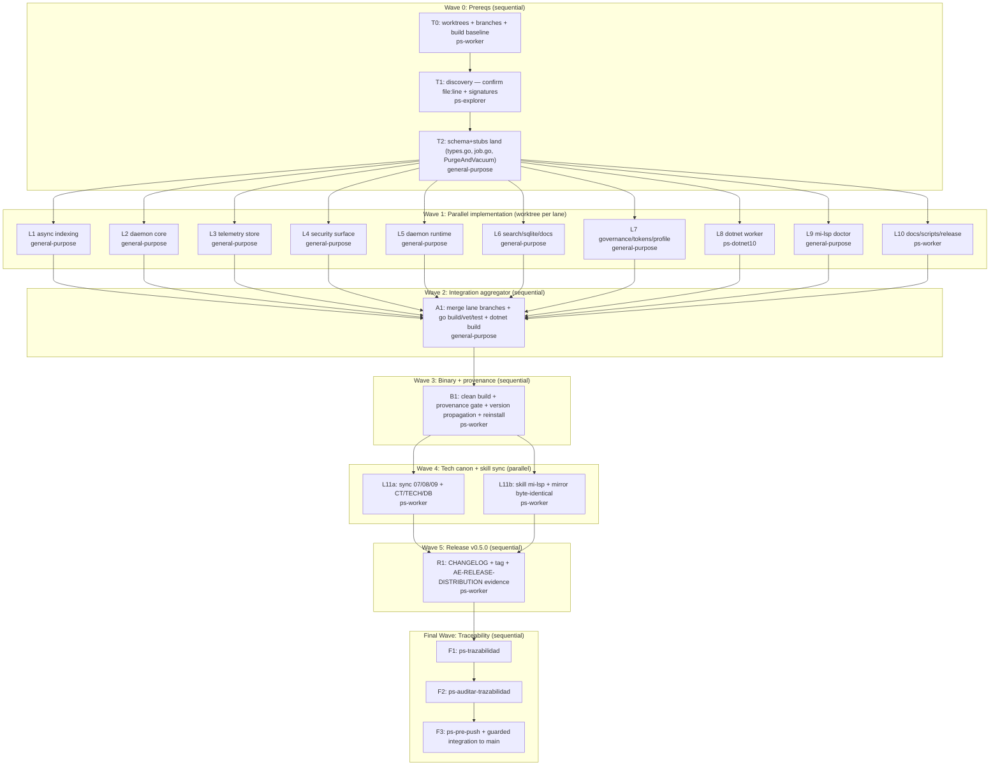

# mi-lsp v0.5.0 Remediation Implementation Plan

**Goal:** Resolver los 48 hallazgos de la auditoría post-release v0.4.2 más 4 features nuevas (indexado async-first, `--profile agent`, `mi-lsp doctor`, gate de provenance de release) en paralelo por worktree-lane, integrar, refrescar binario+skill, y publicar v0.5.0 con ciclo AE completo.

**Architecture:** CLI Go + daemon (`internal/`, `cmd/`) con worker Roslyn .NET (`worker-dotnet/`). La remediación se descompone en lanes con **propiedad exclusiva de archivos** (ningún archivo Go es escrito por dos lanes), cada lane en su propio git worktree/branch. Las interfaces cruzadas entre lanes se fijan como decisiones bloqueadas en Wave 0 (schema + stubs) para que las lanes compilen en paralelo. Un agregador de integración hace merge por commits, no por archivos sueltos. El binario y la skill se refrescan recién después de integrar y verde.

**Tech Stack:** Go 1.2x, SQLite (modernc/mattn), go-winio (named pipes), fsnotify, .NET 10 + Roslyn MSBuildWorkspace, PowerShell (release/install/AE guards).

**Context Source:** `ps-contexto` (esta sesión): governance `valid` para perfil `spec_backend`, `doc_count=120`, índice `current`, `ae_canon=valid`. Flujos activos FL-IDX-01/QRY-01/DAE-01/BOOT-01/CS-01; entidades `WorkspaceRegistration`, `DaemonState`, `RuntimeSnapshot`, `AccessEvent`, `QueryEnvelope`. Evidencia raíz: `.docs/auditoria/2026-06-09-post-release-audit-v042/informe-auditoria.md` (4 P1, 24 P2, 12 P3; 0 P0). Decisiones de brainstorming bloqueadas: release único v0.5.0; alcance P1+P2+P3 completo; las 4 features nuevas adentro; worktree por lane.

**Runtime:** CC

**Available Agents:**
- `general-purpose` — implementación Go multi-archivo con build/test (Bash); usado para todas las lanes de código Go
- `ps-dotnet10` — cambios .NET en el worker Roslyn (`worker-dotnet/`)
- `ps-worker` — docs, scripts PowerShell, skill, git, config (no genera código .NET/Next)
- `ps-explorer` — exploración read-only para fijar file:line y firmas
- `Explore` — búsqueda read-only de respaldo
- `—` — tareas de cierre inline (trazabilidad/auditoría)

**Initial Assumptions:**
1. Los file:line de la auditoría siguen vigentes en HEAD `268f512`; Wave 0/T1 los reconfirma antes de mutar (stop_if si difieren).
2. El indexado async-first puede convivir con el flag `--no-index` actual y con el lock de archivo existente sin romper FL-IDX-01.
3. `worker-dotnet` compila con `dotnet build` local en ARM64; si el SDK .NET 10 no está, L8 queda en `cleanup_blocked` y AUD-04 cierra solo el lado Go (timeout).

## Goal Index

```yaml
goals:
  - goal_id: G1
    title: "Runtime P1: indexado async-first, resolución de workspace, timeout Roslyn, path canon"
    source_refs:
      rs: []
      fl: ["FL-IDX-01", "FL-BOOT-01", "FL-DAE-01"]
      rf: ["RF-IDX-001", "RF-IDX-002", "RF-WKS-001", "RF-DAE-001"]
      ct: ["CT-CLI-DAEMON-ADMIN"]
    github_issues: []
    expected_outcome: "workspace.add/init devuelve <2s con indexado en background; nav.refs contra solution rota falla en <=30s y cachea el fallo; alias mal resuelto se autocorrige cuando el cwd es inequívoco; path duplicado da error accionable."
    done_when:
      - "go test ./internal/indexer/... ./internal/service/... passes"
      - "workspace.add on a >1GB repo returns before 5s with status=indexing"
      - "nav.refs against a broken solution returns error in <=30s on second call without re-spawning MSBuild"
    evidence_expected:
      - ".docs/auditoria/2026-06-09-milsp-v050-remediation/L1-verdict.yaml"
      - ".docs/auditoria/2026-06-09-milsp-v050-remediation/L5-verdict.yaml"
    stop_if:
      - "async index leaves index.db in a half-written state on cancel"
  - goal_id: G2
    title: "Seguridad: frame size, admin auth/CSRF, named pipe SDDL, perms, redacción telemetría, pin rg/git"
    source_refs:
      fl: ["FL-DAE-01"]
      rf: ["RF-DAE-002", "RF-DAE-003"]
      ct: ["CT-CLI-DAEMON-ADMIN"]
    github_issues: []
    expected_outcome: "El daemon rechaza frames >256MB, valida Host/Origin y un token en endpoints mutantes, crea pipe con SDDL restrictivo, escribe state/lock 0o600, redacta paths en telemetría, y resuelve rg/git solo desde rutas confiables."
    done_when:
      - "go test ./internal/daemon/... ./internal/worker/... passes"
      - "POST /api/workspaces/{n}/warm without token returns 401/403"
      - "ReadFrame rejects length > MaxFrameSize with an error, no allocation"
    evidence_expected:
      - ".docs/auditoria/2026-06-09-milsp-v050-remediation/L4-verdict.yaml"
    stop_if:
      - "admin auth change breaks the existing admin UI handshake"
  - goal_id: G3
    title: "Performance: SQLite pragmas, FTS/doc-rank cache, telemetry async+retención, memoria/watcher"
    source_refs:
      fl: ["FL-QRY-01", "FL-IDX-01", "FL-DAE-01"]
      rf: ["RF-QRY-001", "RF-IDX-003", "RF-DAE-004"]
    github_issues: []
    expected_outcome: "wiki.search repetida sirve de cache; SQLite usa cache_size/mmap; telemetría purga+VACUUM por ticker con cap por tamaño; daemon reclama memoria sobre umbral; watcher acota dirs por watcher."
    done_when:
      - "go test ./internal/store/... ./internal/service/... ./internal/daemon/... passes"
      - "repeated identical wiki.search second call latency < 50% of first (bench or logged)"
    evidence_expected:
      - ".docs/auditoria/2026-06-09-milsp-v050-remediation/L3-verdict.yaml"
      - ".docs/auditoria/2026-06-09-milsp-v050-remediation/L6-verdict.yaml"
    stop_if:
      - "telemetry async queue drops events under load"
  - goal_id: G4
    title: "Tokens: --profile agent unificado + recorte de verbosidad de envelopes"
    source_refs:
      fl: ["FL-QRY-01"]
      rf: ["RF-QRY-001"]
      ct: ["CT-CLI-DAEMON-ADMIN"]
    github_issues: []
    expected_outcome: "Un cliente harness (client_name conocido) recibe por defecto salida comprimida, sin recent_accesses ni index_sync_details, con paths deduplicados; daemon status baja de ~6200 a <1500 tokens en modo agent."
    done_when:
      - "go test ./internal/output/... ./internal/service/... passes"
      - "daemon status --profile agent token estimate < 1500"
    evidence_expected:
      - ".docs/auditoria/2026-06-09-milsp-v050-remediation/L2-verdict.yaml"
      - ".docs/auditoria/2026-06-09-milsp-v050-remediation/L7-verdict.yaml"
    stop_if:
      - "compress default breaks manual-cli human-readable output"
  - goal_id: G5
    title: "Self-check y release hygiene: mi-lsp doctor + gate de provenance + version propagation"
    source_refs:
      fl: ["FL-BOOT-01", "FL-DAE-01"]
      rf: ["RF-DAE-001"]
    github_issues: []
    expected_outcome: "mi-lsp doctor reporta los riesgos de la auditoría; el script de release rechaza binarios +dirty y verifica que el daemon reporte la versión real (no 'dev')."
    done_when:
      - "mi-lsp doctor exits 0 on a clean install and non-zero with findings on a dirty one"
      - "ae-release-binaries.ps1 aborts when build tree is dirty"
      - "daemon status reports version=v0.5.0 (not dev) after spawn from release binary"
    evidence_expected:
      - ".docs/auditoria/2026-06-09-milsp-v050-remediation/L9-verdict.yaml"
      - ".docs/auditoria/2026-06-09-milsp-v050-remediation/release-provenance.yaml"
    stop_if:
      - "doctor itself mutates daemon or workspace state"
  - goal_id: G6
    title: "Docs/policy/skill sync + release v0.5.0"
    source_refs:
      fl: []
      rf: []
      ct: ["CT-CLI-DAEMON-ADMIN"]
    github_issues: []
    expected_outcome: "07/08/09 + CT/TECH/DB sincronizados con el nuevo comportamiento; CLAUDE.md/AGENTS.md deduplicados; AE docs con manifest mínimo; skill mi-lsp y su mirror byte-idénticos; v0.5.0 taggeado con evidencia AE-RELEASE-DISTRIBUTION."
    done_when:
      - "scripts/compare-skill-mirrors.ps1 reports byte_identical for mi-lsp skill"
      - "mi-lsp nav governance reports in_sync after index rebuild"
      - "git tag v0.5.0 exists with CHANGELOG entry and provenance evidence"
    evidence_expected:
      - ".docs/auditoria/2026-06-09-milsp-v050-remediation/traceability-closure.yaml"
      - ".docs/auditoria/2026-06-09-milsp-v050-remediation/evidence-index.yaml"
    stop_if:
      - "skill source and mirror hashes differ"
      - "docs still describe pre-change behavior after sync"
```

---

## Risks & Assumptions

**Assumptions needing validation (Wave 0 / T1 discovery):**
- Los file:line de la auditoría siguen vigentes — T1 los reconfirma con `mi-lsp nav search`/`nav refs`; stop_if si difieren.
- `internal/model/types.go` puede recibir todos los campos nuevos de tokens en un único commit Wave 0 sin romper serialización TOON/JSON — T2 valida con `go build`.
- El worker .NET puede detectar nombres de proyecto duplicados antes de cargar la solution — L8 valida con un .sln de prueba.

**Known risks:**
- **Contención en archivos calientes** (`server.go`, `state_store.go`, `workspace_ops.go`, `model/types.go`). Mitigación: propiedad exclusiva por lane (matriz abajo) + cambios de struct consolidados en Wave 0 (T2).
- **Acoplamiento de interfaz async-index entre L1 (motor) y L2 (server.go llama)**. Mitigación: firma `StartBackgroundIndex(ctx, reg) (jobID string, err error)` bloqueada en T2 como stub; L1 implementa, L2 consume.
- **Cambio de comportamiento `governance-ae-canon-blocking`** podría alterar `docs_ready` en otros workspaces no-AE. Mitigación: L7 lo hace condicional a que el workspace declare capa AE; test de no-regresión sobre `axi-smoke` (declara AE) y un workspace sintético sin AE.
- **Carrera git entre subagentes** (memoria conocida). Mitigación: worktree+branch por lane; el agregador serializa los merges; ningún subagente hace push.
- **Default compress rompiendo salida humana**. Mitigación: `--profile agent` se activa por `client_name`, nunca para `manual-cli`; default humano intacto.

**Unknowns:**
- ¿`go-winio` permite SDDL en la versión vendorizada? — T1 inspecciona `go.mod`/uso de `ListenPipe`; si no, L4 documenta y baja SEC-03 a follow-up.
- ¿El SDK .NET 10 está disponible localmente para construir el worker? — Wave 3 lo verifica antes de regenerar binarios; si no, release usa worker pre-construido y se registra drift.

---

## Cross-Lane Locked Interfaces (Wave 0 / T2)

Estas firmas se materializan como stubs en T2 antes de Wave 1. Ninguna lane las cambia; las consumen.

```go
// internal/indexer/job.go  (NEW, owned by L1)
// Arranca indexado en background; devuelve jobID inmediatamente.
func (e *Engine) StartBackgroundIndex(ctx context.Context, reg model.WorkspaceRegistration, mode IndexMode) (jobID string, err error)
func (e *Engine) IndexJobStatus(jobID string) (IndexJobState, bool)

// internal/store/state_store.go  (owned by L3) — método consumido por L2 ticker
func (s *StateStore) PurgeAndVacuum(retentionDays int, maxBytes int64) (purged int, vacuumed bool, err error)

// internal/model/types.go  (owned by L7) — campos nuevos consumidos por L2/L3
type AccessEvent struct { /* ...existing...; DecisionHash string `json:"decision_hash,omitempty"` */ }
type OutputProfile string // "human" | "agent"
// QueryEnvelope gana: Profile OutputProfile `json:"-"`  (no se serializa; controla render)
```

## File Ownership Matrix (exclusive write sets — NINGÚN archivo en dos lanes)

```yaml
L1_async_indexing:
  agent: general-purpose
  owns: [internal/indexer/indexer.go, internal/indexer/job.go(new), internal/store/index_lock.go, internal/store/queries_incremental.go, internal/store/index_publish.go, internal/service/workspace_ops.go, internal/cli/index.go, internal/cli/init.go]
  findings: [AUD-01, AUD-05, index-lock-no-timeout, incremental-indexing-unused, autoindex-no-background, AUD-07(memory snapshot publish), workspace_init_extreme_latency]
L2_daemon_core:
  agent: general-purpose
  owns: [internal/daemon/server.go, internal/daemon/options.go]
  findings: [AUD-01(server exec-ctx wraps StartBackgroundIndex), AUD-02(version propagation), SEC-09(protocol version required), PERF-05(retention ticker), backpressure-limited-scope, TOK-01(recent_accesses default 5/opt-in), daemon-version-mismatch-risk]
L3_telemetry_store:
  agent: general-purpose
  owns: [internal/daemon/state_store.go, internal/telemetry/access_diagnostics.go, internal/telemetry/access_events.go]
  findings: [telemetry-sqlite-contention(PERF-06), SEC-04(perms 0o600), SEC-05(path redaction), TOK-02(decision_json->hash), TOK-03(workspace_root dedup), PERF-05(PurgeAndVacuum impl)]
L4_security_surface:
  agent: general-purpose
  owns: [internal/daemon/admin.go, internal/daemon/admin_ui.go, internal/daemon/server_windows.go, internal/daemon/server_unix.go, internal/worker/protocol.go]
  findings: [SEC-01(frame size), SEC-02(admin auth+Host/Origin), SEC-03(named pipe SDDL), SEC-10(CSP/X-Frame), admin-warm-no-auth]
L5_daemon_runtime:
  agent: general-purpose
  owns: [internal/daemon/lifecycle.go, internal/daemon/file_watcher.go]
  findings: [AUD-04(per-call timeout + failure cache), PERF-07(memory reclaim policy), PERF-08(watcher dir cap), watcher-debounce-per-file]
L6_search_sqlite_docs:
  agent: general-purpose
  owns: [internal/store/db.go, internal/store/queries_docs.go, internal/service/doc_query_context.go, internal/service/doc_ranking.go, internal/service/search.go, internal/service/config.go, internal/indexer/incremental.go, internal/indexer/search_text.go]
  findings: [PERF-02(doc rank cache), PERF-03(FTS cache+optimize), PERF-04(sqlite pragmas), AUD-06(search timeout 7-10s), SEC-06(rg/git PATH pin + MI_LSP_GIT)]
L7_governance_tokens_profile:
  agent: general-purpose
  owns: [internal/docgraph/governance.go, internal/service/governance.go, internal/output/formatter.go, internal/output/truncator.go, internal/workspace/registry.go, internal/cli/root.go, internal/model/types.go]
  findings: [AUD-03(resolution autocorrect), governance-ae-canon-blocking, TOK-04(index_sync opt-in), TOK-05(--profile agent/auto-compress), TOK-06(ae_canon repeat), envelope-limits-double-apply, ae-canon-modules-hardcoded, workspace-resolution-complex-hint, output-format-ae-canon-verbosity, protocol-version-optional(doc), toon-format-auto-compress]
L8_dotnet_worker:
  agent: ps-dotnet10
  owns: [worker-dotnet/MiLsp.Worker/RoslynService.cs, worker-dotnet/MiLsp.Worker/Program.cs, worker-dotnet/MiLsp.Worker/ProtocolModels.cs]
  findings: [AUD-04(.NET side: detect duplicate project names, fail fast with diagnostic), worker_roslyn(documented signing follow-up note)]
L9_doctor_cmd:
  agent: general-purpose
  owns: [internal/cli/doctor.go(new), internal/service/doctor.go(new)]
  findings: [NEW mi-lsp doctor, truncation_high_rate(surface), nav_recall_latency(surface)]
L10_docs_scripts_release:
  agent: ps-worker
  owns: [scripts/release/ae-release-binaries.ps1, scripts/install/install.ps1, scripts/install/install-agent.ps1, scripts/ae/pre-push-guard.ps1, CLAUDE.md, AGENTS.md, PATHS.md, .docs/wiki/ae/**, CHANGELOG.md]
  findings: [NEW release provenance gate, SEC-07(MSBuild doc), SEC-08(GITHUB_TOKEN warning), pre-push-guard-session-contract-strictness(migration note), TOK-07(CLAUDE/AGENTS dedup), TOK-08(AE manifest lazy-load)]
L11_tech_canon_skill:
  agent: ps-worker
  owns: [.docs/wiki/07_baseline_tecnica.md, .docs/wiki/07_tech/**, .docs/wiki/08_modelo_fisico_datos.md, .docs/wiki/08_db/**, .docs/wiki/09_contratos_tecnicos.md, .docs/wiki/09_contratos/**, C:/Users/fgpaz/.agents/skills/mi-lsp/**, C:/repos/buho/assets/skills/mi-lsp/**]
  findings: [docs sync 07/08/09 for async-index/admin-auth/telemetry/profile, skill update + mirror]
```

---

## Wave Dispatch Map



## Task Index Table

| Task | Goal | Wave | Agent | Subdoc | Issue/Card | Done When |
|------|------|------|-------|--------|------------|-----------|
| T0 | G6 | 0 | ps-worker | `./2026-06-09-milsp-v050-remediation/T0-setup.md` | — | worktrees+branches creados, `go build ./...` exit 0 baseline |
| T1 | G1-G5 | 0 | ps-explorer | `./2026-06-09-milsp-v050-remediation/T1-discovery.md` | — | `discovery.yaml` con file:line confirmados o stop |
| T2 | G1,G4 | 0 | general-purpose | `./2026-06-09-milsp-v050-remediation/T2-schema-stubs.md` | — | `go build ./...` exit 0 con stubs |
| L1 | G1 | 1 | general-purpose | `./2026-06-09-milsp-v050-remediation/L1-async-indexing.md` | — | go test indexer/service exit 0; add<5s |
| L2 | G1,G4,G5 | 1 | general-purpose | `./2026-06-09-milsp-v050-remediation/L2-daemon-core.md` | — | go test daemon exit 0; version propagada |
| L3 | G2,G3,G4 | 1 | general-purpose | `./2026-06-09-milsp-v050-remediation/L3-telemetry-store.md` | — | go test store/telemetry exit 0 |
| L4 | G2 | 1 | general-purpose | `./2026-06-09-milsp-v050-remediation/L4-security-surface.md` | — | go test daemon/worker exit 0; warm sin token 401 |
| L5 | G1,G3 | 1 | general-purpose | `./2026-06-09-milsp-v050-remediation/L5-daemon-runtime.md` | — | go test daemon exit 0; refs<30s 2da llamada |
| L6 | G3 | 1 | general-purpose | `./2026-06-09-milsp-v050-remediation/L6-search-sqlite-docs.md` | — | go test store/service exit 0 |
| L7 | G4 | 1 | general-purpose | `./2026-06-09-milsp-v050-remediation/L7-governance-tokens-profile.md` | — | go test output/service exit 0; profile<1500tok |
| L8 | G1 | 1 | ps-dotnet10 | `./2026-06-09-milsp-v050-remediation/L8-dotnet-worker.md` | — | dotnet build exit 0; duplicado detectado |
| L9 | G5 | 1 | general-purpose | `./2026-06-09-milsp-v050-remediation/L9-doctor.md` | — | go build exit 0; doctor corre read-only |
| L10 | G5,G6 | 1 | ps-worker | `./2026-06-09-milsp-v050-remediation/L10-docs-scripts-release.md` | — | provenance gate aborta en dirty |
| A1 | all | 2 | general-purpose | `./2026-06-09-milsp-v050-remediation/A1-integration.md` | — | merge limpio; go build/vet/test verde |
| B1 | G5 | 3 | ps-worker | `./2026-06-09-milsp-v050-remediation/B1-binary-provenance.md` | — | binario vcs_modified=false; doctor exit 0 |
| L11a | G6 | 4 | ps-worker | `./2026-06-09-milsp-v050-remediation/L11a-tech-canon.md` | — | nav governance in_sync tras reindex |
| L11b | G6 | 4 | ps-worker | `./2026-06-09-milsp-v050-remediation/L11b-skill-mirror.md` | — | compare-skill-mirrors byte_identical |
| R1 | G6 | 5 | ps-worker | `./2026-06-09-milsp-v050-remediation/R1-release.md` | — | tag v0.5.0 + provenance evidence |
| F1 | all | F | — | inline | — | ps-trazabilidad packet escrito |
| F2 | all | F | — | inline | — | ps-auditar-trazabilidad Approved |
| F3 | all | F | — | inline | — | ps-pre-push PASS + push a main verificado |

---

## Final Wave: Traceability Closure (inline, sequential, NON-OPTIONAL)

**F1 — ps-trazabilidad:** Cerrar cadena `00 -> FL -> RF -> 08/09/10 -> TP` para G1-G6. Verificar sync de `07_baseline_tecnica.md`, `08_modelo_fisico_datos.md`, `09_contratos_tecnicos.md` y owners `TECH-*`/`DB-*`/`CT-*` (CT-CLI-DAEMON-ADMIN para admin auth, telemetría, profile). Escribir `.docs/auditoria/2026-06-09-milsp-v050-remediation/traceability-closure.yaml` con `git_before/after`, `changed_paths`, `scope_verdict`, `no_drift_snapshot`, `shared_skill_sync` (hashes source/mirror), `runtime_sensitive: true` con evidencia de `mi-lsp doctor` + `mi-lsp version`.

**F2 — ps-auditar-trazabilidad:** Auditoría read-only severity-based. Verificar contra el contrato de sesión: allowed/forbidden paths, propiedad exclusiva de archivos respetada, ningún archivo Go en dos branches de lane, drift de docs vs runtime cero, mirror de skill byte-idéntico, provenance del binario (vcs_modified=false), daemon version != dev. Verdict `Approved`/`Approved with follow-ups`/`Blocked`.

**F3 — ps-pre-push + integración guarded:** Correr `scripts/ae/pre-push-guard.ps1` con el contrato de sesión. Si verde + F2 Approved + CI verde → merge guarded de la rama de integración a `main` (`gh pr merge --merge --admin --delete-branch` solo si protección lo exige y CI verde). Verificar HEAD remoto == local pusheado. Limpiar worktrees de lane vía `finishing-a-development-branch`.
