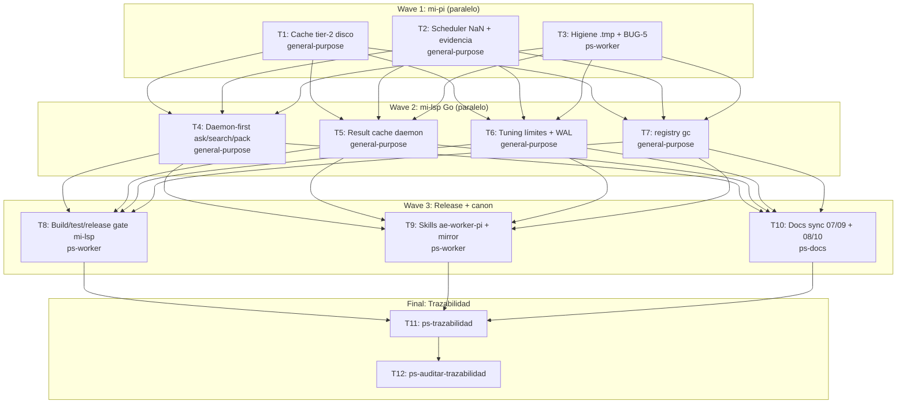

# Max Optimización mi-lsp × mi-pi Implementation Plan

**Goal:** Escalar `ae-worker-pi` con mi-lsp vivo de 3 a 50 workers concurrentes multi-proyecto, colapsando trabajo repetido (seeds, cargas de índice, cola NaN invisible) a estado compartido por máquina.

**Architecture:** Ola 1 hace que los N procesos pi compartan estado por disco (cache tier-2 de seed/context por `(workspace, generación)`) y compitan por 3 slots NaN máquina-wide con lanes encoladas baratas (sesión pi creada recién al adquirir slot). Ola 2 lleva las queries caras de mi-lsp al daemon caliente (routing + result cache por generación) y sube los límites del pool. Ola 3 proyecta las nuevas reglas al canon y las skills.

**Tech Stack:** TypeScript/Node (mi-pi extensions + scripts ESM), Go (mi-lsp CLI/daemon), SQLite, skills Markdown.

**Context Source:** ps-contexto + governance gate OK (`governance_blocked=false`, profile spec_backend, in_sync). Diagnóstico por 3 exploradores paralelos + forensic audit 2026-07-09 de mi-pi: (M1) cache seed/context en memoria por proceso — 27 seeds duplicados por TTL; (M2) `nav.ask/search/pack` siempre directos — 27 cargas de índice SQLite `MaxOpenConns=1`; (M3) doble spawn node+mi-lsp por tool call — 16 node vivos, 1.88 GB RAM; (M4) `max_concurrent_text_requests=3` en NaN sin semáforo global — timeouts en cola invisible; (M5) `.tmp` 273 MB/5827 dirs, registry 493 workspaces, WAL 5.7 MB sin checkpoint, pool runtimes=3 con thrash LRU.

**Runtime:** CC

**Available Agents:**
- `general-purpose` — tareas de código multi-paso (tools: *)
- `ps-worker` — ejecución general no-código: scripts, git, config, docs
- `ps-explorer` — exploración read-only
- `ps-docs` — documentación wiki/specs
- `Explore` — búsqueda read-only

**Initial Assumptions:**
- El daemon mi-lsp puede ejecutar `nav.ask/search/pack` server-side por la misma capa de servicio (si falta handler, T4 se bloquea y reporta).
- El mtime/generación de `.mi-lsp/index.db` es una clave de invalidación válida para el cache tier-2.
- Los 3 slots NaN son por API key (una key por máquina) — el scheduler global por usuario de OS es el scope correcto.

## Goal Index

```yaml
goals:
  - goal_id: G1
    title: "Ola 1 — mi-pi: estado compartido por disco + admisión controlada NaN"
    source_refs: { rs: [], fl: [], rf: [], ct: ["CT-MIPI-NAN-MODELS-01"] }
    github_issues: []
    expected_outcome: "Con N procesos pi sobre el mismo workspace, 1 solo seed/context por TTL; con M>3 lanes concurrentes en toda la máquina, 0 timeouts por cola NaN invisible; evidencia model-selection/fallback-chain/verdict por spawn"
    done_when:
      - "npm run mi-pi:check exit 0 y smoke native-milsp PASS"
      - "2 procesos concurrentes sobre el mismo workspace producen 1 solo directorio de seed nuevo (log de cache HIT en el segundo)"
      - "pi-fanout con 6 lanes y MI_PI_NAN_MAX_CONCURRENT=3 completa 6/6 sin timeout de cola"
    evidence_expected:
      - ".docs/auditoria/2026-07-09-max-optimizacion-milsp-mipi/wave1-verify.md en mi-pi"
    stop_if:
      - "smoke native-milsp FAIL tras cambios"
  - goal_id: G2
    title: "Ola 2 — mi-lsp Go: daemon-first + result cache + límites + registry gc"
    source_refs: { rs: [], fl: ["FL-QRY-01","FL-DAE-01"], rf: ["RF-QRY-001","RF-QRY-004","RF-DAE-001","RF-DAE-002","RF-DAE-003"], ct: [] }
    github_issues: []
    expected_outcome: "nav.ask/search/pack sirven desde el daemon caliente con fallback directo; queries repetidas devuelven cache hit; defaults del daemon soportan 50 clientes; registry purgable"
    done_when:
      - "go build ./... y go test ./internal/... exit 0"
      - "con daemon vivo, nav ask ejecuta vía daemon (telemetría/log lo evidencia) y con daemon caído sigue funcionando directo"
      - "mi-lsp registry gc --dry-run lista workspaces muertos sin borrar"
    evidence_expected:
      - ".docs/auditoria/2026-07-09-max-optimizacion-milsp-mipi/wave2-verify.md en mi-lsp"
    stop_if:
      - "daemon no expone las ops y agregarlas requiere rediseño de protocolo (reportar, no improvisar)"
  - goal_id: G3
    title: "Ola 3 — canon y skills sincronizados con las nuevas reglas"
    source_refs: { rs: [], fl: [], rf: [], ct: ["CT-MIPI-NAN-MODELS-01"] }
    github_issues: []
    expected_outcome: "ae-worker-pi (y mirror buho) enseñan scheduler global de máquina; wikis 07/09 (mi-lsp) y 08/10 (mi-pi) reflejan runtime real; release gate mi-lsp cerrado o waiver registrado"
    done_when:
      - "sha256 de SKILL.md igual en ~/.agents y mirror buho"
      - "mi-lsp nav governance sigue governance_blocked=false tras docs sync"
    evidence_expected:
      - "closure packet con hashes de mirror y paths de docs tocados"
    stop_if:
      - "mirror buho inexistente o divergente de forma no explicable"
```

---

## Risks & Assumptions

**Assumptions needing validation:**
- Daemon soporta `nav.ask/search/pack` server-side — T4 lo valida leyendo `internal/daemon/server.go` antes de tocar routing.
- Lockfiles con `wx` + reclaim por mtime funcionan en Windows/ARM64 — T2 incluye smoke de contención.

**Known risks:**
- Carrera de commits entre subagentes en el mismo repo — mitigación: los subagentes NO commitean; el orquestador commitea secuencialmente por ola.
- `pi-worker-launch.mjs` tiene drift preexistente sin commitear — se integra deliberadamente en el commit de T2 (waiver en session contract).
- Release de binarios mi-lsp (ARM64) — T8 cierra con `ae-release-binaries.ps1` o waiver explícito registrado.

**Unknowns:**
- Hit-rate real del result cache del daemon — se mide post-implementación con telemetría; no bloquea diseño (LRU acotado).

---

## Wave Dispatch Map



| Task | Goal | Wave | Agent | Subdoc | Issue/Card | Done When |
|------|------|------|-------|--------|------------|-----------|
| T1 | G1 | 1 | general-purpose | `./2026-07-09-max-optimizacion-milsp-mipi/T1-cache-tier2-disco.md` | — | smoke PASS + cache HIT cross-proceso |
| T2 | G1 | 1 | general-purpose | `./2026-07-09-max-optimizacion-milsp-mipi/T2-scheduler-nan-evidencia.md` | — | 6 lanes / 3 slots sin timeout + 4 yaml de evidencia por spawn |
| T3 | G1 | 1 | ps-worker | `./2026-07-09-max-optimizacion-milsp-mipi/T3-higiene-tmp.md` | — | pi-tmp-clean --dry-run lista y --apply borra >7d |
| T4 | G2 | 2 | general-purpose | `./2026-07-09-max-optimizacion-milsp-mipi/T4-daemon-first-routing.md` | — | go test OK + ask via daemon con fallback |
| T5 | G2 | 2 | general-purpose | `./2026-07-09-max-optimizacion-milsp-mipi/T5-result-cache-daemon.md` | — | go test OK + hit en query repetida |
| T6 | G2 | 2 | general-purpose | `./2026-07-09-max-optimizacion-milsp-mipi/T6-tuning-limites-wal.md` | — | go test OK + defaults nuevos documentados |
| T7 | G2 | 2 | general-purpose | `./2026-07-09-max-optimizacion-milsp-mipi/T7-registry-gc.md` | — | registry gc --dry-run funciona |
| T8 | G2 | 3 | ps-worker | `./2026-07-09-max-optimizacion-milsp-mipi/T8-release-gate.md` | — | build+test verde, binario instalado o waiver |
| T9 | G3 | 3 | ps-worker | `./2026-07-09-max-optimizacion-milsp-mipi/T9-skills-sync.md` | — | sha256 igual en skill y mirror |
| T10 | G3 | 3 | ps-docs | `./2026-07-09-max-optimizacion-milsp-mipi/T10-docs-sync.md` | — | governance sigue verde en ambos repos |
| T11 | all | F | — | inline | — | closure packet completo |
| T12 | all | F | — | inline | — | audit APPROVED |

## Protocolo de despacho — ae-adapter-claude-code + ae-worker-pi

Este plan se ejecuta con la topología del adapter (root estratégico → supervisores → leaf workers pi):

```yaml
leaf_executor_selection_gate:
  orchestration_role: strategic_root        # esta sesión: decide, joinea, juzga
  execution_supervisor: claude_code_subagent_sonnet_medium  # 1 por tarea, despachado por ola
  leaf_default: pi_native_nan_qwen36_via_pi-worker-launch   # mi-lsp vivo
  delegation_boundary:
    strategic_root_may_launch_pi_nan: false   # el root NO corre los launchers
    execution_supervisor_may_launch_pi_nan: true
    leaf_may_subdelegate: false
  pi_nan_launch_owner: execution_supervisor
  child_supervisor_required: true
```

**Reglas operativas por tarea (obligatorias para cada supervisor):**
1. **Descubrimiento → pi worker read-only primero**: antes de editar, lanzar 1-3 micro-lanes read-only `node C:/repos/mios/mi-pi/scripts/pi-worker-launch.mjs --id <lane> --workspace <repo> --brief "<worker_packet de una sola pregunta>"` (o `pi-fanout.mjs --lanes-file`) para extraer las regiones exactas y confirmar anclajes. Key injection NO necesaria (authStorage resuelve desde models.json — verificado 2026-07-09); nunca imprimir la key.
2. **Authoring**: lanes de código acotadas pueden delegarse a `nan/qwen3.6` como propuestas exact-string `{file, find, replace}` (worker_packet completo: allowed_paths, forbidden_paths, verify, stop_if, output_format, max_output_lines). Código sensible a concurrencia (locks, singleflight) puede autorarlo el supervisor directamente registrando `why_not_nan` en el verdict.
3. **Apply-mechanism (CRÍTICO)**: el supervisor aplica con `pi-apply.mjs --check` → `--apply` o con Edit exact-string del harness. NUNCA `git apply` de un diff crudo de NaN.
4. **Máx 3 lanes pi concurrentes por supervisor** (límite NaN actual; justamente lo que T2 arregla máquina-wide).
5. **Join contra artefactos en disco**: verdict JSON del launcher + salida real; verdict DONE con salida vacía = FAIL. Tras todo worker read-only: `git status --short` (guard de mutación read-only).
6. **Evidencia**: cada supervisor reporta `model_selection` (provider nan, selected_model real, task_class, why_not_cheaper) por lane; el root promueve verdicts a `.docs/auditoria/2026-07-09-max-optimizacion-milsp-mipi/claude-code/worker-registry.yaml`.
7. **Escalación**: FAIL/format-drift de qwen3.6 → 1 retry NaN permitido por chain → el supervisor (sonnet) resuelve inline con `fallback_reason` → conflictos al root. `nan/glm5.2` prohibido (inestable). Modelos no-nan de pi prohibidos para leaf.
8. **Los supervisores y workers NO commitean**; el root commitea secuencialmente por ola.

**Excepción T2**: la tarea edita `pi-worker-launch.mjs` (el launcher mismo). Los lanes pi de descubrimiento se lanzan ANTES de aplicar edits; después de aplicar, el `--dry-run` del launcher modificado es el verify (no lanzar workers live con el launcher a medio editar).

## Final Wave (inline)

**T11 — ps-trazabilidad:** clasificar cambio (runtime multi-repo), verificar sync 07/09 (mi-lsp) y 08/10 (mi-pi), producir `traceability-closure.yaml` en `.docs/auditoria/2026-07-09-max-optimizacion-milsp-mipi/` con evidencia por ola, verdicts de verify, hashes de mirror y disposición de branches/PRs.

**T12 — ps-auditar-trazabilidad:** auditoría read-only cruzada; verificar que cada goal tiene done_when comprobado o gap reportado, que las evidencias existen en disco, y que no queda drift cross-layer. Verdict APPROVED requerido antes del merge guarded.

**Regla de commits:** los subagentes NO ejecutan `git commit`; devuelven diffs aplicados + verify. El orquestador commitea secuencialmente por ola (evita la carrera conocida de commits paralelos en el mismo branch).
