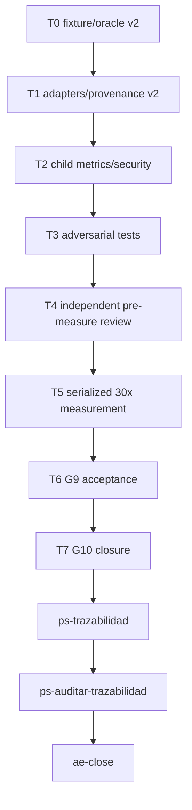

# Graph-native G9–G10 Implementation Plan

**Goal:** Completar G9 con evidencia competitiva reproducible y cerrar G10 localmente sin push, deploy ni publish.

**Architecture:** Mantener Victory Lab v1 intacto y agregar una superficie v2 fail-closed. Ejecutar B→A→C→D por superposición de archivos, revisar antes de medir y serializar toda medición de performance/RSS.

**Tech Stack:** Python 3, Go, SQLite, PowerShell/Windows ARM64, Graphify 0.9.19.

**Context Source:** `ps-contexto`, governance/Harness/Wiki Source PASS y Workflow `wf_7666eac5-ed3`. G1–G8 están aceptados; G9 carece de adapters reales, hashes válidos, RSS hijo y matriz 30x.

**Runtime:** CC

**Available Agents:** `claudex-writer`, `claudex-verifier`, `ps-worker`, `ps-docs`, `verifier-adversarial`.

**Initial Assumptions:** los pins externos siguen limpios; los binarios se reconstruirán antes de medir; baseline graph-only permanece `NOT_COMPARABLE`.

## Goal Index

```yaml
goals:
  - goal_id: G9
    title: Competitive benchmark
    source_refs: {rs: [legacy_missing_governed_disposition], fl: [FL-GPH-01, FL-GPH-02, FL-GPH-03], rf: [RF-GPH-011], ct: [CT-GRAPH-CLI, CT-MILX-V1]}
    github_issues: []
    expected_outcome: Exactly 30 reproducible samples per measured variant with truthful comparable/NOT_COMPARABLE verdicts.
    done_when: [independent G9 review PASS, benchmark report verifier PASS]
    evidence_expected: [.docs/auditoria/2026-07-21-milsp-graph-native-g9-g10/benchmark-summary.yaml, g9-verdict.md]
    stop_if: [correctness or determinism failure, missing pin, fewer than 30 samples]
  - goal_id: G10
    title: Local closure
    source_refs: {rs: [legacy_missing_governed_disposition], fl: [FL-GPH-01, FL-GPH-02, FL-GPH-03], rf: [RF-GPH-001..011], ct: [CT-GRAPH-CLI, CT-MILX-V1]}
    github_issues: []
    expected_outcome: Local audit and ae-close disposition with no external publication.
    done_when: [traceability PASS, security PASS, ae-close APPROVED or truthful BLOCKED]
    evidence_expected: [.docs/auditoria/2026-07-21-milsp-graph-native-g9-g10/closure-packet.yaml, ae-close-verdict.md]
    stop_if: [G9 not PASS, missing audit hashes, forbidden external mutation]
```

## Wave Dispatch Map



| Task | Goal | Wave | Agent | Subdoc | Done When |
|---|---|---:|---|---|---|
| T0 | G9 | 0 | claudex-writer | `./2026-07-21-graph-native-g9-g10/T0-fixture-oracle-v2.md` | fixture hashes validate |
| T1 | G9 | 1 | claudex-writer | `./2026-07-21-graph-native-g9-g10/T1-adapters-v2.md` | adapter tests pass |
| T2 | G9 | 2 | claudex-writer | `./2026-07-21-graph-native-g9-g10/T2-child-metrics-security.md` | child metrics tests pass |
| T3 | G9 | 3 | claudex-writer | `./2026-07-21-graph-native-g9-g10/T3-adversarial-tests.md` | false PASS cases rejected |
| T4 | G9 | 4 | claudex-verifier | `./2026-07-21-graph-native-g9-g10/T4-premeasure-review.md` | review PASS |
| T5 | G9 | 5 | ps-worker | `./2026-07-21-graph-native-g9-g10/T5-measurement.md` | exactly 30 samples per variant |
| T6 | G9 | 6 | verifier-adversarial | `./2026-07-21-graph-native-g9-g10/T6-g9-acceptance.md` | G9 PASS or truthful BLOCKED |
| T7 | G10 | 7 | ps-docs | `./2026-07-21-graph-native-g9-g10/T7-g10-closure.md` | closure artifacts complete |

## Final Wave

1. Ejecutar `ps-trazabilidad` sobre G9/G10.
2. Ejecutar `ps-auditar-trazabilidad` read-only.
3. Ejecutar `ae-close`; no push/deploy/publish aunque el verdict sea APPROVED.
