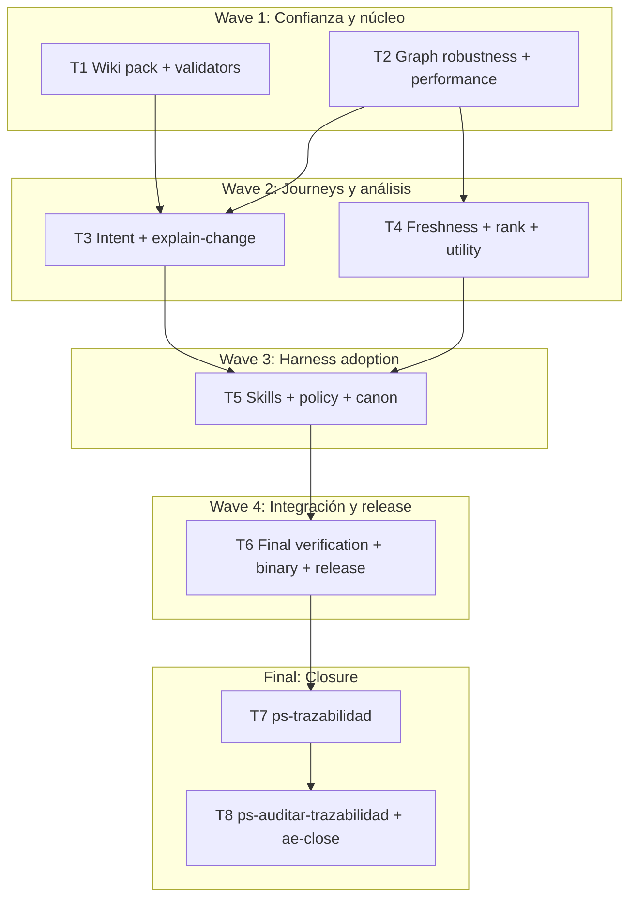

# mi-lsp Harness-first Roadmap Implementation Plan

**Goal:** Convertir la base graph-native en la ruta automática y prioritaria de todos los Harness, con síntesis explain-change, wiki dirigida, consultas robustas y eficientes, skills sincronizadas, binarios arm64 y release integrado en `origin/main`.

**Architecture:** Mantener SQLite como autoridad y ejecutar recorridos acotados sobre una generación publicada fija. Añadir un planificador local de intención que componga grafo, tests y wiki en previews progresivos; freshness, ranking y utility memory sólo pueden ordenar o advertir, nunca reemplazar autoridad ni evidencia exacta.

**Tech Stack:** Go 1.24, SQLite, PowerShell, Python de benchmark existente, .NET Roslyn worker, skills Markdown/YAML.

**Context Source:** `ps-contexto` Tier 2, canon FL/RF/CT/TECH/TP cargado, brainstorming cerrado y Workflow `milsp-harness-roadmap-understand` (comparación lineal f9dbeee, auditoría graph-native, estrategia lean y capacidades Graphify). Riesgos principales: routing wiki incorrecto, validators con corpus no gobernado, impacto sin continuación, seeds no acotadas, hidratación N+1, freshness insuficiente y adopción incompleta por skills.

**Runtime:** CC

**Available Agents:**
- `claudex-writer` — implementación Go, tests, configuración y documentación con criterio técnico.
- `claudex-verifier` — verificación adversarial independiente.
- `ps-docs` — documentación wiki y contratos.
- `ps-code-reviewer` — revisión de performance, diseño y seguridad.
- `ps-worker` — skills, scripts, Git y operaciones no específicas de stack.
- `Explore` — exploración read-only acotada.

**Initial Assumptions:** f9dbeee contiene G1-G8 funcionales; el worktree aislado es la única lane de escritura; Graphify es inspiración/advisory y no dependencia; el benchmark competitivo anterior no es gate; se ejecutará un único benchmark final.

## Goal Index

```yaml
goals:
  - goal_id: G1
    title: "Confianza operativa wiki"
    source_refs: {fl: [FL-WIKI-01], rf: [RF-QRY-016, RF-WIKI-005], ct: [CT-NAV-WIKI]}
    github_issues: []
    expected_outcome: "wiki pack siempre termina con envelope útil y validators sólo evalúan canon gobernado."
    done_when: ["focused H0 tests PASS", "real binary wiki-pack smoke emits output"]
    evidence_expected: ["test summary", "smoke summary"]
    stop_if: ["nav pack legacy changes", "audit/raw docs become authority"]
  - goal_id: G2
    title: "Grafo robusto y eficiente"
    source_refs: {fl: [FL-QRY-01], rf: [RF-GPH-005, RF-GPH-006, RF-GPH-008], ct: [CT-GRAPH-CLI]}
    github_issues: []
    expected_outcome: "consultas graph-native paginables, íntegras, bounded y sin N+1 dominante."
    done_when: ["graph focused tests PASS", "query plans use intended indexes"]
    evidence_expected: ["focused test summary", "EXPLAIN QUERY PLAN summary"]
    stop_if: ["full graph loaded in memory", "exact claims use invalid generation"]
  - goal_id: G3
    title: "Síntesis automática explain-change"
    source_refs: {fl: [FL-QRY-01, FL-WIKI-01], rf: [RF-QRY-017, RF-GPH-006, RF-GPH-011], ct: [CT-GRAPH-CLI, CT-NAV-WIKI]}
    github_issues: []
    expected_outcome: "el Harness recibe impacto, riesgos, callers/callees, tests, contratos, wiki y siguientes consultas desde una intención."
    done_when: ["intent/explain-change tests PASS", "preview includes executable expansions"]
    evidence_expected: ["golden envelopes", "fallback/omission cases"]
    stop_if: ["router silently falls back", "preview omits expansion rationale"]
  - goal_id: G4
    title: "Freshness, ranking y utilidad"
    source_refs: {fl: [FL-QRY-01], rf: [RF-GPH-009, RF-GPH-010, RF-GPH-011], ct: [CT-GRAPH-CLI]}
    github_issues: []
    expected_outcome: "resultados actuales y arquitectónicamente relevantes, con aprendizaje sanitizado que nunca supera autoridad."
    done_when: ["freshness/ranking/utility tests PASS", "memory remains bounded"]
    evidence_expected: ["determinism fixtures", "sanitization assertions"]
    stop_if: ["raw query/content stored", "community or utility outranks exact authority"]
  - goal_id: G5
    title: "Adopción universal por Harness"
    source_refs: {fl: [FL-QRY-01], rf: [RF-QRY-016, RF-GPH-011], ct: [CT-GRAPH-CLI, CT-NAV-WIKI]}
    github_issues: []
    expected_outcome: "skills y políticas llaman mi-lsp automáticamente antes que rg/Grep/Glob."
    done_when: ["all selected skills updated", "source/mirror hashes match"]
    evidence_expected: ["skill inventory", "byte parity report"]
    stop_if: ["opt-out remains for supported intents", "mirror drift"]
  - goal_id: G6
    title: "Release integrado"
    source_refs: {fl: [FL-QRY-01], rf: [RF-GPH-001, RF-GPH-011], ct: [CT-GRAPH-CLI]}
    github_issues: []
    expected_outcome: "origin/main contiene el roadmap, binarios arm64 sincronizados y un nuevo release verificable."
    done_when: ["full deterministic suite PASS", "single final benchmark PASS", "release readback matches integrated SHA"]
    evidence_expected: ["benchmark summary", "binary provenance", "CI and release URLs"]
    stop_if: ["dirty provenance", "CI failure", "installed binary differs from release asset"]
```

## Risks & Assumptions

**Assumptions needing validation:** existing graph cursor signing can be reused for impact continuation; graph_analysis can host bounded derived ranking; AccessEvent/daemon DB can store sanitized utility signals.

**Known risks:** broad graph changes can regress latency; mitigate with batching, bounded budgets and one final E2E benchmark. Shared skills can drift; mitigate with same-run mirror sync and byte comparison.

**Unknowns:** exact release version is derived from current tags only in T6; any schema migration incompatibility must stop rather than improvise.

## Wave Dispatch Map



| Task | Goal | Wave | Agent | Subdoc | Issue/Card | Done When |
|---|---|---:|---|---|---|---|
| T1 | G1 | 1 | claudex-writer | `./2026-07-22-milsp-harness-first-roadmap/T1-wiki-pack-validators.md` | n/a | focused H0 tests pass |
| T2 | G2 | 1 | claudex-writer | `./2026-07-22-milsp-harness-first-roadmap/T2-graph-robustness-performance.md` | n/a | bounded graph tests and plans pass |
| T3 | G3 | 2 | claudex-writer | `./2026-07-22-milsp-harness-first-roadmap/T3-intent-explain-change.md` | n/a | explain-change golden passes |
| T4 | G4 | 2 | claudex-writer | `./2026-07-22-milsp-harness-first-roadmap/T4-freshness-ranking-utility.md` | n/a | deterministic bounded analytics pass |
| T5 | G5 | 3 | ps-worker | `./2026-07-22-milsp-harness-first-roadmap/T5-skills-policy-docs.md` | n/a | all Harness skills and mirrors agree |
| T6 | G6 | 4 | ps-worker | `./2026-07-22-milsp-harness-first-roadmap/T6-integration-release.md` | n/a | one benchmark, binaries, CI, release green |
| T7 | all | F | — | inline | n/a | `ps-trazabilidad` packet PASS |
| T8 | all | F | — | inline | n/a | audit, pre-push, merge, release readback PASS |

## Final Wave

**T7 — `ps-trazabilidad`:** comprobar diff contra contrato, cadena FL/RF/TECH/CT/TP, runtime, skills/mirrors, benchmark, binarios y producir `traceability-closure.yaml`.

**T8 — `ps-auditar-trazabilidad` + `ae-close`:** auditoría read-only, reparación acotada de drift una vez, pre-push guard, PR/CI, merge protegido a `origin/main`, publicación del release y readback remoto. No integrar ni publicar con un gate rojo.
