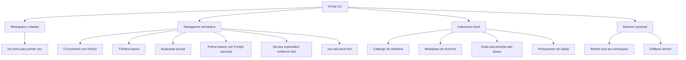

# 1. Objetivo del producto

`mi-lsp` es una CLI semantica local para proyectos no-monorepo, orientada a agentes y desarrolladores que necesitan navegar codigo con alta confiabilidad y bajo consumo de tokens. Resuelve el problema de depender de un MCP persistente para discovery semantico en repos .NET/C# y TypeScript grandes, heterogeneos y abiertos en paralelo.

El exito del producto en v1.3 se mide por cinco resultados:
- la CLI siempre responde aunque el daemon no este activo;
- el primer uso puede resolverse con `mi-lsp init` sin onboarding largo;
- `nav ask` responde preguntas de intencion usando wiki + evidencia de codigo;
- las consultas semanticas C# entregan contexto util y compacto en repos grandes;
- la salida es estable, breve y apta para skills/LLMs sin arrastrar blobs innecesarios.

# 2. Propuesta de valor

- Reemplaza la dependencia de un servidor MCP persistente por una CLI directa con daemon opcional.
- Mantiene una puerta de entrada corta para onboarding: `init -> nav ask`.
- Usa primero la documentacion canonica del repo cuando existe `.docs/wiki`, en vez de obligar al usuario a adivinar comandos o rutas.
- Conecta wiki y codigo sin convertir el indice local en una base semantica pesada.
- Opera bien en workspaces independientes y multiples repos abiertos al mismo tiempo.
- Devuelve envelopes JSON compactos, deterministas y orientados a presupuesto de tokens.
- Resume la superficie observable de un servicio (`nav service`) sin colapsar en un score fuerte de completitud.
- Mantiene el estado operativo dentro del repo y solo usa un registro global minimo para aliases.

# 3. Mapa de capacidades

# 4. Actores

- Desarrollador: ejecuta la CLI manualmente para explorar, entender y diagnosticar codigo.
- Skill/Agente LLM: consume `mi-lsp` como herramienta CLI con salida compacta y confiable.
- Maintainer de wiki: define la estructura canonica en `.docs/wiki` y, cuando hace falta, el `read-model` del proyecto.
- Worker .NET: resuelve semantica profunda C# y responde datos derivados.
- Daemon opcional: mantiene workers calientes por workspace y reduce latencia warm.
- Workspace local: fuente de verdad del indice repo-local, configuracion y archivos de codigo.

# 5. Areas funcionales de alto nivel

- Gestion de workspaces: alta, inicializacion corta, descubrimiento, aliases, estado y warmup.
- Navegacion y discovery: simbolos, referencias, outline, overview, contexto, dependencias, preguntas docs-first y resumen de servicios.
- Indexacion repo-local: catalogo liviano de simbolos, archivos, metadatos del workspace y grafo documental.
- Enrutamiento semantico: derivacion a Roslyn para C#, a tree-sitter/ripgrep para TS/Next y texto, y a Pyright para Python cuando este disponible.
- Formateo de salida: envelopes JSON compactos, truncacion determinista y warnings explicitos.
- Operacion runtime: daemon opcional, worker install explicito y fallback cuando faltan dependencias.

# 6. Fuera de alcance / Evolucion futura

- Edicion y refactor semantico seguro.
- MCP server, dashboard web o GUI remota.
- Semantica TypeScript profunda equivalente a C# mediante `tsserver`.
- Soporte activo para lenguajes fuera de C#/TS/Python en v1.
- Persistencia semantica completa de referencias y jerarquias C# en SQLite.
- Embeddings, reranking externo o servicios remotos para `nav ask`.
