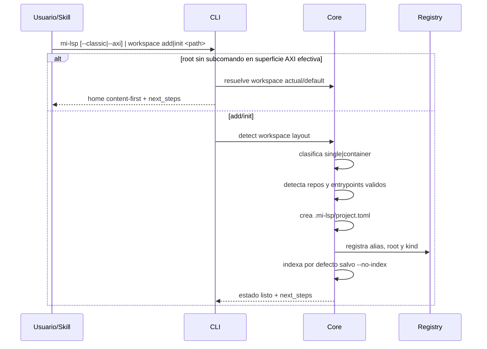

# FL-BOOT-01

## 1. Goal

Registrar o inicializar un workspace `single` o `container` y dejar lista su topologia repo-local para indexacion, `nav ask` y consultas posteriores. Tambien cubre el home content-first del root command y la guia preview-first de onboarding/discovery cuando la superficie entra en AXI efectivo por default o por override explicito.

## 2. Scope in/out

- In: deteccion de root, alias opcional, clasificacion `single|container`, deteccion de repos hijos y `entrypoints`, creacion de `.mi-lsp/`, persistencia de `project.toml`, alta en registry global minimo, `init` como happy path corto, resolucion centralizada del modo efectivo AXI/classic via defaults por superficie + `--axi` + `--classic` + `MI_LSP_AXI=1`, home content-first cuando se invoca `mi-lsp` sin subcomando salvo `--classic`, y la precedencia `workspace explicito > workspace por caller_cwd > last_workspace`.
- Out: descarga automatica de worker y setup remoto.

## 3. Main sequence

## 4. Alternative/error path

| Caso | Resultado |
|---|---|
| Path invalido | error explicito sin side effects |
| No se detecta stack compatible | warning + rechazo |
| Layout ambiguo | se persiste la topologia minima y se exponen defaults claros |
| Multiples aliases registrados para el mismo root | la seleccion automatica prioriza `project.name`, luego basename del root y deja warning visible |
| Paths auxiliares (`.worktrees/`, ignores) | se omiten del bootstrap |
| Entrypoints bajo `.docs/` o `template(s)` | permanecen visibles en topologia, pero no deben quedar como default semantico si existe una opcion real del repo |
| Indexacion falla | registro exitoso con warning no fatal |
| AXI sin workspace resoluble | el home content-first cae a sugerencias de `init`, `workspace scan` y `workspace list` sin mutar estado |

## 5. Data touchpoints

- Repo-local: `.mi-lsp/project.toml`
- Repo-local opcional: `.docs/wiki/_mi-lsp/read-model.toml`
- Global: `~/.mi-lsp/registry.toml`
- Estados: `detected`, `registered`, `single|container`

## 6. Candidate RF references

- RF-WKS-001 registrar workspace por path y alias, incluyendo topologia `single|container`
- RF-WKS-002 indexar automaticamente al registrar un workspace nuevo
- RF-WKS-003 inicializar el workspace actual y dejarlo listo para `nav ask`
- RF-WKS-004 exponer AXI selectivo por superficie para onboarding y discovery del CLI
