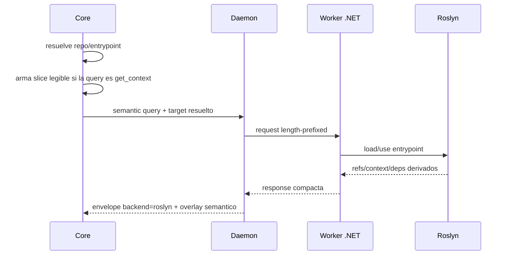

# FL-CS-01

```yaml
harness_protocol: SDD-HARNESS-v1
id: "FL-CS-01"
kind: "support-doc"
audience: "llm-first"
imports:
  - '[[00_gobierno_documental]]'
  - '[[FL-CS-01]]'
exports:
  - 'FL-CS-01'
agent_must_read:
  - .docs/wiki/00_gobierno_documental.md
  - .docs/wiki/03_FL/FL-CS-01.md
agent_may_edit:
  - .docs/wiki/03_FL/FL-CS-01.md
agent_must_not_edit:
  - .docs/wiki/_mi-lsp/read-model.toml
verify:
  - mi-lsp nav governance --workspace mi-lsp --format toon
  - mi-lsp nav wiki validate-harness --workspace mi-lsp --format toon
stop_if:
  - governance_blocked=true
  - harness_verdict=BLOCKED
evidence:
  - .docs/wiki/03_FL/FL-CS-01.md
```

## 1. Goal

Resolver una consulta semantica profunda C# usando un worker Roslyn enrutable al repo hijo y entrypoint correctos.

## 2. Scope in/out

- In: `find_refs`, `get_context`, `get_overview`, `get_deps`, selectors `--repo`, `--entrypoint`, `--solution`, `--project`, runtime pool por entrypoint.
- Out: fanout semantico automatico sobre todos los repos hijos y edicion semantica.

## 3. Main sequence



## 4. Alternative/error path

| Caso | Resultado |
|---|---|
| Worker no instalado | error accionable `mi-lsp worker install` |
| Query ambigua en workspace `container` | `backend=router`, candidatos y `next_hint` |
| `--repo` o `--entrypoint` explicito | bypass de heuristica y routing directo |
| Daemon ausente | el core puede ejecutar el mismo flujo en modo directo |
| Primer candidato Roslyn falla por bootstrap | retry unico con el siguiente candidato `bundle -> installed -> dev-local`; si no recupera, error accionable |
| Roslyn no responde en `get_context` | el core conserva `slice_text` y degrada a `catalog` o `text` con warning |

## 5. Data touchpoints

- request/response stdio
- workspace Roslyn cargado por `entrypoint_path`
- estados: `worker hot`, `worker cold`, `ambiguous`
- slice textual local construido por el core

## 6. Candidate RF references

- RF-CS-001 consulta semantica C# via Roslyn con routing por repo/entrypoint
