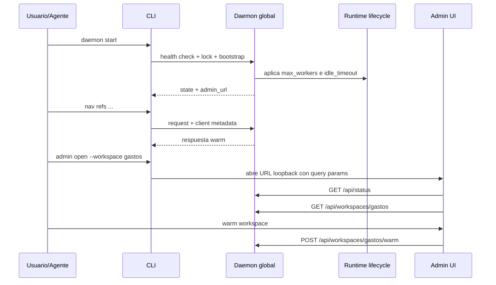

# FL-DAE-01

## 1. Goal

Mantener un daemon global opcional por usuario que reduzca latencia warm, comparta estado entre clientes locales y exponga una vista de gobernanza workspace-first sin convertirse en requisito operativo para la CLI. El input visible sigue siendo `workspace` (alias/path), mientras que la identidad canonica de runtime y analytics es `workspace_root`.

## 2. Scope in/out

- In: start/stop/status, named pipe/unix socket, runtime pool por `(workspace_root, backend_type, entrypoint_id)`, LRU, idle eviction, governance UI loopback, telemetry local, warm seguro via admin API, logs locales.
- Out: auth remota, cluster multi-host, observabilidad externa, acciones destructivas desde la UI.

## 3. Actors and ownership

- Desarrollador/agente: administra `daemon start|stop|status`, `admin open|status` y acciones seguras de gobernanza.
- CLI: detecta disponibilidad, decide fallback, envia `client_name/session_id` y arma deep-links consistentes con un `workspace` visible.
- Daemon: enruta requests, resuelve `workspace_root`, administra runtimes, registra telemetria y publica la vista admin.
- Admin UI: consume endpoints loopback y presenta runtimes, accesos, logs y acciones seguras preservando el foco por `workspace` sin perder la clave canonica.

## 4. Preconditions

- Binario `mi-lsp` disponible.
- Permisos suficientes para crear pipe/socket local y escribir state/telemetry en `~/.mi-lsp/daemon/`.
- Si el usuario abre la UI, el browser del sistema debe poder resolver `127.0.0.1`.

## 5. Postconditions

- Daemon operativo o fallback garantizado.
- Instancia compartida reutilizable entre terminales y agentes del mismo usuario.
- Admin URL disponible por `daemon status` / `admin status`.
- La UI local puede mostrar estado, activity, logs y ejecutar `warm workspace` sin salir del navegador, preservando alias/path visibles y agrupando internamente por `workspace_root`.
- Diagnosticos administrativos como `worker status` mantienen el mismo envelope visible con y sin daemon; solo cambia el estado vivo observado.
- El daemon expone diagnostico de performance suficiente para presupuestos de agentes: proceso (`working_set_bytes`, `private_bytes`, `handle_count`, `thread_count`), watchers (`mode`, roots/dirs activos, eventos pendientes) y backpressure de requests pesadas.

## 6. Main sequence

## 7. Alternative/error path

| Caso | Resultado |
|---|---|
| Daemon no inicia | la CLI sigue usable sin el |
| Segundo `daemon start` | devuelve la instancia ya viva |
| Limite de runtimes alcanzado | eviction LRU |
| Runtime idle > timeout | runtime liberado |
| Presion de requests pesadas > `max_inflight` | envelope `ok=false` con warning `daemon/backpressure_busy` y retry accionable |
| Watchers deshabilitados o lazy | el daemon sigue operativo; el re-index incremental por watcher queda apagado o se activa solo al tocar un workspace |
| alias/path ambiguo para un mismo root | el daemon conserva el foco visible y normaliza a `workspace_root` para runtime/telemetria |
| `tsserver` ausente | warning y fallback semantico/textual |
| `admin_url` no responde | error explicito para `admin` y `daemon open` |
| log aun inexistente | panel de logs y endpoint devuelven warning no fatal |

## 8. Architecture slice

`daemon/server.go`, `daemon/client.go`, `daemon/lifecycle.go`, `daemon/admin.go`, `daemon/state_store.go`.

## 9. Data touchpoints

- named pipe / unix socket local
- `~/.mi-lsp/daemon/state.json`
- `~/.mi-lsp/daemon/daemon.db`
- `{repoRoot}/.mi-lsp/daemon.log`
- metricas de worker/runtime status
- estados: daemon down, daemon up, runtime active, runtime evicted

## 10. Candidate RF references

- RF-DAE-001 lifecycle idempotente del daemon global
- RF-DAE-002 runtime pool compartido, governance UI y telemetria local

## 11. Bottlenecks, risks, and selected mitigations

- Riesgo: daemon como punto unico de falla.
- Mitigacion: bypass automatico y contrato CLI independiente.
- Riesgo: demasiados runtimes vivos.
- Mitigacion: `max_workers`, LRU e `idle_timeout`.
- Riesgo: demasiados watchers o aliases duplicados consumen handles/RAM.
- Mitigacion: `watch_mode=lazy` por defecto, dedupe por root canonico y cap LRU con `max_watched_roots`.
- Riesgo: concurrencia de agentes satura el daemon.
- Mitigacion: lock global de auto-start, health recheck, y backpressure `MI_LSP_DAEMON_MAX_INFLIGHT`.
- Riesgo: drift entre clientes o aliases distintos del mismo repo.
- Mitigacion: metadata `client_name/session_id` + telemetry local con identidad canonica por `workspace_root`.
- Riesgo: UI poco accionable.
- Mitigacion: vista workspace-first, filtros, drawer, panel de logs y acciones seguras.

## 12. RF handoff checklist

- Actores definidos: ready
- Ownership por paso: ready
- Datos y estados clave: ready
- Riesgos explicitos: ready
