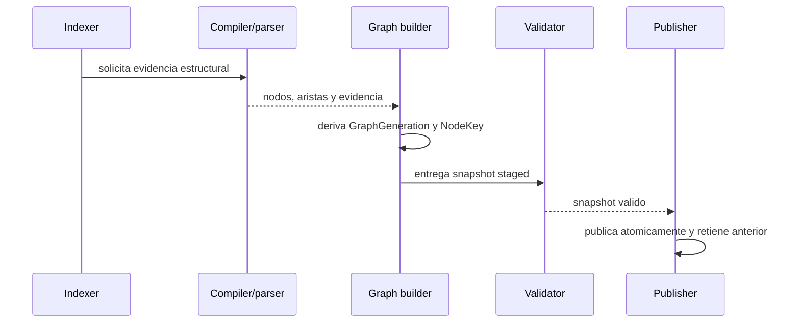

# FL-GPH-01

```yaml
harness_protocol: SDD-HARNESS-v1
id: "FL-GPH-01"
kind: "flow"
audience: "llm-first"
imports:
  - '[[00_gobierno_documental]]'
  - '[[02_arquitectura]]'
  - '[[03_FL]]'
exports:
  - 'FL-GPH-01'
agent_must_read:
  - .docs/wiki/00_gobierno_documental.md
  - .docs/wiki/02_arquitectura.md
  - .docs/wiki/03_FL.md
  - .docs/wiki/03_FL/FL-GPH-01.md
agent_may_edit:
  - .docs/wiki/03_FL/FL-GPH-01.md
agent_must_not_edit:
  - .docs/wiki/_mi-lsp/read-model.toml
verify:
  - mi-lsp nav governance --workspace mi-lsp --format toon
  - mi-lsp nav wiki validate-harness --workspace mi-lsp --format toon
  - mi-lsp nav wiki validate-source --workspace mi-lsp --format toon
stop_if:
  - governance_blocked=true
  - harness_verdict=BLOCKED
evidence:
  - .docs/wiki/03_FL/FL-GPH-01.md
```

## 1. Goal

Generar, validar y publicar un grafo nativo desde evidencia estructural disponible en los backends del workspace. La generacion es identificable como `GraphGeneration`, los nodos usan `NodeKey` estable y las aristas conservan evidencia suficiente para explicar su origen.

## 2. Scope in/out

- In: compilador/parser disponible, normalizacion de nodos y aristas, validacion de identidad, staging, publicacion atomica y conservacion de la generacion anterior para rollback.
- Out: consultas, extensiones, RF/TP y cambios de autoridad documental; se derivan en olas posteriores.

## 3. Preconditions and postconditions

- Preconditions: workspace con entrypoint resoluble y backend estructural que devuelva evidencia o `unresolved` explicito.
- Postconditions: generacion identificable; cada nodo tiene `NodeKey` y origen; una publicacion fallida no reemplaza el snapshot activo.

## 4. Main sequence



## 5. Alternative/error path

| Caso | Resultado |
|---|---|
| Backend no disponible | no se publica; warning con el motivo |
| Identidad invalida o colision | staging rechazado; generacion anterior permanece activa |
| Evidencia incompleta | se conserva como `unresolved`; no se inventa arista semantica |
| Fallo durante publish | rollback al puntero anterior y cleanup del staging |

## 6. Invariants

1. El compilador/parser es la fuente primaria; el texto solo aporta metadata auxiliar.
2. `NodeKey` no depende de posiciones inestables cuando existe identidad semantica.
3. Publicacion all-or-nothing; siempre se identifica la generacion activa.
4. Query no muta el snapshot ni el catalogo.
5. No se afirma performance, p95 o RSS sin medicion reproducible en el gate correspondiente.

## 7. Deferred contracts

RF, TP, TECH, DB y CT se derivan en la siguiente ola; este flujo solo fija alcance e invariantes SDD-A.
