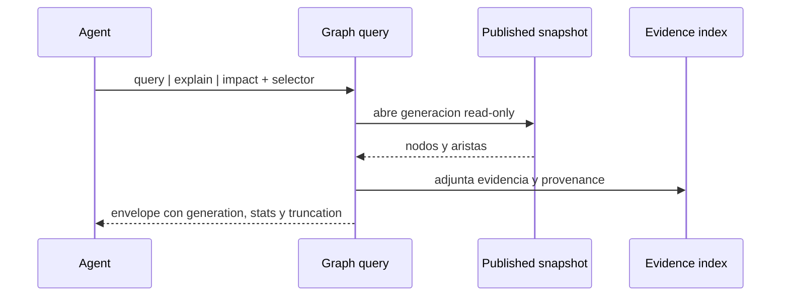

# FL-GPH-02

```yaml
harness_protocol: SDD-HARNESS-v1
id: "FL-GPH-02"
kind: "flow"
audience: "llm-first"
imports:
  - '[[00_gobierno_documental]]'
  - '[[02_arquitectura]]'
  - '[[03_FL]]'
  - '[[FL-GPH-01]]'
exports:
  - 'FL-GPH-02'
agent_must_read:
  - .docs/wiki/00_gobierno_documental.md
  - .docs/wiki/02_arquitectura.md
  - .docs/wiki/03_FL/FL-GPH-01.md
  - .docs/wiki/03_FL/FL-GPH-02.md
agent_may_edit:
  - .docs/wiki/03_FL/FL-GPH-02.md
agent_must_not_edit:
  - .docs/wiki/_mi-lsp/read-model.toml
verify:
  - mi-lsp nav governance --workspace mi-lsp --format toon
  - mi-lsp nav wiki validate-harness --workspace mi-lsp --format toon
  - mi-lsp nav wiki validate-source --workspace mi-lsp --format toon
stop_if:
  - governance_blocked=true
  - harness_verdict=BLOCKED
evidence:
  - .docs/wiki/03_FL/FL-GPH-02.md
```

## 1. Goal

Consultar una generacion publicada y explicar caminos de aristas o el impacto alcanzable sin mutar el indice, el catalogo ni el snapshot consultado.

## 2. Scope in/out

- In: operaciones read-only `query`, `explain` e `impact`; seleccion explicita de `GraphGeneration`; limites de profundidad, cantidad y tokens; evidencia y warnings deterministas.
- Out: edicion semantica, reconstruccion implicita, publicacion, escritura del grafo y RF/TP.

## 3. Preconditions and postconditions

- Preconditions: existe una generacion publicada y el selector identifica un nodo o patron sin ambiguedad no resuelta.
- Postconditions: la respuesta identifica la generacion consultada, devuelve resultados truncables y no cambia archivos ni estado del grafo.

## 4. Main sequence



## 5. Alternative/error path

| Caso | Resultado |
|---|---|
| Generacion ausente | error accionable; no fallback que invente grafo |
| Selector ambiguo | `backend=router`, candidatos y `next_hint` |
| Evidencia unresolved | resultado marcado con warning, sin elevar confianza |
| Budget agotado | `truncated=true` y continuation determinista |

## 6. Invariants

1. Query, explain e impact son solo lectura.
2. La generacion consultada se informa en toda respuesta no vacia.
3. La profundidad y el presupuesto son limites de salida, no licencia para scan ilimitado.
4. La evidencia se conserva junto al camino; no se presentan inferencias como hechos.
5. Las respuestas siguen siendo validas aunque el daemon no este activo.

## 7. Deferred contracts

Los nombres finales de comandos, RF, TP, CT y schemas de persistencia se derivan despues de validar este flujo.
