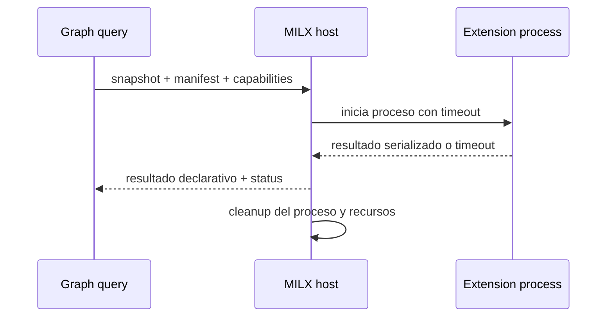

# FL-GPH-03

```yaml
harness_protocol: SDD-HARNESS-v1
id: "FL-GPH-03"
kind: "flow"
audience: "llm-first"
imports:
  - '[[00_gobierno_documental]]'
  - '[[02_arquitectura]]'
  - '[[03_FL]]'
  - '[[FL-GPH-01]]'
exports:
  - 'FL-GPH-03'
agent_must_read:
  - .docs/wiki/00_gobierno_documental.md
  - .docs/wiki/02_arquitectura.md
  - .docs/wiki/03_FL/FL-GPH-01.md
  - .docs/wiki/03_FL/FL-GPH-03.md
agent_may_edit:
  - .docs/wiki/03_FL/FL-GPH-03.md
agent_must_not_edit:
  - .docs/wiki/_mi-lsp/read-model.toml
verify:
  - mi-lsp nav governance --workspace mi-lsp --format toon
  - mi-lsp nav wiki validate-harness --workspace mi-lsp --format toon
  - mi-lsp nav wiki validate-source --workspace mi-lsp --format toon
stop_if:
  - governance_blocked=true
  - harness_verdict=BLOCKED
evidence:
  - .docs/wiki/03_FL/FL-GPH-03.md
```

## 1. Goal

Ejecutar extensiones declarativas `MILX-v1` sobre un snapshot publicado mediante un host aislado, con capabilities explicitas, timeout, salida serializada y tolerancia a fallos.

## 2. Scope in/out

- In: proceso separado, snapshot read-only, allowlist de capabilities, limites de tiempo/salida, serializacion de resultado y telemetria de estado.
- Out: MCP, red implicita, memoria compartida, escritura del indice principal, mutacion del grafo y RF/TP.

## 3. Preconditions and postconditions

- Preconditions: extension valida, version MILX-v1 soportada y snapshot publicado seleccionado.
- Postconditions: resultado declarativo o estado de timeout/fallo; el core continua disponible y el grafo primario no cambia.

## 4. Main sequence



## 5. Alternative/error path

| Caso | Resultado |
|---|---|
| Capability no permitida | rechazo antes de ejecutar |
| Timeout | status timeout; no falla la consulta ni el core |
| Salida invalida/excesiva | resultado descartado y warning acotado |
| Error del proceso | host terminado; el core continua disponible y se conserva el snapshot activo |

## 6. Observabilidad

- Cada ejecucion informa `GraphGeneration`, extension/version, capabilities solicitadas, status, duracion, tamano de salida y resultado del cleanup.
- Los estados observables son `accepted`, `rejected`, `timeout` y `failed`; los warnings son acotados, deterministas y no exponen payloads arbitrarios.
- El resultado conserva provenance del snapshot y referencias suficientes para explicar cualquier relacion de grafo o impacto wiki-code; una inferencia se marca como tal y no se presenta como hecho del compilador.
- `client_name` y `session_id` pueden acompañar la telemetria como metadatos operativos de trazabilidad, sin convertirse en autoridad funcional ni habilitar red implicita.

## 7. Invariants

1. El snapshot publicado es la unica entrada de datos y se abre en modo read-only.
2. El host corre fuera del proceso principal, sin memoria compartida, MCP, red implicita ni escritura del indice o grafo primario.
3. Las capabilities se validan antes de iniciar; timeout, crash, salida invalida o exceso de salida solo afectan a la extension.
4. El cleanup de proceso y recursos ocurre aun cuando la extension falle; la generacion activa permanece sin cambios.
5. Toda respuesta es bounded, generation-aware y provenance-bearing; no se afirma completitud, impacto ni performance sin evidencia reproducible.

## 8. Aceptacion y trazabilidad

- Aceptar solo manifests MILX-v1 validos con capabilities allowlisted y snapshot publicado seleccionado.
- Verificar rechazo previo para capabilities no permitidas, timeout/fallo aislado, descarte de salida invalida o excesiva y cleanup sin mutacion del core.
- Mantener explicable la cadena snapshot -> resultado -> evidencia, incluyendo referencias wiki-code cuando correspondan y warnings explicitos para estados unresolved.
- La trazabilidad de este flujo queda limitada a `01_alcance_funcional.md`, `02_arquitectura.md`, `03_FL.md` y `FL-GPH-01`; RF, TP, TECH, DB y CT se crean solo en olas posteriores.

## 9. Deferred contracts

Los nombres finales de comandos, RF, TP, TECH, DB y CT, schemas persistentes y limites numericos se derivan despues de validar este flujo; no se reservan identificadores downstream en SDD-A.
