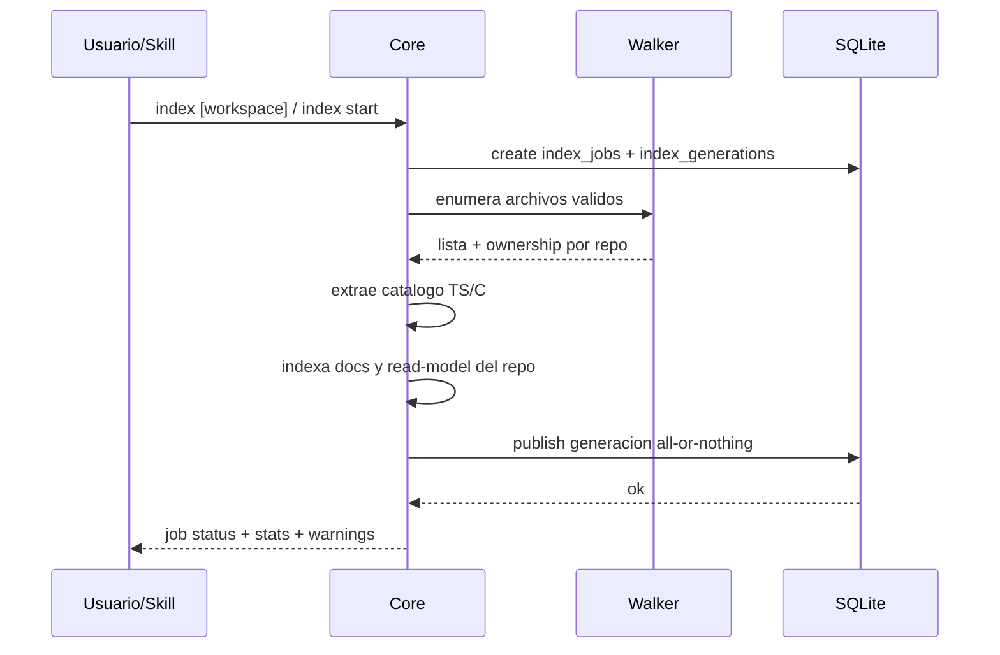

# FL-IDX-01

## 1. Goal

Construir o refrescar el indice repo-local del workspace de manera incremental, determinista y con ownership por repo, incluyendo el corpus documental necesario para `nav ask`.

## 2. Scope in/out

- In: scan de archivos, respeto de ignores por defaults + `.gitignore` + `.milspignore` + `project.toml` honrando orden y re-includes negados, escritura en SQLite, ownership por `repo_id`, actualizacion por `content_hash`, indexacion de docs `.md`, warnings de ruido evidente.
- Out: persistencia semantica completa de refs y jerarquias C#.

## 3. Main sequence

## 4. Alternative/error path

| Caso | Resultado |
|---|---|
| Archivo ignorado | se omite silenciosamente |
| Archivo fuera de repos detectados | warning y asignacion al root del workspace |
| Indice contaminado por ruido | warning con sugerencia concreta para `.milspignore` |
| Cambio en `.docs/wiki`, `README*`, `docs/` o `read-model.toml` | el incremental degrada a full re-index |
| `index.db` previo sin docs canonicos aunque la wiki existe | `index` no responde `no changes detected`: degrada a full re-index para autocurar `doc_records` |
| `--clean` activo | se recompone el indice desde cero |
| Proceso muere antes de publicar | la transaccion SQLite revierte y queda activa la generacion previa |
| Lock con PID inexistente | se recupera automaticamente antes de iniciar el nuevo job |

## 5. Data touchpoints

- `.mi-lsp/index.db`
- tablas `workspace_repos`, `workspace_entrypoints`, `symbols`, `files`, `doc_records`, `doc_edges`, `doc_mentions`, `index_jobs`, `index_generations`, `workspace_meta`
- estados: sin indice, job queued/running/publishing/succeeded/failed/canceled, generacion activa, indice con warnings de ruido; `index cancel --force` puede cortar un job colgado y liberar el workspace para reintento, y `publishing` debe quedar reservado al cierre final del job

## 6. Candidate RF references

- RF-IDX-001 indexacion inicial y refresh del catalogo repo-local con ownership por repo y docs wiki-aware
- RF-IDX-002 incremental git-aware con fallback a full re-index cuando cambian docs o perfil de lectura
