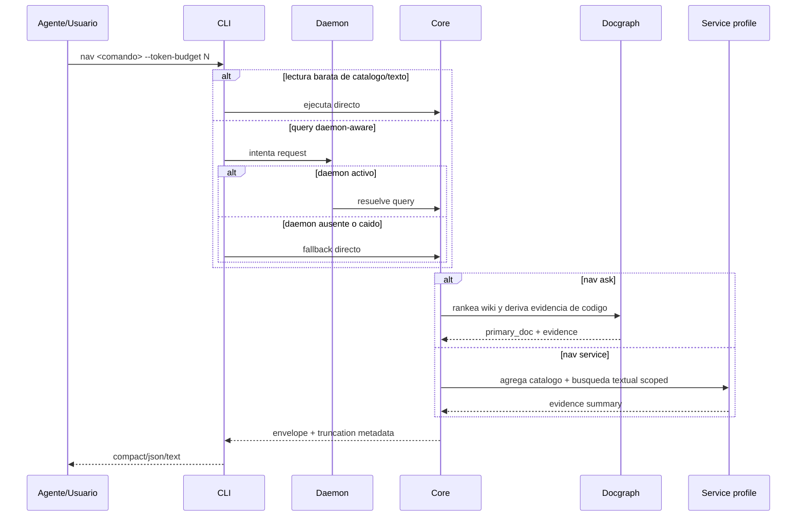

# FL-QRY-01

## 1. Goal

Resolver una consulta con salida compacta, truncacion determinista y fallback cuando el daemon o el backend semantico no estan disponibles. Tambien cubre `nav ask` como consulta docs-first guiada por wiki, la exploracion evidence-first de servicios y la regla de que las lecturas baratas de catalogo/texto no dependen del daemon.

## 2. Scope in/out

- In: routing por backend, aplicacion de `--token-budget`, `--max-items`, `--max-chars`, warnings de degradacion, `nav service <path>`, `nav ask <question>` y la decision centralizada de ejecutar directo `nav.find`, `nav.search`, `nav.symbols`, `nav.outline`, `nav.overview` y `nav.multi-read`.
- Out: edicion/refactor, respuestas con blobs de codigo completos y score fuerte de completitud.

## 3. Actors and ownership

- Skill/Agente o desarrollador: dispara comando `nav`.
- CLI: normaliza flags, decide routing directo vs daemon y formatea respuesta final.
- Daemon/Core: enruta a backend y produce envelope para queries daemon-aware.
- Docgraph/read-model: rankea wiki y conecta docs con codigo.
- Service exploration profile: agrega evidencia de catalogo y texto scoped a un path.

## 4. Preconditions

- Workspace resoluble.
- Comando `nav` valido.
- Path de servicio existente cuando se usa `nav service`.
- Corpus documental accesible cuando se usa `nav ask`.

## 5. Postconditions

- El usuario recibe un envelope estable y compacto.
- Si hubo truncacion o degradacion, queda explicitado en `warnings`/`next_hint`.
- Si se uso `nav service`, la respuesta contiene evidencia estructurada y no un veredicto fuerte de completitud.
- Si se uso `nav ask`, la respuesta deja visible documento primario, evidencia documental, evidencia de codigo y siguientes pasos.
- Si se uso una lectura barata de catalogo/texto, la respuesta no queda bloqueada por health del daemon.

## 6. Main sequence

## 7. Alternative/error path

| Caso | Resultado |
|---|---|
| Daemon caido | fallback directo para queries daemon-aware; las lecturas baratas siguen directas |
| Operacion de catalogo/texto (`find/search/symbols/outline/overview/multi-read`) | ejecuta directo y no depende de health del daemon |
| Presupuesto agotado | `truncated=true` + `next_hint` |
| Backend degradado (`tsserver` ausente, worker semantico no disponible) | `warnings` explicitos y backend alternativo |
| Catalogo ausente para `nav service` | degradacion a evidencia textual con warning |
| `nav ask` sin corpus documental fuerte | degradacion a fallback generico/textual con warning |
| Formato no reconocido | el render cae al formato `compact` |

## 8. Architecture slice

`output/formatter.go`, `output/truncator.go`, `daemon/client.go`, `daemon/server.go`, `service/app.go`, `service/ask.go`, `service/service_exploration.go`, `docgraph/*`.

## 9. Data touchpoints

- envelope JSON
- flags de salida
- politica de routing directo vs daemon
- estados: warm, cold, truncated, degraded
- `ServiceSurfaceSummary`
- `AskResult`
- `DocRecord` / `DocEdge` / `DocMention`

## 10. Candidate RF references

- RF-QRY-001 envelope estable y truncacion determinista
- RF-QRY-002 routing con fallback de daemon/backend y warnings explicitos
- RF-QRY-003 resumen evidence-first de servicio sin score fuerte
- RF-QRY-010 preguntas docs-first guiadas por wiki con evidencia de codigo
