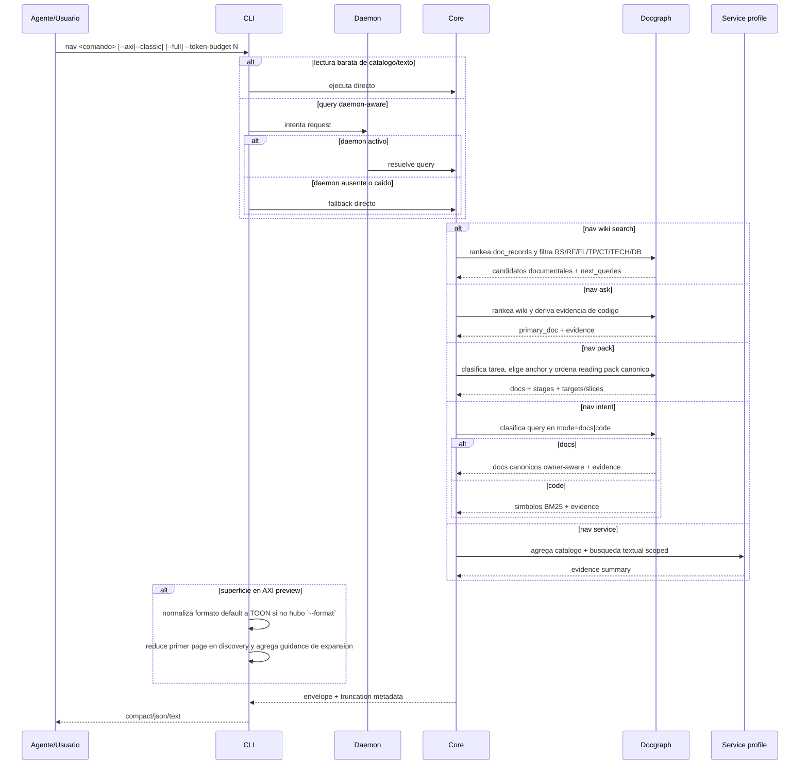

# FL-QRY-01

## 1. Goal

Resolver una consulta con salida compacta, truncacion determinista y fallback cuando el daemon o el backend semantico no estan disponibles. Incluye `nav wiki` como superficie dedicada para explorar RS/RF/FL/TP/CT/TECH/DB, `nav route` como selector canonico de bajo token para obtener el documento de anclaje y un mini reading pack antes de expandir con `nav ask` o `nav pack`. Tambien cubre `nav ask` como consulta docs-first guiada por wiki, `nav pack` como reading pack canonico para tareas spec-driven, `nav.intent` como superficie hibrida `docs|code`, la exploracion evidence-first de servicios, la regla de que las lecturas baratas de catalogo/texto no dependen del daemon, la disclosure preview-first de las superficies que caen en AXI efectivo, un bloque opcional `coach` para reruns/refinamientos explicitos y una capa tiny de continuidad/reentrada (`continuation`, `memory_pointer`) para que skills y harnesses sepan como seguir buscando.

## 2. Scope in/out

- In: routing por backend, aplicacion de `--token-budget`, `--max-items`, `--max-chars`, warnings de degradacion, `nav wiki search|route|pack|trace`, `nav service <path>`, `nav ask <question>`, `nav pack <task>`, `nav intent <question>`, `--axi`, `--classic`, `MI_LSP_AXI=1`, `--full` cuando el modo efectivo es AXI, el scorer owner-aware compartido para docs-first y la decision centralizada de ejecutar directo `nav.find`, `nav.search`, `nav.wiki.search`, `nav.intent`, `nav.symbols`, `nav.outline`, `nav.overview`, `nav.multi-read` y `nav pack`. En workspaces `container`, `find/search/intent` pueden acotar con `--repo`; si `nav.intent` clasifica la consulta como `docs`, ese selector se valida pero no redefine la lane documental. `nav ask|route|pack --repo` existe solo como compatibilidad guiada y no crea scope documental por repo. Cuando el request omite `--workspace`, la query se resuelve usando `caller_cwd` antes de `last_workspace`. Los docs outcome `RS-*` participan como layer `RS` y stage `outcome` entre `scope` y `architecture` cuando la gobernanza lo declara.
- Out: edicion/refactor, respuestas con blobs de codigo completos y score fuerte de completitud.

## 3. Actors and ownership

- Skill/Agente o desarrollador: dispara comando `nav`.
- CLI: normaliza flags, decide routing directo vs daemon y formatea respuesta final.
- Daemon/Core: enruta a backend y produce envelope para queries daemon-aware.
- Docgraph/read-model: rankea wiki y conecta docs con codigo.
- Service exploration profile: agrega evidencia de catalogo y texto scoped a un path.

## 4. Preconditions

- Workspace resoluble.
- Comando `nav` valido.
- Path de servicio existente cuando se usa `nav service`.
- Corpus documental accesible cuando se usa `nav ask`.

## 5. Postconditions

- El usuario recibe un envelope estable y compacto.
- Si hubo truncacion o degradacion, queda explicitado en `warnings`/`next_hint`; cuando existe una accion de continuidad fuerte, el envelope puede agregar `coach`.
- Las superficies calientes pueden agregar `continuation` machine-readable y `memory_pointer` wiki-aware para dejar un proximo paso o una pista de reentrada con muy bajo costo de tokens.
- Si se uso `nav service`, la respuesta contiene evidencia estructurada y no un veredicto fuerte de completitud.
- Si se uso `nav ask`, la respuesta deja visible documento primario, evidencia documental, evidencia de codigo y siguientes pasos; si la evidencia es fina o cayo a fallback textual, puede agregar `coach`.
- Si se uso `nav pack`, la respuesta deja visible el reading pack canonico, sus stages y sus targets o slices segun preview/full.
- Si se uso `nav wiki search`, la respuesta deja visible candidatos documentales por capa y `next_queries` concretos para pack/trace/multi-read/ask.
- Si se uso `nav intent`, la respuesta deja visible `mode=docs|code`: capability-like -> docs canonicos owner-aware; symbol-like -> ranking BM25 de catalogo.
- Si se uso una lectura barata de catalogo/texto, la respuesta no queda bloqueada por health del daemon.
- Si el workspace se resolvio por fallback (`same-root alias ambiguity` o `last_workspace`), la respuesta deja warning visible con el alias seleccionado.

## 6. Main sequence

## 7. Alternative/error path

| Caso | Resultado |
|---|---|
| Daemon caido | fallback directo para queries daemon-aware; las lecturas baratas siguen directas |
| Operacion de catalogo/texto (`find/search/intent/symbols/outline/overview/multi-read/pack`) | ejecuta directo y no depende de health del daemon |
| Presupuesto agotado | `truncated=true` + `next_hint` |
| Backend degradado (`tsserver` ausente, worker semantico no disponible) | `warnings` explicitos y backend alternativo |
| Catalogo ausente para `nav service` | degradacion a evidencia textual con warning |
| `nav ask` sin corpus documental fuerte | degradacion a fallback generico/textual con warning y `coach` de refinamiento |
| `nav wiki search` con docgraph vacio | `backend=wiki.search`, `items=[]` y hint hacia `index --docs-only` |
| `nav ask|route|pack --repo docs` | el flag se acepta por compatibilidad, se ignora para docs y se emite warning/hint hacia `nav wiki` |
| query natural capability-like sobre docs nuevos | scorer owner-aware y `owner_hints` deben priorizar docs canonicos positivos por encima de `README` |
| `workspace` omitido y sin match por `caller_cwd` | fallback a `last_workspace` con warning explicito |
| multiples aliases para el mismo root | seleccion determinista con warning explicito |
| Formato no reconocido | el render cae al formato `compact` |
| AXI preview efectivo | el envelope agrega guidance para `--full` sin cambiar la semantica base y puede exponer `coach.trigger=preview_trimmed` |
| Snapshot de reentrada stale | `memory_pointer.stale=true` y `continuation` puede redirigir a `workspace status --full` antes de seguir profundizando |

## 8. Architecture slice

`output/formatter.go`, `output/truncator.go`, `daemon/client.go`, `daemon/server.go`, `service/app.go`, `service/ask.go`, `service/service_exploration.go`, `docgraph/*`.

## 9. Data touchpoints

- envelope JSON
- flags de salida
- politica de routing directo vs daemon
- estados: warm, cold, truncated, degraded
- `ServiceSurfaceSummary`
- `AskResult`
- `PackResult`
- `WikiSearchResult`
- `ReentryMemorySnapshot`
- `DocRecord` / `DocEdge` / `DocMention`

## 10. Candidate RF references

- RF-QRY-001 envelope estable y truncacion determinista
- RF-QRY-002 routing con fallback de daemon/backend y warnings explicitos
- RF-QRY-003 resumen evidence-first de servicio sin score fuerte
- RF-QRY-010 preguntas docs-first guiadas por wiki con evidencia de codigo
- RF-QRY-011 busqueda de simbolos por intencion con scope opcional de repo
- RF-QRY-011 busqueda hibrida por intencion con `mode=docs|code`
- RF-QRY-012 reading pack canonico docs-first para una tarea
- RF-QRY-014 comando publico nav route para resolver documento canonico minimo
- RF-QRY-015 reutilizacion interna del route core desde ask y pack
- RF-QRY-016 exploracion wiki-first para agentes y compatibilidad `--repo`
