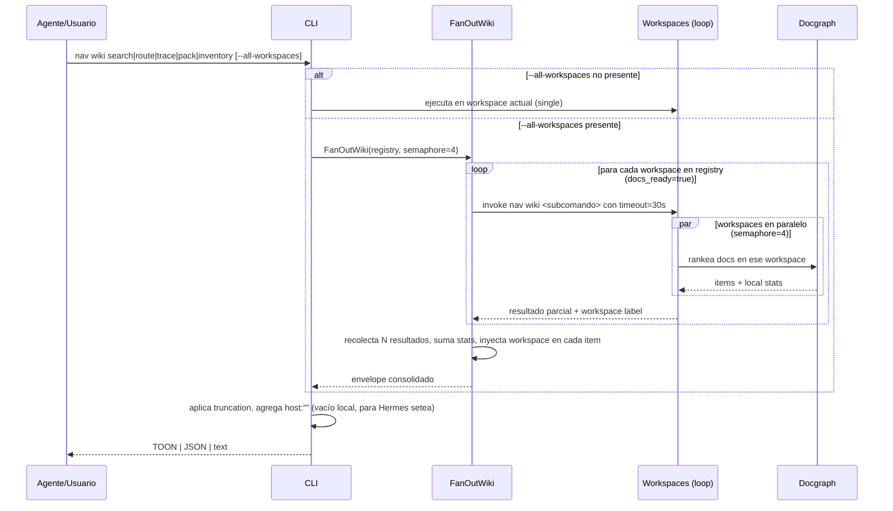

# FL-WIKI-01

```yaml
harness_protocol: SDD-HARNESS-v1
id: "FL-WIKI-01"
kind: "flow"
audience: "llm-first"
imports:
  - '[[FL-QRY-01]]'
  - '[[RF-WIKI-001]]'
  - '[[RF-WIKI-002]]'
  - '[[RF-WIKI-003]]'
  - '[[RF-WIKI-004]]'
  - '[[RF-WIKI-005]]'
exports:
  - '[[TP-WIKI]]'
  - '[[TECH-WIKI-FANOUT]]'
  - '[[CT-NAV-WIKI]]'
agent_must_read:
  - .docs/wiki/00_gobierno_documental.md
  - .docs/wiki/03_FL/FL-QRY-01.md
  - .docs/wiki/03_FL/FL-WIKI-01.md
agent_may_edit:
  - .docs/wiki/03_FL/FL-WIKI-01.md
agent_must_not_edit:
  - .docs/wiki/_mi-lsp/read-model.toml
verify:
  - mi-lsp nav governance --workspace mi-lsp --format toon
  - mi-lsp nav wiki validate-harness --workspace mi-lsp --format toon
  - mi-lsp nav wiki validate-source --workspace mi-lsp --format toon
stop_if:
  - governance_blocked=true
  - harness_verdict=BLOCKED
evidence:
  - .docs/wiki/03_FL/FL-WIKI-01.md
```

## 1. Goal

Federar consultas wiki (search, route, trace, pack, inventory) across N workspaces registrados en `~/.mi-lsp/registry.toml` dentro de una máquina, y proporcionar un envelope TOON merge-friendly que Hermes pueda extender cross-máquina vía SSH/Tailscale sin que `mi-lsp` aprenda transporte de red. El flujo hereda la estructura y contratos de [[FL-QRY-01]] pero amplía el scope desde single-workspace a multi-workspace con fan-out paralelo y consolidación de resultados con trazabilidad por workspace.

## 2. Scope in/out

- In: `nav wiki` subcomandos (search, route, trace, pack, inventory) con flag `--all-workspaces`, patrón AllWorkspaces con semaphore=4 reusado de `internal/service/ask.go`, federar contra todos los workspaces `docs_ready=true` en registry, envelope TOON con campo `workspace` por item, `host:""` como anclaje para extensión cross-máquina, stats de `workspaces_queried/failed`, timeout por workspace (30s heredado de `nav ask`).
- Out: edicion de workspaces, refactor de patrones de fan-out a nivel daemon, MCP/HTTP — mi-lsp permanece CLI puro.

## 3. Actors and ownership

- Usuario/Hermes: dispara `mi-lsp nav wiki <subcomando> --all-workspaces` en máquina local.
- CLI: normaliza flags, aplica `--all-workspaces`, rutas a fan-out paralelo.
- Daemon/Core (opcional): el patrón AllWorkspaces ejecuta directo por workspace sin necesidad de daemon global; daemon puede optimizar con warm state pero no es requisito.
- FanOutWiki helper: coordina iteración sobre registry, aplica semaphore, recolecta resultados.
- Docgraph por workspace: rankea docs dentro de ese workspace, independiente de otros.
- Consolidador de envelope: merge items de N resultados, stampa `workspace` en cada uno, suma stats.

## 4. Preconditions

- Workspace base (actual) resoluible y con `docs_ready=true`.
- Al menos uno de los workspaces registrados en `~/.mi-lsp/registry.toml` tiene `docs_ready=true` para poder ejecutar `--all-workspaces`.
- Comando `nav wiki <subcomando>` válido y soportado por [[CT-NAV-WIKI]].
- `--all-workspaces` flag presente en subcomando (T8-T12 implementan soporte).

## 5. Postconditions

- El usuario recibe un envelope TOON estable y compacto con items de múltiples workspaces.
- Cada item en la lista lleva `workspace: <alias>` visible.
- El campo `host:""` existe (vacío en ejecución local, poblado por Hermes cross-máquina).
- `stats.workspaces_queried` y `stats.workspaces_failed[]` detallan qué workspaces se intentaron y cuáles fallaron (con reason).
- Si se agota timeout de un workspace individual, ese workspace entra a `workspaces_failed` pero no bloquea resultados de otros.
- Shape single-workspace sin `--all-workspaces` permanece idéntico para backward-compat.

## 6. Main sequence



## 7. Alternative/error path

| Caso | Resultado |
|---|---|
| Workspace sin indice doc | timeout 30s, entra a `workspaces_failed[]` con reason="index_not_ready", otros workspaces siguen |
| Timeout cumplido para un workspace | parámetro en `workspaces_failed[]`, stats actualizado, no bloquea consolidación |
| Registry vacía o sin `docs_ready=true` | warning explícito, devuelve envelope con `items=[]` y `workspaces_queried=0` |
| `--all-workspaces` sin soporte en subcomando | error claro dirigiendo a CT-NAV-WIKI para feature matrix |
| Presupuesto agotado en fan-out | los primeros N resultados dentro del budget se retornan truncados con `truncated=true` + `next_hint` |
| Fan-out paralelo saturado (semaphore=4) | cola FIFO respeta límite, no hay stall; slower workspaces simplemente aparecen después en reordenamiento |
| Hermes setea `host:` en remote execution | item entra con `workspace:` + `host: tesla-desktop` indicando origen, diferenciable de local `host:""` |
| Merge cross-máquina en Hermes falla | Hermes ve `hosts_failed[]` y decide si reintenta o expone al usuario |

## 8. Architecture slice

Código nuevo/modificado según plan:
- `internal/nav/fanout_wiki.go` — helper FanOutWiki (T7)
- `internal/cli/nav.go` — flags `--all-workspaces` en subcomandos (T8-T12)
- `internal/nav/wiki/search.go`, `route.go`, `trace.go`, `pack.go` — soporte federación (T8-T11)
- `internal/nav/wiki/inventory.go` — nuevo subcomando (T12)
- `output/formatter.go` — envelope con `workspace`/`host` (heredado de [[FL-QRY-01]], ampliación minimal)

## 9. Data touchpoints

- envelope JSON/TOON con `items[].workspace` y `items[].host` (new)
- `stats.workspaces_queried: N`
- `stats.workspaces_failed[]` con reason
- registry `.toml` — lectura para listar workspaces, no mutación
- `.mi-lsp/index.db` por workspace — lectura en paralelo
- FanOutWiki semaphore — control de concurrencia

## 10. Candidate RF references

- [[RF-WIKI-001]] fan-out paralelo con semaphore y timeout
- [[RF-WIKI-002]] envelope con workspace y host
- [[RF-WIKI-003]] consolidación de stats
- [[RF-WIKI-004]] backward-compat single-workspace
- [[RF-WIKI-005]] test coverage del fan-out bajo contaminación (workspaces fallidos)

## 11. Decisiones normativas

```toon
block_id: fl-wiki-01-invariants
---
INVARIANTS

1. mi-lsp no aprende SSH, HTTP, MCP, ni ningún transporte de red.
   Hermes consume el envelope TOON y setupea el merge cross-máquina.

2. El campo 'host' en items es anclaje para Hermes, no funcionalidad
   de mi-lsp. Locale ejecución setea host:"" implícitamente; Hermes
   lo rellena en merge.

3. Un workspace con índice corrupto no bloquea fan-out. Timeout 30s
   + entrada a workspaces_failed[] preserva resultados de otros
   workspaces.

4. El envelope single-workspace (sin --all-workspaces) es idéntico al
   actualmente documentado en CT-NAV-WIKI. Aditivos (host, workspace
   en item, workspaces_queried/failed en stats) no rompen parsers
   existentes.

5. Semaphore=4 es límite concurrencia reusado de internal/service/ask.go.
   No es configurable por usuario en Wave 1 (puede abrirse en Wave 2).

6. Inventory es nuevo subcomando bajo 'nav wiki inventory', no raíz
   'mi-lsp inventory'. Namespace protegido.

7. --all-workspaces no replica con --repo; ambos flags pueden coexistir
   pero --repo se ignora cuando se federar a registry. Warning explícito
   en CT-NAV-WIKI.
```

```toon
block_id: fl-wiki-01-actors
---
ACTORS

- Agente/Usuario: dispara comando 'mi-lsp nav wiki <subcomando> --all-workspaces'
  desde cualquier máquina (teslita, tesla-desktop, etc).

- Hermes (wrapper PowerShell): consume envelope local, invoca SSH a hosts remotos
  via Tailscale, mergea resultados con host label. Vive fuera mi-lsp.

- CLI: normaliza flags, decide routing local vs --all-workspaces, aplica
  truncation/formatting.

- FanOutWiki helper: iterador sobre registry, semaphore=4, timeout 30s por
  workspace, recolector de resultados parciales.

- Docgraph (por workspace): rankea docs en ese workspace, devuelve items
  + stats locales. Cada workspace corre docgraph independientemente.

- Registry.toml: fuente de verdad de qué workspaces existen; mi-lsp solo
  lee, nunca escribe durante fan-out.
```

```toon
block_id: fl-wiki-01-overview
---
FLUJO: FEDERACION DE WIKI GLOBAL

Entrada:
  usuario corre: mi-lsp nav wiki <subcomando> --all-workspaces

Fan-out (paralelo, semaphore=4):
  para cada workspace en registry donde docs_ready=true:
    - iniciar go routine con timeout=30s
    - ejecutar subcomando en ese workspace (repo-local index.db)
    - recolectar items + local stats

Merge en cliente (CLI):
  - aguardar todas las go routines (timeout respetado)
  - reunir items de todos los workspaces exitosos
  - inyectar 'workspace: <alias>' en cada item
  - inyectar 'host: ""' (vacío; Hermes lo rellena cross-máquina)
  - sumar stats: workspaces_queried, workspaces_failed[]
  - aplicar truncation si presupuesto agotado

Salida (TOON):
  envelope compacto con:
    items: [{workspace, host, ...}, ...]
    stats: {workspaces_queried, workspaces_failed}
    warnings, truncated, next_hint

Extensión Hermes (fuera mi-lsp):
  - wrapper PowerShell invoca local mi-lsp nav wiki ...
  - invoca SSH: 'tailscale ssh <host> -- mi-lsp nav wiki ...'
  - mergea dos envelopes: local (host:"") + remote (host:"<nombre_host>")
  - consolida items, deduplicación si es necesario
  - expone hosts_failed[] si SSH falló
```

## 12. Cross-references

- [[FL-QRY-01]] — base para consultas single-workspace; FL-WIKI-01 hereda envelope y routing.
- [[RF-WIKI-001]] — fan-out paralelo con semaphore.
- [[RF-WIKI-002]] — envelope con workspace + host.
- [[RF-WIKI-003]] — consolidación de stats.
- [[RF-WIKI-004]] — backward-compat.
- [[RF-WIKI-005]] — robustez ante workspaces fallidos.
- [[TP-WIKI]] — cobertura de prueba para fan-out y merge.
- [[TECH-WIKI-FANOUT]] — detalles técnicos de FanOutWiki helper, semaphore, timeouts.
- [[CT-NAV-WIKI]] — contratos de subcomandos `nav wiki *` con `--all-workspaces`.
