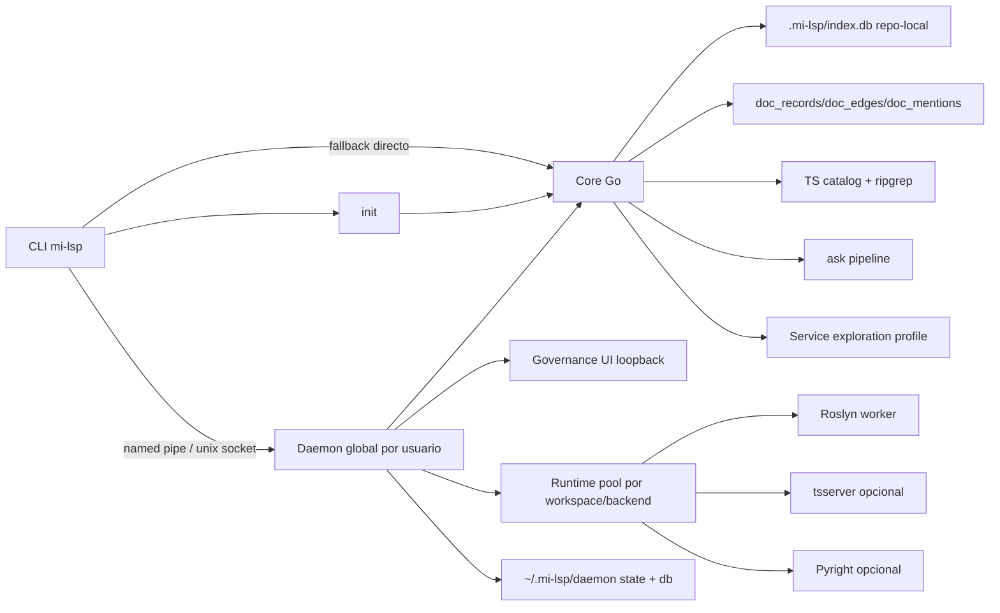

# 07. Baseline tecnica

## Proposito y alcance

Este documento resume la base tecnica operativa de `mi-lsp` en su fase `v1.3 hardening`.
Su foco es el runtime local, los componentes ejecutables, las fronteras tecnicas y las decisiones que deben sobrevivir a futuros refactors.
El detalle operativo y de subsistemas vive en `07_tech/`.

## Inventario de componentes

| Componente | Tipo | Owner logico | Responsabilidad |
|---|---|---|---|
| `mi-lsp` CLI | Binario Go | Core runtime | Punto de entrada, flags, routing y salida |
| Shortcut `init` | Surface CLI | Core runtime | Detectar, registrar e indexar rapido el workspace actual |
| AXI selective discovery mode | Overlay CLI | CLI surface | Home content-first, TOON default y disclosure preview/full solo en superficies donde reduce round-trips |
| Daemon global | Proceso Go opcional | Runtime supervision | Compartir warm state entre terminales/agentes |
| Runtime pool | Subsistema daemon | Runtime supervision | Mantener un runtime vivo por `(workspace, backend)` |
| Worker Roslyn | Proceso .NET hijo | C# semantic backend | Semantica profunda C# |
| Governance resolver | Subsistema Go | Query/runtime | Validar `00_gobierno_documental.md`, compilar perfil efectivo y proyectar `read-model.toml` |
| Docgraph/read-model | Subsistema Go | Query/runtime | Rankear wiki, clasificar preguntas y conectar docs con codigo |
| TS catalog/indexer | Subsistema Go | Discovery backend | Discovery estructural TS/JS/Next repo-local |
| Service exploration profile | Subsistema Go | Query/runtime | Agregar evidencia observable por path de servicio usando catalogo + texto |
| TS semantic backend | Runtime opcional | TS semantic backend | Semantica TS/JS via `tsserver` cuando exista |
| Python indexer | Subsistema Go | Discovery backend | Indexacion Python lexical acotada para catalogo repo-local |
| Pyright semantic backend | Runtime opcional | Python semantic backend | Semantica Python via `pyright-langserver` |
| Governance UI | HTTP loopback local | Runtime supervision | Estado, accesos, memoria y diagnostico |
| File watcher (fsnotify) | Subsistema daemon | Pre-fetch | Re-indexa archivos modificados en background |
| Agent acceleration CLI | Subsistema Go | Compound commands | `multi-read`, `batch`, `related`, `workspace-map`, `search --include-content`, `nav ask`, `nav pack` |
| Store repo-local | SQLite | Workspace owner | Catalogo de codigo, indice documental y metadata del repo |
| Index job runner | CLI + SQLite repo-local | Workspace owner | Jobs de indexacion `queued/running/published`, generacion de indice y cancelacion cooperativa |
| Store global daemon | SQLite + state file | Runtime supervision | Estado global del daemon y telemetria local |
| Cross-platform detach | Modulos Go | Runtime supervision | `server_windows.go` para named pipes, `server_unix.go` para unix sockets |
| Git integration | Subsistema Go | Query/indexing | Soporte incremental git-aware para re-indexing de archivos modificados |

## Dependencias externas

- `github.com/fsnotify/fsnotify` v1.9.0+ (file watcher para pre-fetch daemon)
- `ripgrep` opcional (busqueda de texto; fallback Go nativo si no existe)
- SDK/runtime de cada backend (Roslyn/.NET, Node/tsserver, Pyright)
- `.docs/wiki/00_gobierno_documental.md` obligatorio como fuente humana de gobernanza
- `.docs/wiki/_mi-lsp/read-model.toml` obligatorio como proyeccion versionada del gobierno documental

## Mapa runtime e integracion

## Decisiones e invariantes

- Existe un unico daemon por usuario/host; no un daemon por workspace.
- El daemon debe ser compartible entre Claude Code, Codex y subagentes del mismo usuario.
- El daemon nunca es requisito funcional: toda consulta debe poder hacer fallback directo.
- AXI se resuelve por superficie en el borde del CLI: root, `init`, `workspace status`, `nav search`, `nav intent` y `nav pack` son AXI-default; `nav ask` solo lo es para preguntas claras de onboarding/orientacion.
- `nav workspace-map` y el resto de la CLI conservan modo clasico por default; `--axi` o `MI_LSP_AXI=1` pueden forzar AXI sobre superficies soportadas.
- `--classic` prevalece sobre defaults por superficie y sobre `MI_LSP_AXI=1`; `--axi` y `--classic` juntos son invalidos.
- `--axi=false` explicito anula el default AXI de la superficie actual; equivalente a `--classic` para esa invocacion.
- En AXI efectivo, el root command sin subcomando devuelve un home content-first; no hace side effects para resolver ese overview.
- En AXI efectivo, `--format` explicito gana; si no existe, las superficies cubiertas usan TOON como default.
- En AXI efectivo, `--full` solo expande disclosure sobre superficies cubiertas; no cambia semantica ni routing de la operacion.
- La version actual de AXI no instala hooks ni mantiene contexto ambiente persistente fuera del proceso CLI.
- Las lecturas baratas de catalogo/texto (`nav.find`, `nav.search`, `nav.symbols`, `nav.outline`, `nav.overview`, `nav.multi-read`) deben ejecutarse directas y no depender del health del daemon.
- `nav.ask` tambien usa el camino directo por default; el daemon no es el hot path obligatorio para respuestas docs-first.
- `nav trace` sigue siendo una lectura directa del repo-local y debe resolver IDs `RS-*`, `RF-*` y `TP-*` desde `doc_records/doc_mentions`; para `RS-*` devuelve identidad documental (`doc_id`, `layer=RS`, `stage=outcome`) sin poblar el campo legacy `rf`, y para `RF-*` los docs TP del layer `06` cuentan como evidencia documental de cobertura y evitan falsos `missing` despues de `index --docs-only`.
- Todo subprocesso no interactivo debe usar la politica comun de proceso; en Windows eso implica `HideWindow + CREATE_NO_WINDOW`, y los procesos background del daemon agregan `DETACHED_PROCESS`.
- El `tool_root` del worker se resuelve contra el ejecutable/distribucion activa o, en desarrollo, contra el repo `mi-lsp`; nunca contra el `cwd` arbitrario del workspace consultado.
- `index`, `index start` y `index run-job` deben estar protegidos por un lock interproceso repo-local (`.mi-lsp/index.lock`) durante toda la indexacion, no solo durante el commit SQLite.
- `index start` crea un job durable en `index_jobs`; sin `--wait` lanza un proceso hijo detached y devuelve `job_id`, con `--wait` ejecuta el job en el proceso actual.
- `index cancel` sin `--force` debe detener cooperativamente loops largos de catalogo/docs mediante polling de `requested_cancel`; `index cancel --force` puede terminar el PID vivo asociado al job, marcarlo `canceled` y limpiar el lock asociado cuando el PID ya no existe.
- `index status.phase` mantiene `indexing` durante el trabajo pesado y reserva `publishing` para el cierre/publicacion final, para no confundir jobs largos con commit ya iniciado.
- `index status` debe refrescar `updated_at` durante trabajos largos y exponer progreso vivo mediante `current_stage`, `current_path`, `files_total` y los contadores `files/symbols/docs`.
- La publicacion full debe ser all-or-nothing: catalogo, docgraph y memoria de reentrada se reemplazan en una unica transaccion SQLite y solo entonces se publica la generacion activa.
- `--clean` fuerza recomposicion/publicacion completa del modo elegido, pero no debe borrar `index.db` antes de caminar archivos; si el proceso muere antes del commit, la generacion activa anterior sigue disponible.
- La unidad de warm state es un runtime por `(workspace_root, backend_type)`.
- La unidad de file watching es `workspace_root` canonico; aliases duplicados no crean watchers adicionales.
- `watch_mode=lazy` es el default para proteger memoria/handles; `off` deshabilita watchers y `eager` es opt-in via CLI/env.
- El daemon expone `daemon_process` y `watchers` en status/admin para presupuestos operativos (`working_set`, `private_bytes`, handles, threads, roots/dirs/eventos).
- Requests pesadas daemon-aware se limitan con `MI_LSP_DAEMON_MAX_INFLIGHT` y devuelven `daemon/backpressure_busy` cuando se supera el limite.
- La resolucion efectiva de workspace para queries usa la precedencia `--workspace explicito > workspace registrado cuyo root contiene caller_cwd > last_workspace`.
- Si varios aliases registrados comparten root, la seleccion automatica usa `project.name`, luego basename del root, luego `last_workspace` solo si apunta a ese mismo root, y deja warning visible.
- El estado semantico persistente del workspace vive repo-local; el estado global solo guarda registro, estado del daemon y telemetria local.
- El estado documental persistente tambien vive repo-local: `doc_records`, `doc_edges` y `doc_mentions`.
- La gobernanza documental manda sobre toda tarea spec-driven: `00_gobierno_documental.md` es la autoridad humana y `read-model.toml` su proyeccion ejecutable.
- El orden funcional del reading pack se deriva primero de `governance.hierarchy[*].pack_stage`; cuando la gobernanza declara `outcome`, esa etapa queda entre `scope` y `architecture` y los docs `RS-*`, `02_resultados_soluciones_usuario.md` y `02_resultados/*.md` se clasifican como `layer=RS`.
- `owner_hints` vive en `00_gobierno_documental.md`, se proyecta al `read-model.toml` y solo refina ownership documental repo-especifico; no reemplaza las heuristicas generales del binario.
- Si `00`, su YAML embebido, la proyeccion o el indice quedan fuera de sync, el workspace entra en `blocked mode`.
- `nav ask` es docs-first: primero rankea docs canonicos, luego deriva evidencia de codigo desde menciones y fallback textual.
- `nav route`, `nav ask`, `nav pack` y `nav.intent` comparten el scorer owner-aware del lane documental: FTS + overlap lexico + `doc_id` + stem/path + hints opcionales + penalizacion a `generic/README` y a artefactos de soporte bajo `.docs/raw/` cuando hay un candidato canonico positivo dentro del corpus documental gobernado por `00`/`read-model`.
- La recencia documental solo opera como `weak tie-break`; no rescata docs irrelevantes ni pisa un match canonico fuerte.
- El envelope de query puede agregar un bloque opcional `coach` query-level para guidance explicito (`rerun|refine|narrow|expand`) cuando existe una accion de continuidad clara.
- El envelope de query puede agregar un bloque opcional `continuation`, tiny y machine-readable, para sugerir el mejor siguiente paso del harness sin requerir parsing de comandos raw.
- El envelope de query puede agregar un bloque opcional `memory_pointer`, wiki-anchored, para reentrar rapido sobre cambios canonicos recientes y handoff relevante del workspace.
- La memoria de reentrada repo-local se construye durante `mi-lsp index`, se persiste en `workspace_meta` y no se recompone completa en cada query del hot path.
- `mi-lsp index --docs-only` y `mi-lsp index start --mode docs` reconstruyen `doc_records`, `doc_edges`, `doc_mentions` y `memory_pointer` sin reemplazar `files` ni `symbols`; se usan para recuperar corpus documental vacio sin pagar el costo de reindexar codigo.
- `nav ask`, `nav pack` y `nav route` deben compartir `profile + docs + ranking + route core` dentro de la misma request; no se acepta recomputacion duplicada del mismo corpus en el hot path.
- `nav ask`, `nav pack` y `nav route` deben consultar el gate de gobernanza antes de seguir.
- `nav pack` es docs-first y pack-first: clasifica la tarea, elige un anchor y arma un reading pack ordenado de lo mas global a lo mas especifico, empezando por `00` cuando la gobernanza es valida.
- En AXI preview, `nav ask` reduce compute y salida a `primary_doc + 1 linked doc + 1 code evidence`; `nav pack` reduce a `anchor + 2 docs`.
- `nav governance` es la superficie primaria de diagnostico del perfil efectivo, sync y blockers.
- Aun con `read_model=default`, un workspace inicializado con docs minimas utiles bajo `.docs/wiki/07_*.md`, `.docs/wiki/08_*.md` o `.docs/wiki/09_*.md` debe poder resolver una respuesta docs-first razonable sin requerir `read-model.toml` custom.
- La UI de gobernanza es unica, local a loopback y debe abrirse enfocando workspace, sin duplicar instancias.
- C# profundo se resuelve con Roslyn; TS/JS discovery sigue existiendo aunque no haya backend semantico.
- Python se indexa con un extractor lexical acotado por lineas para mantener el catalogo repo-local cancelable; semantica profunda opcional via `pyright-langserver` cuando exista.
- `nav context` es slice-first: el core arma un bloque legible por lineas y luego superpone enriquecimiento semantico o de catalogo cuando exista.
- `nav service` usa evidencia observable, no score fuerte de completitud.
- `nav route` es la superficie publica de routing de bajo token: resuelve `anchor_doc + mini_pack_preview` con semantica fail-closed y canonical lane autoritativa. `nav ask` y `nav pack` reutilizan este motor internamente.
- `nav.intent` es hibrido router-first: clasifica `mode=docs|code`, usa el scorer owner-aware en `docs` y conserva BM25 de simbolos en `code` sin mezclar ambos lanes en la misma lista.

## Busqueda: cadena de fallback

La busqueda textual implementa una cadena de fallback robusta:

1. `rg` binario: si existe y es accesible, usa `ripgrep` nativo con `--hidden` para no perder docs gobernados ni artefactos repo-locales ocultos cuando la consulta apunta ahi
2. Go native: fallback a `searchPatternGo` nativo que respeta `.milspignore` y filtra binarios
3. `MI_LSP_RG` env var: permite override de la ruta de `rg`

La cadena garantiza que la busqueda siempre funciona sin dependencias externas obligatorias.
Si `rg` devuelve exit code `1` por ausencia de matches, el core lo normaliza a `items=[]` en vez de exponerlo como error.
Si el usuario forza `--regex` y el patron es invalido, el core reintenta automaticamente como literal y devuelve warning visible.
La exploracion de servicios y el fallback de `nav ask` reutilizan la misma cadena.

## Config y valores por defecto

El struct `internal/service/config.go` centraliza todos los valores hardcodeados:

- `DefaultConfig()` inicializa fallbacks sensatos
- Incluye rutas de workers, timeouts, limites de memoria, ignoreslists por defecto
- Permite override via flags CLI y variables de entorno
- El `read-model` por defecto se embebe en `docgraph.DefaultProfile()` y puede ser sobreescrito por el proyecto
- La capa de ignores del indexer normaliza paths con `/`, honra el orden de `.gitignore`/`.milspignore`, excluye caches/dependencias generadas (`node_modules`, `.next`, `.turbo`, `.venv`, `venv`, `__pycache__`, `.pytest_cache`) y soporta re-includes negados para no expulsar la wiki canonica por accidente
- Separacion clara entre valores de compilacion vs runtime

## Telemetria universal

- Todas las operaciones (con y sin daemon) registran `access_events` en `~/.mi-lsp/daemon/daemon.db`.
- CLI directo usa `daemon_run_id = NULL`; el daemon usa su `run_id`.
- En requests servidos por daemon, el `access_event` canonico lo escribe el daemon; la CLI solo persiste eventos directos, `direct_fallback` o fallas previas a la ejecucion remota.
- WAL mode habilitado para manejar escrituras concurrentes daemon + CLI.
- `index.db` repo-local tambien debe usar `WAL + busy_timeout`, y las escrituras de indexacion/watcher se serializan por workspace para evitar `SQLITE_BUSY`.
- Cuando `index.db` esta corrupta, el comando legacy `index` debe cuarentenarla, reconstruir y dejar warning visible con la ruta respaldada.
- `index.run` debe chequear `context.Context` durante walk, lectura de candidatos y parseo documental para que un timeout operativo corte el trabajo en curso.
- Si el incremental detecta `doc_records` sin docs canonicos aunque la wiki existe en disco, `index.run` debe degradar a full rebuild en vez de devolver `no changes detected`.
- Auto-purge de eventos > 30 dias (configurable via `MI_LSP_RETENTION_DAYS`) en startup de CLI y daemon.
- `access_events` separa identidad analitica y diagnostica: `workspace_root` es la clave canonica de agrupacion; `workspace_alias` y `workspace_input` preservan display y forensics.
- `workspace_input` preserva el selector crudo recibido, incluso cuando viene vacio; `workspace`, `workspace_alias` y `workspace_root` deben reflejar el workspace resuelto efectivamente.
- Tanto CLI directo como daemon deben persistir `runtime_key` determinista; en modo directo puede ser pseudo-runtime y sigue siendo valido para attribution/export.
- `access_events.seq` ordena eventos dentro de un `session_id`; vale `0` cuando la llamada no trae sesion y arranca en `1` para la primera operacion de una sesion trazable.
- `access_events` tambien preserva metadata minima del llamado para analitica local: `route` (`direct`, `daemon`, `direct_fallback`), `format`, presupuestos (`token_budget`, `max_items`, `max_chars`) y `compress`.
- La ola actual de telemetria operativa agrega causalidad tipada para search/routing sin guardar payloads crudos: `warning_count`, `pattern_mode`, `routing_outcome`, `failure_stage`, `hint_code`, `truncation_reason` y `decision_json`.
- El bloque `coach` no se persiste crudo; solo puede derivar metadata sanitizada como `coach_present`, `coach_trigger` y `coach_action_count` dentro de `decision_json`.
- `decision_json` puede incluir solo metadata derivada de `continuation` y `memory_pointer` (`continuation_present`, `continuation_reason`, `continuation_op`, `memory_pointer_present`, `memory_stale`) y nunca el `why`, `query`, `handoff` ni comandos raw.
- `decision_json` puede incluir ademas `doc_ranker` e `intent_mode` como metadata derivada de routing; nunca persiste el texto de la query, hints o comandos completos.
- `decision_json` es compacto y sanitizado: solo guarda metadatos estructurados de debug (`pattern_len`, `pattern_has_spaces`, `pattern_regex_like`, `used_regex`, presencia/validez de selector, hints emitidos, fallback, source backend) y nunca persiste `pattern`, argv ni payload completo.
- `result_count` cuenta los items realmente emitidos en el envelope final luego de truncation/limits; no debe leerse como alias de `Stats.Symbols`.
- La taxonomia minima de errores tipados distingue al menos `sdk/*`, `worker_bootstrap/*` y `backend_runtime/*`.
- Export: `mi-lsp admin export` soporta raw (json/csv/compact), `--summary` y el preset explicito `--recent` para la ultima ventana de 24h.
- Export raw filtra por `--operation`, `--session-id`, `--client-name`, `--route`, `--query-format`, `--truncated`, `--pattern-mode`, `--routing-outcome`, `--failure-stage` y `--hint-code` ademas de `--workspace`/`--backend`.
- Export summary puede agregar breakdowns opcionales por `--by-route`, `--by-client`, `--by-hint` y `--by-failure-stage` sin cambiar la semantica base de la ventana.
- `admin export --summary` debe agregar sobre toda la ventana filtrada por defecto; `--limit` solo acota el summary si el usuario lo pide explicitamente.
- Governance UI y admin HTTP comparten la misma semantica de ventana via `window=recent|7d|30d|90d`.

## Resumen operativo

- `daemon start` debe ser idempotente y resolver si ya existe una instancia saludable.
- Queries semanticas y compuestas seleccionadas inician automaticamente el daemon si no esta corriendo (desactivar con `--no-auto-daemon`).
- `nav.find`, `nav.search`, `nav.intent`, `nav.symbols`, `nav.outline`, `nav.overview` y `nav.multi-read` no deben auto-iniciar ni enrutar por daemon en builds actuales; en workspaces `container`, `find/search/intent` pueden acotar con `--repo`.
- `workspace list` debe salir desde registry + `project.toml` normalizado, sin redescubrir child repos en el hot path.
- `workspace status --no-auto-sync` permite diagnostico read-only para smokes cross-workspace: reporta la proyeccion stale/bloqueada sin escribir `read-model.toml` en repos externos.
- `nav.workspace-map` debe arrancar con summary-first directo, no auto-iniciar daemon, y reservar scans de endpoints/eventos/dependencias para `--full`.
- En AXI efectivo, `init`, `workspace status`, `nav search`, `nav intent` y `nav pack` arrancan en preview-first por default; `nav ask` lo hace solo cuando la heuristica detecta orientacion, y `nav workspace-map` solo cuando se fuerza AXI.
- `init` registra, persiste proyecto e indexa por defecto sin requerir `workspace add` previo.
- `worker install` es explicito; no hay descargas silenciosas durante consultas.
- `worker install` copia un worker bundled por RID cuando la distribucion lo trae adjunto; si la CLI corre dentro del repo `mi-lsp` y no existe bundle adjunto, publica el worker desde `worker-dotnet/` con `dotnet publish`.
- Las queries Roslyn resuelven candidatos por presencia de archivos en orden `bundle -> installed -> dev-local` y no hacen probe de compatibilidad en el hot path.
- `worker status` debe exponer `tool_root`, `tool_root_kind`, `cli_path`, `protocol_version`, origen seleccionado (`bundle|installed|dev-local`) y compatibilidad de candidatos; el probe explicito vive ahi y no en las queries regulares.
- Si `worker status` se sirve a traves del daemon, la respuesta visible debe seguir siendo el mismo envelope canonico de `backend=worker`; el estado vivo del daemon solo entra via `active_workers`.
- Si el candidato Roslyn elegido falla por bootstrap/arranque, el caller reintenta una sola vez con el siguiente candidato determinista antes de devolver error accionable.
- Los cambios en `.docs/wiki`, `README*`, `docs/`, `00_gobierno_documental.md` o `read-model.toml` fuerzan full re-index del corpus documental; el incremental por git no intenta mezclar deltas parciales de docs.
- `workspace status` debe exponer perfil, sync de gobernanza, estado bloqueado, `doc_count`, `docs_index_ready` y estado del indice respecto de `00`/`read-model`; si la wiki existe pero `doc_count=0`, debe sugerir `mi-lsp index --docs-only`.
- Si `docs_index_ready=true` pero `index_ready=false`, `workspace status` debe dejar visible que el repo quedo en modo "docs-only listo": el corpus gobernado y `memory_pointer` estan disponibles, pero el catalogo de codigo y las superficies code-first siguen ausentes hasta un `mi-lsp index` full/catalog.
- `workspace status --full` debe exponer ademas el digest expandido de memoria de reentrada (`recent_canonical_changes`, `handoff`, `best_reentry`, `stale`) sin recalcularlo en caliente.
- `nav ask --all-workspaces` fan-out sobre workspaces registrados con un pool acotado de 4 workers y merge determinista por score.
- `nav.find`, `nav.symbols`, `nav.overview` y `nav.intent` aceptan `--offset` para paginacion cursor-like sobre queries SQL; `nav.search` queda fuera de ese contrato porque sigue siendo rg/text-backed.
- `nav service` debe funcionar sin Roslyn y seguir entregando evidencia util incluso cuando el catalogo es parcial.
- `nav context` sobre archivos no semanticos no debe depender de Roslyn, `tsserver` ni Pyright.
- Si `tsserver` o `pyright` ya fallaron por indisponibilidad en la misma sesion/runtime, el core puede entrar en cooldown corto y degradar directamente a catalog/text.

## Documentos detalle

- [TECH-DAEMON-GOBERNANZA.md](07_tech/TECH-DAEMON-GOBERNANZA.md)
- [TECH-AXI-DISCOVERY.md](07_tech/TECH-AXI-DISCOVERY.md)
- [TECH-TS-BACKEND.md](07_tech/TECH-TS-BACKEND.md)
- [TECH-DEPENDENCY-HARDENING.md](07_tech/TECH-DEPENDENCY-HARDENING.md)
- [TECH-PYTHON-BACKEND.md](07_tech/TECH-PYTHON-BACKEND.md)
- [TECH-SERVICE-EXPLORATION.md](07_tech/TECH-SERVICE-EXPLORATION.md)
- [TECH-WIKI-AWARE-SEARCH.md](07_tech/TECH-WIKI-AWARE-SEARCH.md)
- [TECH-GOVERNANCE-PROFILES.md](07_tech/TECH-GOVERNANCE-PROFILES.md)
- [TECH-DOC-ROUTER.md](07_tech/TECH-DOC-ROUTER.md)

## Change triggers

Actualizar `07` y/o `TECH-*` cuando cambie cualquiera de estos puntos:

- topologia CLI/daemon/runtime pool/UI
- modo AXI de onboarding/discovery y reglas de disclosure preview/full
- lifecycle de runtimes o politica de eviction
- dependencia obligatoria del worker o estrategia de instalacion
- backend semantico TS/JS
- backend semantico Python (Pyright)
- estrategia de hardening de dependencias o bootstrap runtime
- perfiles de exploracion docs-first o evidence-first como `nav ask` y `nav service`
