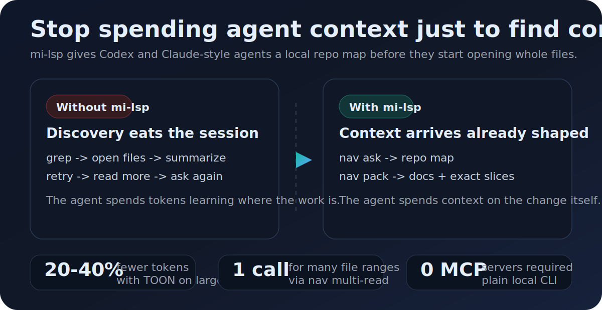
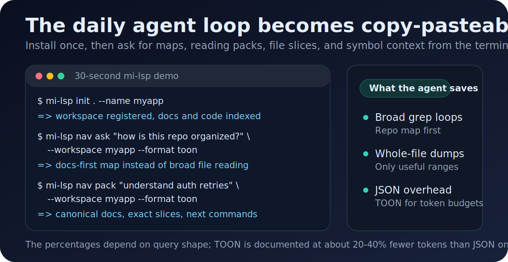

# mi-lsp


**Stop burning agent context before the real work starts.**

You asked for a fix.
The agent spends its first turns discovering the repo: search, open files, summarize, retry.
`mi-lsp` gives Codex, Claude Code, and terminal-based agents a repo map before they wander: ask the canonical docs, get a reading pack, read exact file slices, and inspect related symbols from one local CLI.
No MCP server required.



## Why Agents Use It

Agents do their best work after they know where the truth lives.
The waste happens before that: broad searches, whole-file dumps, repeated summaries, and JSON-heavy output pasted back into the chat.

`mi-lsp` moves that discovery into a local index and returns the smallest useful evidence:

| Before | With `mi-lsp` |
|---|---|
| Ask the agent to grep, open files, summarize, retry | Ask `nav ask` or `nav pack` for the repo map and reading order |
| Paste whole files into the conversation | Use `nav multi-read` to return only the useful ranges |
| Spend tokens on large JSON result arrays | Use TOON output, documented at about 20-40% fewer tokens than JSON on large arrays |
| Set up a server before getting value | Run a plain local CLI; the daemon is optional warm state |

These are workflow savings, not a universal benchmark.
The practical benefit is simple: the agent spends more context on the change and less context finding the change.

## Install In One Command

Recommended for agents: install the CLI and the `mi-lsp` skill for Codex/Claude-style workflows.

```powershell
irm https://raw.githubusercontent.com/fgpaz/mi-lsp/main/scripts/install/install-agent.ps1 | iex
```

```bash
curl -fsSL https://raw.githubusercontent.com/fgpaz/mi-lsp/main/scripts/install/install-agent.sh | sh
```

CLI-only install or update:

```powershell
irm https://raw.githubusercontent.com/fgpaz/mi-lsp/main/scripts/install/install.ps1 | iex
```

```bash
curl -fsSL https://raw.githubusercontent.com/fgpaz/mi-lsp/main/scripts/install/install.sh | sh
```

The installers download the latest GitHub Release, pick the host RID (`win-x64`, `win-arm64`, `linux-x64`, `linux-arm64`, `darwin-x64`, or `darwin-arm64`), verify SHA256 checksums, install the bundled `workers/<rid>/` layout, and run `mi-lsp version` plus `mi-lsp worker status`. Darwin archives map to worker RIDs `osx-x64` and `osx-arm64` internally.

## 30-Second Demo

From any repo:

```powershell
mi-lsp init . --name myapp
mi-lsp nav ask "how is this workspace organized?" --workspace myapp --format toon
mi-lsp nav pack "understand how authentication works" --workspace myapp --format toon
```



`mi-lsp init` detects the workspace shape, registers an alias, writes `.mi-lsp/project.toml`, and indexes code plus docs by default.
`nav ask` answers from canonical docs first when the repo has them.
`nav pack` gives the reading order before expanding into file content.
When the pack points to file ranges, `nav multi-read` returns multiple exact slices in one call:

```powershell
mi-lsp nav multi-read path/to/file.cs:1-90 path/to/other.ts:20-80 --workspace myapp --format toon
```

## Built For The Daily Agent Loop

| You need the agent to... | Run this |
|---|---|
| Orient in a new repo | `mi-lsp nav ask "how is this workspace organized?" --workspace myapp --format toon` |
| Get the docs reading order for a task | `mi-lsp nav pack "understand billing retry" --workspace myapp --format toon` |
| Find canonical RF/FL/TP/CT/TECH docs | `mi-lsp nav wiki search "billing retry" --workspace myapp --format toon` |
| Search text and see matching code | `mi-lsp nav search "billing retry" --include-content --workspace myapp --format toon` |
| Read only useful slices | `mi-lsp nav multi-read file1.cs:1-80 file2.ts:20-80 --workspace myapp --format toon` |
| Understand a symbol neighborhood | `mi-lsp nav related MySymbol --workspace myapp --format toon` |
| Read code around one line | `mi-lsp nav context path/to/file.cs 42 --workspace myapp --format toon` |
| Audit one service path | `mi-lsp nav service src/backend/orders --workspace myapp --format toon` |
| Resume from evidence without opening logs | `mi-lsp nav evidence inventory "release evidence" --workspace myapp --format toon` |
| Map a parent folder with many repos | `mi-lsp nav workspace-map --workspace myapp --axi --format toon` |

Use `--full` only when a preview asks you to expand detail:

```powershell
mi-lsp nav search "billing retry" --include-content --workspace myapp --full
mi-lsp nav workspace-map --workspace myapp --axi --full
```

For container workspaces, start broad and then narrow with `--repo`, `--entrypoint`, `--solution`, or `--project`:

```powershell
mi-lsp nav workspace-map --workspace myapp --format toon
mi-lsp nav search "forgot password" --workspace myapp --repo web --format toon
mi-lsp nav refs IOrderRepository --workspace myapp --repo Orders.Api --format toon
```

## What It Does Under The Hood

- Docs-first answers when a repo has `.docs/wiki`
- Canonical reading packs for a task before the agent opens files
- `multi-read`, `batch`, and `related` commands to replace repeated full-file reads
- TOON and compact output formats built for token budgets
- Semantic C# queries through a bundled Roslyn worker, with text/catalog fallbacks elsewhere
- Optional local daemon for warm state, never a required MCP server

Manual release downloads are still available on the [Releases page](https://github.com/fgpaz/mi-lsp/releases).
If you move only the binary after extracting a release, run `mi-lsp worker install` once so C# semantic queries can find the bundled worker.

`install-agent` intentionally requires `npx` and installs the skill through `npx skills add fgpaz/mi-lsp --skill mi-lsp -g -a codex -a claude-code -y`.
There is no direct folder-copy fallback in that path.

## Docs-First Search

If the repo has `.docs/wiki`, `mi-lsp nav ask` uses it as the primary source of truth.
The project can optionally add `.docs/wiki/_mi-lsp/read-model.toml` to teach `mi-lsp` how to rank:
- functional docs (`01-06`)
- technical docs (`07-09`)
- UX/UI docs (`10-16`)
- generic fallback docs (`README*`, `docs/`, `.docs/`)

That gives you a local, explainable answer instead of a black-box summary.

## Semantic Recall Over Knowledge Wikis

For repositories that have a markdown knowledge wiki but no formal `00_gobierno_documental.md`, use `mi-lsp nav recall` to embed a freeform query and rank wiki sections by semantic similarity.
It works multilingually: a Spanish query will find matching English notes by meaning, not just text.
When embeddings are unavailable, use `mi-lsp nav wiki search` as the lexical/wiki fallback.

The feature is gated by optional `[embeddings]` configuration in `.mi-lsp/project.toml`.
A block with both `base_url` and `model` is active by default; set `enabled = false` only when you need an explicit local kill switch:

```toml
[embeddings]
# enabled = false  # optional kill switch; omit for normal active config
provider = "openai"
base_url = "https://api.nan.builders/v1"
model = "qwen3-embedding"
dim = 4096
api_key_env = "NAN_API_KEY"
profile = "knowledge-wiki"
batch_size = 32
timeout_ms = 30000
encoding_format = "float"
user_agent = "mi-lsp-embeddings/1.0"
```

The API key is populated through the environment or `mkey run` and injected as the variable named in `api_key_env`; never print or commit key values.
Nan/Qwen3 is the documented reference endpoint for operational recall.
The `knowledge-wiki` profile auto-detects when no formal governance exists, bypassing the spec-driven gate.
Chunks are stored in repo-local `wiki_chunk_embeddings` table with incremental re-embedding by metadata-prefix, content hash, model, and dimension.
Rerunning `mi-lsp index` can backfill missing vectors even when the document catalog reports no source changes.

Use `--intent` to tune recall toward the job:

```powershell
mi-lsp nav recall "what contract defines recall result fields?" --workspace <alias> --intent formula --format toon
mi-lsp nav recall "collect citations for semantic fallback" --workspace <alias> --intent evidence --format toon
mi-lsp nav recall "where should I start this docs task?" --workspace <alias> --intent route --map --format toon
```

Intent guide: `formula` finds rules and definitions, `evidence` finds citable support, `route` finds the next anchor to inspect, `explore` is the balanced default, and `learning` favors onboarding/explanatory material. Qwen discovers candidates; route-only material is not a final source of truth until you open the canonical doc or evidence it points to.
If Nan, the key, or the provider fails, rerun through `mi-lsp nav wiki search "<query>" --workspace <alias> --format toon`. There is no hidden BGE fallback.

## Evidence Inventory For Agent Reentry

Use `mi-lsp nav evidence inventory "<query>" --workspace myapp --format toon` before opening large audit folders or historical prompts.
The preview returns canonical wiki anchors first, then metadata-only summaries for `.docs/auditoria`, `.docs/raw/prompts`, and `.docs/raw/plans`.
It prefers `manifest.yaml`, `verdict.md`, `issues.yaml`, summaries, assertions, and hashes before raw turns, logs, screenshots, or prompt bodies.
Heavy raw evidence is counted with file/byte/token estimates and omitted from content by default.

## Use With Claude Code, Codex, and Skill-Based Agents

The repository ships a ready-to-install skill in [`skills/mi-lsp`](skills/mi-lsp).
The recommended path installs the CLI and registers the skill through the skills CLI:

```powershell
irm https://raw.githubusercontent.com/fgpaz/mi-lsp/main/scripts/install/install-agent.ps1 | iex
```

```bash
curl -fsSL https://raw.githubusercontent.com/fgpaz/mi-lsp/main/scripts/install/install-agent.sh | sh
```

That path uses:

```text
npx skills add fgpaz/mi-lsp --skill mi-lsp -g -a codex -a claude-code -y
```

Once the skill is installed, an agent can start with prompts such as:

```text
Use $mi-lsp to initialize this repo and explain how it is organized.
Use $mi-lsp to answer where daemon routing is documented and which code backs it.
Use $mi-lsp to audit src/backend/orders and summarize endpoints, consumers, publishers, and entities.
Use $mi-lsp to read the relevant files for OrderHandler and show only the important slices.
```

For session-wide AXI discovery defaults:

```powershell
$env:MI_LSP_AXI = "1"
```

To opt out on an AXI-default surface:

```powershell
mi-lsp --classic
mi-lsp nav search "billing retry" --workspace myapp --classic --format compact
```

For shared daemon attribution across several agents, set:

```powershell
$env:MI_LSP_CLIENT_NAME = "codex"
$env:MI_LSP_SESSION_ID = "demo-session"
```

To update only the installed skill later:

```powershell
npx skills update mi-lsp -g -y
```

## Workspace Model

`mi-lsp` supports two canonical workspace shapes:
- `single`: one repo with one obvious semantic root
- `container`: one parent folder that contains many independent repos without requiring a parent `.sln`

Recommended operating pattern:
- use the parent folder for broad discovery: `ask`, `find`, `search`, `overview`, `workspace-map`
- use the child repo or explicit selectors for deep semantics: `refs`, `context`, `deps`
- use `service` for evidence-first exploration of an implementation area

## Runtime Model

- One global daemon per OS user, shared across terminals, Claude Code, Codex, and local subagents
- One live runtime per `(workspace_root, backend_type, entrypoint_id)` inside the daemon
- Repo-local semantic state:
  - `.mi-lsp/project.toml`
  - `.mi-lsp/index.db`
- Global local-machine state:
  - `~/.mi-lsp/registry.toml`
  - `~/.mi-lsp/daemon/state.json`
  - `~/.mi-lsp/daemon/daemon.db`

The daemon is a performance optimization, not a prerequisite for the CLI.

## Core Capabilities

```text
mi-lsp init [path] [--name <alias>] [--no-index]
mi-lsp workspace add|remove|scan|list|warm|status
mi-lsp nav ask|pack|symbols|find|refs|overview|outline|service|search|context|deps|multi-read|batch|related|workspace-map|diff-context|recall
mi-lsp index [path] [--clean]
mi-lsp info
mi-lsp daemon start|stop|restart|status|logs
mi-lsp worker install|status
mi-lsp admin open|status|export
```

Useful global flags:

```text
--workspace
--axi
--classic
--full
--format compact|json|text|toon|yaml
--client-name
--session-id
--backend roslyn|tsserver|catalog|text
--no-auto-daemon
--compress
```

## Build From Source

Source builds are intended for contributors and maintainers.

Prerequisites:
- Go 1.24+
- .NET 10 SDK

Build and test:

```bash
make build
make test
make lint
```

For release-like local validation on a specific RID:

```powershell
pwsh ./scripts/release/build-dist.ps1 -Rids @('win-x64') -Clean
pwsh ./scripts/release/install-local.ps1 -Rid win-x64 -InstallDir $HOME\bin
```

On macOS or Linux, use the shell local installer. It detects the current host RID
(`osx-x64` on this Mac), builds the CLI plus bundled worker, installs both, and
verifies `version` and `worker status`:

```bash
make install-local

# Or explicitly for Intel macOS:
sh ./scripts/release/install-local.sh --rid osx-x64 --install-dir "$HOME/.local/bin"
export PATH="$HOME/.local/bin:$PATH"
```

For AE-managed release distribution across Windows/Linux and ARM64/x64:

```powershell
pwsh ./scripts/release/ae-release-binaries.ps1 -Clean
pwsh ./scripts/release/ae-release-binaries.ps1 -Clean -MirrorRoot C:\repos\buho\assets\skills\mi-lsp
pwsh ./scripts/release/ae-release-binaries.ps1 -Clean -Publish -Tag vX.Y.Z
```

The `-Publish` mode requires a clean worktree and a tag that points at `HEAD`; pushing the tag triggers the GitHub release workflow that uploads all platform assets.

## Troubleshooting

Common first checks:

```powershell
mi-lsp info
mi-lsp worker status --format compact
mi-lsp workspace status myapp --format compact
mi-lsp nav ask "how is this workspace organized?" --workspace myapp
```

If a repo changed heavily under `.docs/wiki`, rerun:

```powershell
mi-lsp index --workspace myapp --clean
```

If a command fails before `mi-lsp` itself starts, treat it as a host incident first.
See the public runbook in [TROUBLESHOOTING.md](TROUBLESHOOTING.md).

## Current Scope

- Global daemon with governance UI and local telemetry
- Repo-local lightweight catalog in SQLite with repo ownership and docs graph
- Semantic C# queries via Roslyn worker
- Container workspaces with explicit or inferred repo/entrypoint routing
- TS/JS discovery index for symbols, routes, and overview
- Optional TS semantic bridge through `tsserver`
- Optional Python semantic bridge through `pyright-langserver`
- Optional Go semantic enrichment through `gopls`
- Service exploration summaries via `nav service`
- Docs-first repo questions via `nav ask`
- Canonical reading packs via `nav pack`
- Semantic recall over knowledge wikis via optional embeddings
- Evidence inventory for low-token agent reentry

Out of scope:
- MCP transport
- Semantic editing/refactors
- Automatic semantic fanout across all child repos
- Remote or multi-host daemon sharing
- Authenticated governance UI
- Additional languages beyond the current C#/TS/Python/Go catalog focus
- Strong completeness scoring for services

## Documentation

The versioned documentation canon lives in `.docs/wiki/`.
`README.md` is the public entrypoint; the repo wiki is the source of truth.

Start here:
- [Documentation Governance](.docs/wiki/00_gobierno_documental.md)
- [Functional Scope](.docs/wiki/01_alcance_funcional.md)
- [Architecture](.docs/wiki/02_arquitectura.md)
- [Flow Index](.docs/wiki/03_FL.md)
- [Requirements Index](.docs/wiki/04_RF.md)
- [Data Model](.docs/wiki/05_modelo_datos.md)
- [Test Matrix](.docs/wiki/06_matriz_pruebas_RF.md)
- [Technical Baseline](.docs/wiki/07_baseline_tecnica.md)
- [Physical Data Model](.docs/wiki/08_modelo_fisico_datos.md)
- [Technical Contracts](.docs/wiki/09_contratos_tecnicos.md)
- [Troubleshooting](TROUBLESHOOTING.md)

## License

MIT

<!--
harness_protocol: SDD-HARNESS-v1
id: README
kind: public-entrypoint
audience: public-human
imports:
  - .docs/wiki/01_alcance_funcional.md
  - .docs/wiki/02_arquitectura.md
  - .docs/wiki/04_RF/RF-QRY-001.md
  - .docs/wiki/09_contratos_tecnicos.md
exports:
  - public onboarding narrative
  - public install commands
  - agent workflow examples
agent_must_read:
  - README.md
agent_may_edit:
  - README.md
  - docs/assets/readme/**
agent_must_not_edit:
  - .docs/wiki/_mi-lsp/read-model.toml
  - .mi-lsp/**
verify:
  - mi-lsp workspace status mi-lsp --format toon
  - mi-lsp nav governance --workspace mi-lsp --format toon
  - mi-lsp nav wiki validate-harness --workspace mi-lsp --format toon
  - mi-lsp nav wiki validate-source --workspace mi-lsp --format toon
  - validate README local links and asset paths
stop_if:
  - README leads with implementation details before user benefit
  - README makes unsupported benchmark or speed claims
  - public install commands drift from scripts/install paths
  - linked README assets are missing
evidence:
  - .docs/auditoria/<YYYY-MM-DD>-<task-slug>/
-->
