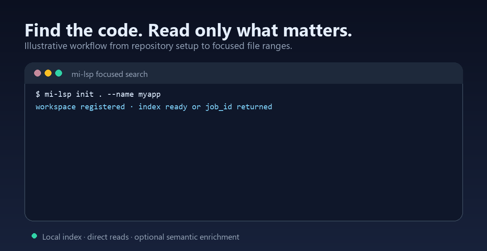

# mi-lsp

[](LICENSE)

[](https://github.com/fgpaz/mi-lsp/actions/workflows/test.yml)

**Stop wasting your agent's context on repository discovery.**

`mi-lsp` is a local CLI that finds relevant code, reads exact file ranges, and follows your repository's canonical documentation. It works with Claude Code, Codex, terminal scripts, and other skill-based agents. No MCP server is required.

[Install](#install) · [See it work](#see-it-work) · [Documentation](#learn-more) · [Releases](https://github.com/fgpaz/mi-lsp/releases)

## Install

The recommended installer adds the CLI and the `mi-lsp` skill for Codex and Claude Code. It requires `npx`.

**Windows:**

```powershell
irm https://raw.githubusercontent.com/fgpaz/mi-lsp/main/scripts/install/install-agent.ps1 | iex
```

**Linux and macOS:**

```bash
curl -fsSL https://raw.githubusercontent.com/fgpaz/mi-lsp/main/scripts/install/install-agent.sh | sh
```

Want only the CLI? Use `install.ps1` or `install.sh` instead:

```powershell
irm https://raw.githubusercontent.com/fgpaz/mi-lsp/main/scripts/install/install.ps1 | iex
```

```bash
curl -fsSL https://raw.githubusercontent.com/fgpaz/mi-lsp/main/scripts/install/install.sh | sh
```

The installers select a published Windows, Linux, or macOS bundle, verify its SHA256 checksum, keep the bundled C# worker beside the CLI, and run installation probes.

## See it work

Initialize a repository, search with matching code included, then read only the useful ranges. The query and paths below are illustrative; use the files returned by your search.

```powershell
mi-lsp init . --name myapp
mi-lsp nav search "billing retry" --include-content --workspace myapp --format toon
mi-lsp nav multi-read src/billing/retry.go:20-80 tests/billing/retry_test.go:10-55 --workspace myapp --format toon
```



The same flow works from a terminal or an agent skill. Search results stay local, and `multi-read` returns the requested slices instead of entire files. On a large first index, `init` may return a background `job_id`; wait for that job to finish before querying.

## Why coding agents use it

Agents lose useful context when they must repeatedly search, open files, summarize them, and try again. `mi-lsp` moves that discovery into a local index and returns focused evidence.

- **Search with context.** `nav search --include-content` returns matching code without a second file read.
- **Read exact ranges.** `nav multi-read` batches several slices in one command.
- **Follow relationships.** `nav related` returns a symbol's definition, callers, implementations, and tests when the backend supports them.
- **Keep analysis local.** The index lives inside the repository, and the daemon is optional.

These are workflow tools, not a universal speed or token benchmark. Results depend on the repository, query, and available semantic backend.

## Docs-first, not README-first

When a repository defines canonical documentation, `mi-lsp` uses it before treating generic READMEs or raw notes as authority.

```powershell
mi-lsp nav ask "how does billing retry work?" --workspace myapp --format toon
mi-lsp nav pack "change billing retry" --workspace myapp --format toon
mi-lsp nav wiki search "billing retry" --workspace myapp --format toon
```

- `nav ask` combines the strongest canonical documents with code evidence.
- `nav pack` returns a small reading order for a task.
- `nav wiki search` searches governed RF, FL, TP, CT, TECH, and DB documents directly.

### Harness-first intent routing

For supported intents, `mi-lsp` is the mandatory first route; there is no opt-out to bypass it. The local planner keeps the response bounded and makes every fallback explicit.

```powershell
mi-lsp nav intent "explain this change with callers callees tests contracts wiki" --workspace myapp --format toon
mi-lsp nav explain-change --path internal/service/intent.go --workspace myapp --format toon
mi-lsp nav wiki route "graph impact contracts" --workspace myapp --format toon
```

`explain-change` returns seven named sections: `change`, `affected`, `callers`, `callees`, `tests`, `contracts`, and `wiki`. Preview responses include executable `expansions[]` with a reason. Graph freshness, rank/community signals, utility hints, omissions, and sanitized telemetry remain advisory; they never replace canonical wiki authority. Fallback is terminal only for `unsupported_operation`, `unavailable_binary`, `invalid_workspace`, or `explicit_incomplete`. A timeout without a typed diagnostic is a blocker, not permission to silently switch to `rg`.

Repositories without formal governance can still use text search, the code catalog, and optional semantic backends.

## How it works

`mi-lsp` keeps the default path simple:

1. `init` detects the workspace, writes `.mi-lsp/project.toml`, and starts indexing.
2. Direct commands query the repo-local `.mi-lsp/index.db` without requiring a daemon.
3. An optional per-user daemon keeps semantic workers warm across terminals and agents.
4. Text and catalog queries degrade visibly when enrichment is unavailable. Semantic bootstrap failures return warnings or actionable errors.

| Area | Behavior |
|---|---|
| C# | Deep symbol queries through the bundled Roslyn worker |
| TypeScript/JavaScript | Local catalog with optional `tsserver` enrichment |
| Python | Local catalog with optional `pyright-langserver` enrichment |
| Go | Native AST catalog with optional `gopls` enrichment; not Roslyn-level semantics |
| Documentation | Governed wiki graph, lexical search, and optional semantic recall |

Cheap reads such as `nav search`, `nav multi-read`, and `nav wiki search` run directly. The daemon improves warm-state performance; it does not change the public CLI contract.

## Compatibility and limits

Public release bundles currently cover:

- Windows: `win-x64`, `win-arm64`
- Linux: `linux-x64`, `linux-arm64`
- macOS: `darwin-x64`, `darwin-arm64`

Public installers support Windows, Linux, and macOS. Source builds and contributor setup are documented in [CONTRIBUTING.md](CONTRIBUTING.md).

`mi-lsp` supports single repositories and container workspaces that hold several independent repositories. Use `--repo`, `--entrypoint`, `--solution`, or `--project` when a semantic query needs a narrower target.

Current limits:

- no MCP transport;
- no semantic editing or automated refactoring;
- no remote or multi-host daemon sharing;
- no authenticated remote governance UI;
- C# provides the deepest semantics through Roslyn; TypeScript, Python, and Go use local catalogs with optional language-server enrichment.

## Use it from an agent

After installing the skill, prompts can stay short:

```text
Use $mi-lsp to initialize this repo and show where billing retry is implemented.
Use $mi-lsp to find the canonical docs for daemon routing before changing code.
Use $mi-lsp to read only the relevant ranges for OrderHandler and its tests.
```

For shared attribution across several local agents, set `MI_LSP_CLIENT_NAME` and `MI_LSP_SESSION_ID` before running commands.

## Learn more

- [Agent skill and command guide](skills/mi-lsp/SKILL.md)
- [Quickstart](skills/mi-lsp/references/quickstart.md)
- [Compound command recipes](skills/mi-lsp/references/compound-commands.md)
- [Functional scope](.docs/wiki/01_alcance_funcional.md)
- [Technical baseline](.docs/wiki/07_baseline_tecnica.md)
- [CLI and protocol contracts](.docs/wiki/09_contratos_tecnicos.md)
- [Release distribution](.docs/wiki/ae/AE-RELEASE-DISTRIBUTION.md)
- [Troubleshooting](TROUBLESHOOTING.md)
- [Contributing](CONTRIBUTING.md)
- [Security policy](SECURITY.md)

## License

[MIT](LICENSE)

<!--
harness_protocol: SDD-HARNESS-v1
id: README
kind: public-entrypoint
audience: public-human
imports:
  - .docs/wiki/01_alcance_funcional.md
  - .docs/wiki/07_baseline_tecnica.md
  - .docs/wiki/09_contratos_tecnicos.md
  - .docs/wiki/ae/AE-RELEASE-DISTRIBUTION.md
exports:
  - public onboarding narrative
  - public install commands
  - agent workflow examples
agent_must_read:
  - README.md
agent_may_edit:
  - README.md
  - docs/assets/readme/**
agent_must_not_edit:
  - .docs/wiki/_mi-lsp/read-model.toml
  - .mi-lsp/**
verify:
  - mi-lsp workspace status . --format toon
  - mi-lsp nav governance --workspace . --format toon
  - mi-lsp nav wiki validate-harness --workspace . --format toon
  - mi-lsp nav wiki validate-source --workspace . --format toon
  - validate README local links and asset paths
stop_if:
  - README leads with implementation details before user benefit
  - README makes unsupported benchmark or platform claims
  - public install commands drift from scripts/install paths
  - linked README assets are missing
evidence:
  - .docs/auditoria/2026-07-16-readme-redesign/
-->
